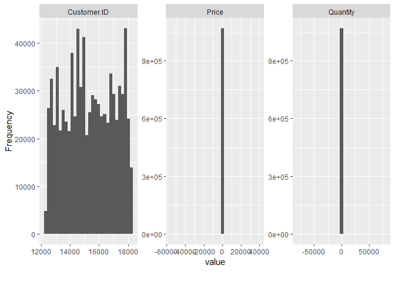
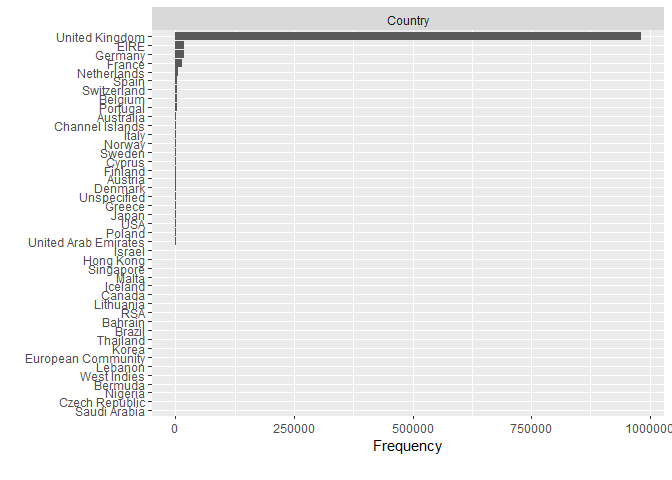
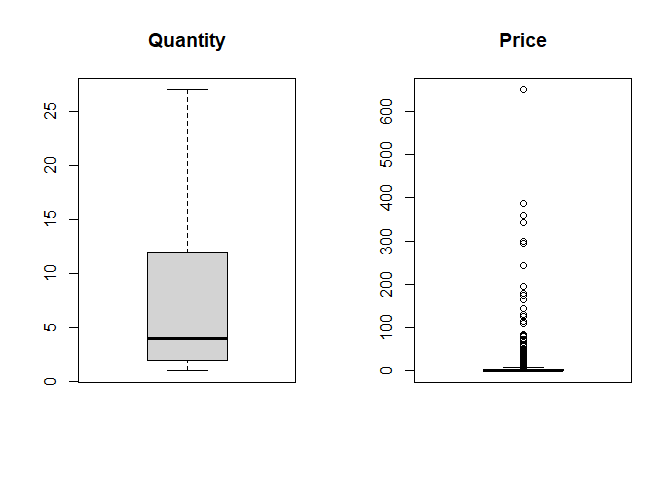

Data Cleaning & Exploratory Data Analysis
================
Dimas_Mahesa
December 2023

- [Pendahuluan](#pendahuluan)
  - [Deskripsi Data](#deskripsi-data)
  - [Informasi Atribut](#informasi-atribut)
  - [Teknologi yang digunakan](#teknologi-yang-digunakan)
- [Data Preparation & Exploration](#data-preparation--exploration)
  - [Data Preparation](#data-preparation)
  - [Data Exploration](#data-exploration)
    - [Pemeriksaan Tipe Data](#pemeriksaan-tipe-data)
    - [Pemeriksaan Missing Value](#pemeriksaan-missing-value)
    - [Pemeriksaan Pada Variabel
      Numerik](#pemeriksaan-pada-variabel-numerik)
    - [Pemeriksaan Pada Kolom Country](#pemeriksaan-pada-kolom-country)
    - [Pemeriksaan Pada Kolom Invoice](#pemeriksaan-pada-kolom-invoice)
    - [Pemeriksaan Pada Kolom
      StockCode](#pemeriksaan-pada-kolom-stockcode)
    - [Ringkasan Statistik](#ringkasan-statistik)
- [Data Cleaning](#data-cleaning)
  - [Transformasi Pada Data](#transformasi-pada-data)
  - [Menghilangkan NA Values](#menghilangkan-na-values)
  - [Pemeriksaan Duplikasi pada Data](#pemeriksaan-duplikasi-pada-data)
  - [Penyesuaian pada Kolom Price](#penyesuaian-pada-kolom-price)
  - [Penanganan Outlier](#penanganan-outlier)
  - [Pemeriksaan pada Produk Terjual](#pemeriksaan-pada-produk-terjual)
  - [Hasil Akhir](#hasil-akhir)

# Pendahuluan

## Deskripsi Data

Dataset
[online_retail2.csv](https://archive.ics.uci.edu/ml/datasets/Online+Retail+II)
berisi semua transaksi yang terjadi antara 01/12/2009 sampai dengan
09/12/2011 pada ritel online non-toko yang berbasis di Inggris.
Perusahaan ini menjual peralatan hadiah unik yang sebagian besar
konsumen perusahaan adalah agen grosir.

## Informasi Atribut

- **InvoiceNo** : Nomor faktur (Nominal), berisi 6 digit nomor yang
  ditetapkan secara unik untuk setiap transaksi. Jika kode dimulai
  dengan huruf “C”, ini menunjukkan pembatalan transaksi.

- **StockCode** : Kode produk (Nominal). berisi 5 digit nomor unik yang
  ditetapkan secara unik untuk setiap produk yang berbeda.

- **Description** : Nama produk (Nominal).

- **Quantity** : Jumlah setiap produk per transaksi (Numerik)

- **InvoiceDate** : Tanggal dan waktu faktur (Numerik), berisi hari dan
  waktu ketika transaksi dilakukan.

- **Price** : Harga satuan (Numerik), berisi harga produk per unit dalam
  pound sterling (£).

- **CustomerID** : Customer number (Nominal), berisi 5 digit nomor yang
  ditetapkan secara unik untuk setiap pelanggan.

- **Country** : Nama negara (Nominal), berisi nama negara tempat
  pelanggan tinggal.

## Teknologi yang digunakan

**Bahasa pemrograman**: R

**Pustaka (Library)**: tidyverse, lubridate, DataExplorer, janitor,
ggplot2, inventorize, forecast

# Data Preparation & Exploration

Data preparation merupakan proses mempersiapkan data yang akan digunakan
dalam pemodelan. Tahap ini dimulai dengan menginput dataset dan library
yang digunakan dalam pemodelan. Sedangkan data exploration merupakan
tahapan yang dilakukan untuk memahami data sebelum diolah untuk proses
selanjutnya dengan menggali informasi untuk melihat karakteristik dan
pola yang ada di dalam data.

Pada tahap ini akan mengeksplorasi data dengan tujuan mencari informasi
dasar pada data untuk mengetahui apakah setiap variabel sudah memiliki
tipe data yang tepat, berapa banyak nilai yang hilang (missing value),
apakah terdapat nilai outlier, serta pola-pola apa saja yang terdapat
dalam data.

## Data Preparation

Tahap ini dilakukan persiapan data yang akan digunakan dalam pemodelan
yang dimulai dengan menginput dataset dan library yang digunakan dalam
pemodelan.

``` r
## impor library
library(tidyverse)
library(lubridate)
library(DataExplorer)
library(janitor)
library(ggplot2)
library(kableExtra)
library(cluster)
library(factoextra)
library(ggQC)
library(tsibble)
library(tseries)
library(forecast)

## impor dan tampilkan dataframe secara singkat
retail <- read_csv("../../machine_learning_approach_in_inventory_management/dataset/online_retail2.csv")
retail
```

    ## # A tibble: 1,067,371 × 8
    ##    Invoice StockCode Description              Quantity InvoiceDate         Price
    ##    <chr>   <chr>     <chr>                       <dbl> <dttm>              <dbl>
    ##  1 489434  85048     "15CM CHRISTMAS GLASS B…       12 2009-12-01 07:45:00  6.95
    ##  2 489434  79323P    "PINK CHERRY LIGHTS"           12 2009-12-01 07:45:00  6.75
    ##  3 489434  79323W    "WHITE CHERRY LIGHTS"          12 2009-12-01 07:45:00  6.75
    ##  4 489434  22041     "RECORD FRAME 7\" SINGL…       48 2009-12-01 07:45:00  2.1 
    ##  5 489434  21232     "STRAWBERRY CERAMIC TRI…       24 2009-12-01 07:45:00  1.25
    ##  6 489434  22064     "PINK DOUGHNUT TRINKET …       24 2009-12-01 07:45:00  1.65
    ##  7 489434  21871     "SAVE THE PLANET MUG"          24 2009-12-01 07:45:00  1.25
    ##  8 489434  21523     "FANCY FONT HOME SWEET …       10 2009-12-01 07:45:00  5.95
    ##  9 489435  22350     "CAT BOWL"                     12 2009-12-01 07:46:00  2.55
    ## 10 489435  22349     "DOG BOWL , CHASING BAL…       12 2009-12-01 07:46:00  3.75
    ## # ℹ 1,067,361 more rows
    ## # ℹ 2 more variables: `Customer ID` <dbl>, Country <chr>

## Data Exploration

Pada bagian ini kita akan mengeksplorasi data untuk mencari informasi
dasar pada data frame untuk mengetahui apakah setiap variabel dalam data
frame sudah memiliki tipe data yang tepat, berapa banyak nilai yang
hilang pada data (missing value) dan di kolom mana berisi nilai yang
hilang, dan mendapatkan beberapa pola dari data.

### Pemeriksaan Tipe Data

Pemeriksaan terhadap tipe data pada dataframe diperlukan untuk
mengidentifikasi apakah tipe data sudah sesuai sebagaimana mestinya atau
masih terdapat tipe data yang tidak sesuai, sehingga diperlukan
transformasi pada data.

``` r
### tampilkan tipe data 
str(retail) 
```

    ## spc_tbl_ [1,067,371 × 8] (S3: spec_tbl_df/tbl_df/tbl/data.frame)
    ##  $ Invoice    : chr [1:1067371] "489434" "489434" "489434" "489434" ...
    ##  $ StockCode  : chr [1:1067371] "85048" "79323P" "79323W" "22041" ...
    ##  $ Description: chr [1:1067371] "15CM CHRISTMAS GLASS BALL 20 LIGHTS" "PINK CHERRY LIGHTS" "WHITE CHERRY LIGHTS" "RECORD FRAME 7\" SINGLE SIZE" ...
    ##  $ Quantity   : num [1:1067371] 12 12 12 48 24 24 24 10 12 12 ...
    ##  $ InvoiceDate: POSIXct[1:1067371], format: "2009-12-01 07:45:00" "2009-12-01 07:45:00" ...
    ##  $ Price      : num [1:1067371] 6.95 6.75 6.75 2.1 1.25 1.65 1.25 5.95 2.55 3.75 ...
    ##  $ Customer ID: num [1:1067371] 13085 13085 13085 13085 13085 ...
    ##  $ Country    : chr [1:1067371] "United Kingdom" "United Kingdom" "United Kingdom" "United Kingdom" ...
    ##  - attr(*, "spec")=
    ##   .. cols(
    ##   ..   Invoice = col_character(),
    ##   ..   StockCode = col_character(),
    ##   ..   Description = col_character(),
    ##   ..   Quantity = col_double(),
    ##   ..   InvoiceDate = col_datetime(format = ""),
    ##   ..   Price = col_double(),
    ##   ..   `Customer ID` = col_double(),
    ##   ..   Country = col_character()
    ##   .. )
    ##  - attr(*, "problems")=<externalptr>

Terdapat nama kolom yang tidak sesuai dengan format yang seharusnya,
yakni kolom Customer ID sehingga diperlukan transformasi seperti
mengubah nama kolom menjadi Customer_ID dan mengubah tipe datanya dari
numerik menjadi karakter. Kemudian diperlukan transformasi pada kolom
InvoiceDate dengan mempartisinya menjadi 2 kolom, Date dan Time juga
mengubah tipe data kolom Date dari date time ke date.

### Pemeriksaan Missing Value

Proses ini merupakan proses mengidentifikasi apakah terdapat missing
value yang merupakan nilai yang hilang pada dataframe. Missing value
umum ditemukan pada dataframe dan memiliki pengaruh yang signifikan
terhadap hasil pemodelan. Jika missing value tidak ditangani dengan
benar, maka hasil pemodelan menjadi tidak akurat.

``` r
### tampilkan missing value
retail %>% profile_missing()
```

    ## # A tibble: 8 × 3
    ##   feature     num_missing pct_missing
    ##   <fct>             <int>       <dbl>
    ## 1 Invoice               0     0      
    ## 2 StockCode             0     0      
    ## 3 Description        4382     0.00411
    ## 4 Quantity              0     0      
    ## 5 InvoiceDate           0     0      
    ## 6 Price                 0     0      
    ## 7 Customer ID      243007     0.228  
    ## 8 Country               0     0

Terdapat sebanyak 247.389 missing value pada dataframe dengan jumlah
missing value terbanyak terdapat pada kolom Customer ID kemudian diikuti
dengan kolom Description. Dengan informasi tersebut, missing value perlu
dihilangkan dari dataframe karena jika tidak dihilangkan data tersebut
data yang dimiliki akan menjadi bias dan hasil pemodelan menjadi tidak
akurat.

### Pemeriksaan Pada Variabel Numerik

Langkah ini dilakukan untuk memeriksa variabel nurmerik yang ada di
dalam dataframe apakah sesuai sebagaimana mestinya dan apakah data
tersebar dengan baik.

``` r
### histogram dari variabel numerik
retail %>% plot_histogram()
```

<!-- -->

Terdapat kejanggalan pada kolom Price dan Quantity, seperti yang
terlihat pada plot di atas. Pada plot yang dihasilkan hanya menunjukkan
satu baris vertikal yang mengindikasikan jika terdapat outlier dan data
pada kolom tersebut tidak terdistribusi dengan baik. Dengan demikian,
diperlukan transformasi untuk menghilangkan outlier pada dataframe agar
hasil pemodelan menjadi akurat.

### Pemeriksaan Pada Kolom Country

Langkah ini dilakukan untuk menampilkan daftar negara yang ada dalam
dataframe dan memperoleh informasi pada negara mana saja transaksi
terjadi dan berapa banyak jumlah transaksi terjadi pada negara tersebut.

``` r
### menampilkan daftar negara pada dataframe 
unique(retail$Country) 
```

    ##  [1] "United Kingdom"       "France"               "USA"                 
    ##  [4] "Belgium"              "Australia"            "EIRE"                
    ##  [7] "Germany"              "Portugal"             "Japan"               
    ## [10] "Denmark"              "Nigeria"              "Netherlands"         
    ## [13] "Poland"               "Spain"                "Channel Islands"     
    ## [16] "Italy"                "Cyprus"               "Greece"              
    ## [19] "Norway"               "Austria"              "Sweden"              
    ## [22] "United Arab Emirates" "Finland"              "Switzerland"         
    ## [25] "Unspecified"          "Malta"                "Bahrain"             
    ## [28] "RSA"                  "Bermuda"              "Hong Kong"           
    ## [31] "Singapore"            "Thailand"             "Israel"              
    ## [34] "Lithuania"            "West Indies"          "Lebanon"             
    ## [37] "Korea"                "Brazil"               "Canada"              
    ## [40] "Iceland"              "Saudi Arabia"         "Czech Republic"      
    ## [43] "European Community"

``` r
### bar chart negara
retail %>% plot_bar()
```

<!-- -->

Terdapat sebanyak 43 negara yang ada dalam dataframe, dimana sebagian
besar transaksi terjadi di United Kingdom. Pada pemodelan ini dibatasi
hanya menggunakan data yang berasal dari United Kingdom saja, sehingga
akan dilakukan filterisasi pada data dalam dataframe untuk mengambil
data yang berasal dari United Kingdom saja dan membuang data yang
berasal dari negara selain United Kingdom.

### Pemeriksaan Pada Kolom Invoice

Langkah ini dilakukan untuk mendapatkan informasi di dalam kolom Invoice
apakah sesuai sebagaimana mestinya atau terdapat data yang tidak sesuai
sehingga data tersebut harus dihilangkan.

``` r
### menghitung berapa panjang karakter pada setiap invoice
table(nchar(retail$Invoice, type = "chars"))
```

    ## 
    ##       6       7 
    ## 1047871   19500

Terdapat dua informasi mengenai panjang karakter pada setiap invoice
dimana terdapat 1.047.871 data invoice dengan panjang sebanyak 6
karakter dan 19.500 data invoice dengan panjang sebanyak 7 karakter.

``` r
### tampilkan invoice yang memiliki panjang 6 karakter
retail %>% select(Invoice) %>%  filter(nchar(Invoice) == 6) %>% distinct() %>% head()
```

    ## # A tibble: 6 × 1
    ##   Invoice
    ##   <chr>  
    ## 1 489434 
    ## 2 489435 
    ## 3 489436 
    ## 4 489437 
    ## 5 489438 
    ## 6 489439

Pada invoice dengan panjang sebanyak 6 karakter hanya berisi angka yang
menjadi kode transaksi yang terlah terjadi.

``` r
### tampilkan faktur yang memiliki panjang 7 karakter
retail %>% select(Invoice) %>%  filter(nchar(Invoice) == 7) %>% distinct() %>% head()
```

    ## # A tibble: 6 × 1
    ##   Invoice
    ##   <chr>  
    ## 1 C489449
    ## 2 C489459
    ## 3 C489476
    ## 4 C489503
    ## 5 C489504
    ## 6 C489518

Sedangkan pada invoice dengan panjang sebanyak 7 karakter berisi huruf
angka, diawali dengan huruf C diikuti dengan angka sepanjang 6 karakter
yang menjadi kode transaksi yang terlah terjadi.

``` r
### tampilkan invoice yang mengandung huruf "C" 
retail[grep(pattern="C", x = retail$Invoice, ignore.case=TRUE),]
```

    ## # A tibble: 19,494 × 8
    ##    Invoice StockCode Description              Quantity InvoiceDate         Price
    ##    <chr>   <chr>     <chr>                       <dbl> <dttm>              <dbl>
    ##  1 C489449 22087     PAPER BUNTING WHITE LACE      -12 2009-12-01 10:33:00  2.95
    ##  2 C489449 85206A    CREAM FELT EASTER EGG B…       -6 2009-12-01 10:33:00  1.65
    ##  3 C489449 21895     POTTING SHED SOW 'N' GR…       -4 2009-12-01 10:33:00  4.25
    ##  4 C489449 21896     POTTING SHED TWINE             -6 2009-12-01 10:33:00  2.1 
    ##  5 C489449 22083     PAPER CHAIN KIT RETRO S…      -12 2009-12-01 10:33:00  2.95
    ##  6 C489449 21871     SAVE THE PLANET MUG           -12 2009-12-01 10:33:00  1.25
    ##  7 C489449 84946     ANTIQUE SILVER TEA GLAS…      -12 2009-12-01 10:33:00  1.25
    ##  8 C489449 84970S    HANGING HEART ZINC T-LI…      -24 2009-12-01 10:33:00  0.85
    ##  9 C489449 22090     PAPER BUNTING RETRO SPO…      -12 2009-12-01 10:33:00  2.95
    ## 10 C489459 90200A    PURPLE SWEETHEART BRACE…       -3 2009-12-01 10:44:00  4.25
    ## # ℹ 19,484 more rows
    ## # ℹ 2 more variables: `Customer ID` <dbl>, Country <chr>

Huruf C pada invoce tersebut memiliki arti transaksi yang dibatalkan,
ditandai dengan nilai pada kolom Quantity bernilai negatif. Peneliatian
ini hanya akan berfokus pada produk yang terjual, sehingga data tersebut
akan dihilangkan karena membiarkan data ini tetap ada dapat membuat
model dan analisis menjadi tidak akurat.

### Pemeriksaan Pada Kolom StockCode

Langkah ini dilakukan untuk mendapatkan informasi di dalam kolom
StockCode apakah sesuai sebagaimana mestinya atau terdapat data yang
tidak sesuai sehingga data tersebut harus dihilangkan.

``` r
### menghitung panjang karakter pada setiap kode produk
table(nchar(retail$StockCode, type = "chars"))
```

    ## 
    ##      1      2      3      4      5      6      7      8      9     12 
    ##   1713    283   1446   2158 932385 127591   1392    127     74    202

Terdapat sebanyak 10 informasi mengenai panjang karakter pada setiap
kode produk. Terdapat 1713 data kode produk dengan panjang sebanyak 1
karakter, 283 data kode produk dengan panjang sebanyak 2 karakter, 1446
data kode produk dengan panjang sebanyak 3 karakter, 2158 data kode
produk dengan panjang sebanyak 4 karakter, 932.385 data kode produk
dengan panjang sebanyak 5 karakter, 127.591 data kode produk dengan
panjang sebanyak 6 karakter, 1392 data kode produk dengan panjang
sebanyak 7 karakter, 127 data kode produk dengan panjang sebanyak 8
karakter, 74 data kode produk dengan panjang sebanyak 9 karakter, 202
data kode produk dengan panjang sebanyak 12 karakter.

``` r
### kode produk dengan panjang 1 karakter
retail %>% filter(nchar(StockCode) == 1)
```

    ## # A tibble: 1,713 × 8
    ##    Invoice StockCode Description Quantity InvoiceDate           Price
    ##    <chr>   <chr>     <chr>          <dbl> <dttm>                <dbl>
    ##  1 C489535 D         Discount          -1 2009-12-01 12:11:00    9   
    ##  2 C489535 D         Discount          -1 2009-12-01 12:11:00   19   
    ##  3 489609  M         Manual             1 2009-12-01 14:50:00    4   
    ##  4 C489651 M         Manual            -1 2009-12-01 16:48:00    5.1 
    ##  5 C489859 M         Manual            -1 2009-12-02 14:45:00   69.6 
    ##  6 C490126 M         Manual            -1 2009-12-03 18:12:00    5.95
    ##  7 C490129 M         Manual            -1 2009-12-03 18:26:00 1998.  
    ##  8 490300  M         Manual             1 2009-12-04 14:19:00    0.85
    ##  9 490300  M         Manual             1 2009-12-04 14:19:00    0.21
    ## 10 490727  M         Manual             1 2009-12-07 16:38:00    0   
    ## # ℹ 1,703 more rows
    ## # ℹ 2 more variables: `Customer ID` <dbl>, Country <chr>

Kode produk dengan Panjang 1 karakter berisi Manual, Discount, SAMPLES,
dan Adjust bad debt, yang mana bukan merupakan produk yang dijual.

``` r
### kode produk dengan panjang 2 karakter
retail %>% filter(nchar(StockCode) == 2)
```

    ## # A tibble: 283 × 8
    ##    Invoice StockCode Description Quantity InvoiceDate         Price
    ##    <chr>   <chr>     <chr>          <dbl> <dttm>              <dbl>
    ##  1 490127  C2        CARRIAGE           1 2009-12-03 18:13:00    50
    ##  2 490541  C2        CARRIAGE           1 2009-12-07 09:25:00    50
    ##  3 490542  C2        CARRIAGE           1 2009-12-07 09:42:00    50
    ##  4 490998  C2        CARRIAGE           1 2009-12-08 17:24:00    50
    ##  5 491160  C2        CARRIAGE           1 2009-12-10 10:29:00    50
    ##  6 491702  C2        CARRIAGE           1 2009-12-13 13:53:00    50
    ##  7 491990  C2        <NA>             100 2009-12-15 10:06:00     0
    ##  8 492092  C2        CARRIAGE           1 2009-12-15 14:03:00    50
    ##  9 492250  C2        CARRIAGE           1 2009-12-16 10:45:00    50
    ## 10 492746  C2        CARRIAGE           1 2009-12-18 13:01:00    50
    ## # ℹ 273 more rows
    ## # ℹ 2 more variables: `Customer ID` <dbl>, Country <chr>

Kode produk dengan Panjang 2 karakter hanya berisi CARRIAGE, yang mana
bukan merupakan produk yang dijual.

``` r
### kode produk dengan panjang 3 karakter
retail %>% filter(nchar(StockCode) == 3)
```

    ## # A tibble: 1,446 × 8
    ##    Invoice StockCode Description    Quantity InvoiceDate         Price
    ##    <chr>   <chr>     <chr>             <dbl> <dttm>              <dbl>
    ##  1 489597  DOT       DOTCOM POSTAGE        1 2009-12-01 14:28:00 647. 
    ##  2 489600  DOT       DOTCOM POSTAGE        1 2009-12-01 14:43:00  56.0
    ##  3 489601  DOT       DOTCOM POSTAGE        1 2009-12-01 14:44:00  68.4
    ##  4 489602  DOT       DOTCOM POSTAGE        1 2009-12-01 14:45:00  59.4
    ##  5 489603  DOT       DOTCOM POSTAGE        1 2009-12-01 14:46:00  42.4
    ##  6 489604  DOT       DOTCOM POSTAGE        1 2009-12-01 14:47:00  50.9
    ##  7 489607  DOT       DOTCOM POSTAGE        1 2009-12-01 14:49:00  76.3
    ##  8 489609  DOT       DOTCOM POSTAGE        1 2009-12-01 14:50:00  74.6
    ##  9 489612  DOT       DOTCOM POSTAGE        1 2009-12-01 14:55:00  87.4
    ## 10 489614  DOT       DOTCOM POSTAGE        1 2009-12-01 14:56:00  80.3
    ## # ℹ 1,436 more rows
    ## # ℹ 2 more variables: `Customer ID` <dbl>, Country <chr>

Kode produk dengan Panjang 3 karakter hanya berisi DOTCOM POSTAGE, yang
mana bukan merupakan produk yang dijual.

``` r
### kode produk dengan panjang 4 karakter
retail %>% filter(nchar(StockCode) == 4)
```

    ## # A tibble: 2,158 × 8
    ##    Invoice StockCode Description Quantity InvoiceDate          Price
    ##    <chr>   <chr>     <chr>          <dbl> <dttm>               <dbl>
    ##  1 489439  POST      POSTAGE            3 2009-12-01 09:28:00  18   
    ##  2 489444  POST      POSTAGE            1 2009-12-01 09:55:00 141   
    ##  3 489447  POST      POSTAGE            1 2009-12-01 10:10:00 130   
    ##  4 489526  POST      POSTAGE            6 2009-12-01 11:50:00  18   
    ##  5 C489538 POST      POSTAGE           -1 2009-12-01 12:18:00   9.58
    ##  6 489557  POST      POSTAGE            4 2009-12-01 12:52:00  18   
    ##  7 C489685 POST      POSTAGE           -1 2009-12-02 10:28:00  18   
    ##  8 489883  POST      POSTAGE            3 2009-12-02 16:24:00  18   
    ##  9 C490117 POST      POSTAGE           -1 2009-12-03 17:38:00   2.99
    ## 10 C490120 POST      POSTAGE           -2 2009-12-03 17:52:00  18   
    ## # ℹ 2,148 more rows
    ## # ℹ 2 more variables: `Customer ID` <dbl>, Country <chr>

Kode produk dengan Panjang 4 karakter hanya berisi POSTAGE, yang mana
bukan merupakan produk yang dijual.

``` r
### kode produk dengan panjang 5 karakter
retail %>% filter(nchar(StockCode) == 5)
```

    ## # A tibble: 932,385 × 8
    ##    Invoice StockCode Description              Quantity InvoiceDate         Price
    ##    <chr>   <chr>     <chr>                       <dbl> <dttm>              <dbl>
    ##  1 489434  85048     "15CM CHRISTMAS GLASS B…       12 2009-12-01 07:45:00  6.95
    ##  2 489434  22041     "RECORD FRAME 7\" SINGL…       48 2009-12-01 07:45:00  2.1 
    ##  3 489434  21232     "STRAWBERRY CERAMIC TRI…       24 2009-12-01 07:45:00  1.25
    ##  4 489434  22064     "PINK DOUGHNUT TRINKET …       24 2009-12-01 07:45:00  1.65
    ##  5 489434  21871     "SAVE THE PLANET MUG"          24 2009-12-01 07:45:00  1.25
    ##  6 489434  21523     "FANCY FONT HOME SWEET …       10 2009-12-01 07:45:00  5.95
    ##  7 489435  22350     "CAT BOWL"                     12 2009-12-01 07:46:00  2.55
    ##  8 489435  22349     "DOG BOWL , CHASING BAL…       12 2009-12-01 07:46:00  3.75
    ##  9 489435  22195     "HEART MEASURING SPOONS…       24 2009-12-01 07:46:00  1.65
    ## 10 489435  22353     "LUNCHBOX WITH CUTLERY …       12 2009-12-01 07:46:00  2.55
    ## # ℹ 932,375 more rows
    ## # ℹ 2 more variables: `Customer ID` <dbl>, Country <chr>

Kode produk dengan Panjang 5 karakter berisi 15CM CHRISTMAS GLASS BALL
20 LIGHTS, RECORD FRAME 7” SINGLE SIZE, STRAWBERRY CERAMIC TRINKET BOX,
dan sebagainya, yang mana merupakan produk yang dijual.

``` r
### kode produk dengan panjang 6 karakter
retail %>% filter(nchar(StockCode) == 6)
```

    ## # A tibble: 127,591 × 8
    ##    Invoice StockCode Description              Quantity InvoiceDate         Price
    ##    <chr>   <chr>     <chr>                       <dbl> <dttm>              <dbl>
    ##  1 489434  79323P    PINK CHERRY LIGHTS             12 2009-12-01 07:45:00  6.75
    ##  2 489434  79323W    WHITE CHERRY LIGHTS            12 2009-12-01 07:45:00  6.75
    ##  3 489436  48173C    DOOR MAT BLACK FLOCK           10 2009-12-01 09:06:00  5.95
    ##  4 489436  35004B    SET OF 3 BLACK FLYING D…       12 2009-12-01 09:06:00  4.65
    ##  5 489436  84596F    SMALL MARSHMALLOWS PINK…        8 2009-12-01 09:06:00  1.25
    ##  6 489436  84596L    BISCUITS SMALL BOWL LIG…        8 2009-12-01 09:06:00  1.25
    ##  7 489437  84507B    STRIPES DESIGN MONKEY D…        6 2009-12-01 09:08:00  2.55
    ##  8 489437  84970S    HANGING HEART ZINC T-LI…       12 2009-12-01 09:08:00  0.85
    ##  9 489438  84031A    CHARLIE+LOLA RED HOT WA…       56 2009-12-01 09:24:00  3   
    ## 10 489438  84031B    CHARLIE LOLA BLUE HOT W…       56 2009-12-01 09:24:00  3   
    ## # ℹ 127,581 more rows
    ## # ℹ 2 more variables: `Customer ID` <dbl>, Country <chr>

Kode produk dengan Panjang 6 karakter berisi PINK CHERRY LIGHTS, WHITE
CHERRY LIGHTS, DOOR MAT BLACK FLOCK, dan sebagainya, yang mana merupakan
produk yang dijual.

``` r
### kode produk dengan panjang 7 karakter
retail %>% filter(nchar(StockCode) == 7)
```

    ## # A tibble: 1,392 × 8
    ##    Invoice StockCode Description              Quantity InvoiceDate         Price
    ##    <chr>   <chr>     <chr>                       <dbl> <dttm>              <dbl>
    ##  1 489522  79323LP   LIGHT PINK CHERRY LIGHTS        1 2009-12-01 11:45:00  6.75
    ##  2 489526  15056BL   EDWARDIAN PARASOL BLACK         6 2009-12-01 11:50:00  5.95
    ##  3 C489588 79323GR   GREEN CHERRY LIGHTS            -2 2009-12-01 14:01:00  6.75
    ##  4 489604  15056bl   EDWARDIAN PARASOL BLACK         1 2009-12-01 14:47:00 13   
    ##  5 489658  15056BL   EDWARDIAN PARASOL BLACK        12 2009-12-01 17:31:00  5.95
    ##  6 489658  79323LP   LIGHT PINK CHERRY LIGHTS        6 2009-12-01 17:31:00  6.75
    ##  7 489664  79323GR   GREEN CHERRY LIGHTS             2 2009-12-01 18:03:00  6.75
    ##  8 489675  15056BL   EDWARDIAN PARASOL BLACK       240 2009-12-02 09:47:00  4.6 
    ##  9 489688  79323LP   LIGHT PINK CHERRY LIGHTS       24 2009-12-02 10:42:00  5.45
    ## 10 489789  15056BL   EDWARDIAN PARASOL BLACK         3 2009-12-02 11:59:00  5.95
    ## # ℹ 1,382 more rows
    ## # ℹ 2 more variables: `Customer ID` <dbl>, Country <chr>

Kode produk dengan Panjang 7 karakter berisi LIGHT PINK CHERRY LIGHTS,
EDWARDIAN PARASOL BLACK, GREEN CHERRY LIGHTS, dan sebagainya, yang mana
merupakan produk yang dijual.

``` r
### kode produk dengan panjang 8 karakter
retail %>% filter(nchar(StockCode) == 8)
```

    ## # A tibble: 127 × 8
    ##    Invoice StockCode Description              Quantity InvoiceDate         Price
    ##    <chr>   <chr>     <chr>                       <dbl> <dttm>              <dbl>
    ##  1 489597  DCGS0058  MISO PRETTY  GUM                1 2009-12-01 14:28:00  0.83
    ##  2 489597  DCGS0068  DOGS NIGHT COLLAR               1 2009-12-01 14:28:00  8.65
    ##  3 490074  DCGS0004  HAYNES CAMPER SHOULDER …        1 2009-12-03 14:39:00 17.4 
    ##  4 490074  DCGS0058  MISO PRETTY  GUM                1 2009-12-03 14:39:00  0.83
    ##  5 490074  DCGS0076  SUNJAR LED NIGHT NIGHT …        1 2009-12-03 14:39:00 16.5 
    ##  6 490741  DCGS0076  SUNJAR LED NIGHT NIGHT …        1 2009-12-07 17:56:00 16.5 
    ##  7 490745  DCGS0058  MISO PRETTY  GUM                1 2009-12-07 18:02:00  0.83
    ##  8 490745  DCGS0076  SUNJAR LED NIGHT NIGHT …        1 2009-12-07 18:02:00 16.5 
    ##  9 491041  DCGS0003  BOXED GLASS ASHTRAY             1 2009-12-09 09:42:00  2.57
    ## 10 491043  DCGS0076  SUNJAR LED NIGHT NIGHT …        1 2009-12-09 09:51:00 16.5 
    ## # ℹ 117 more rows
    ## # ℹ 2 more variables: `Customer ID` <dbl>, Country <chr>

Kode produk dengan Panjang 8 karakter berisi BOYS PARTY BAG, HAYNES
CAMPER SHOULDER BAG, BOXED GLASS ASHTRAY, dan sebagainya, yang mana
merupakan produk yang dijual.

``` r
### kode produk dengan panjang 9 karakter 
retail %>% filter(nchar(StockCode) == 9)
```

    ## # A tibble: 74 × 8
    ##    Invoice StockCode Description             Quantity InvoiceDate         Price
    ##    <chr>   <chr>     <chr>                      <dbl> <dttm>              <dbl>
    ##  1 493265  DCGS0066N NAVY CUDDLES DOG HOODIE        1 2009-12-22 15:05:00  8.65
    ##  2 493268  DCGS0066N <NA>                           1 2009-12-22 15:07:00  0   
    ##  3 493269  DCGS0066N NAVY CUDDLES DOG HOODIE        1 2009-12-22 15:07:00  8.65
    ##  4 493289  DCGS0066N <NA>                           1 2009-12-22 15:13:00  0   
    ##  5 496722  DCGSSGIRL <NA>                          -1 2010-02-03 14:04:00  0   
    ##  6 499042  DCGSLGIRL <NA>                         -57 2010-02-24 13:31:00  0   
    ##  7 512738  DCGSSGIRL update                       100 2010-06-17 14:11:00  0   
    ##  8 513099  DCGSSGIRL GIRLS PARTY BAG                3 2010-06-21 15:13:00  3.36
    ##  9 513200  DCGSSGIRL GIRLS PARTY BAG                6 2010-06-22 16:28:00  3.36
    ## 10 513574  DCGSSGIRL GIRLS PARTY BAG                1 2010-06-25 15:13:00  3.36
    ## # ℹ 64 more rows
    ## # ℹ 2 more variables: `Customer ID` <dbl>, Country <chr>

Kode produk dengan Panjang 9 karakter berisi NAVY CUDDLES DOG HOODIE dan
GIRLS PARTY BAG yang merupakan produk yang dijual. Sedangkan update dan
AMAZON FEE bukan merupakan produk yang dijual.

``` r
### kode produk dengan panjang 12 karakter
retail %>% filter(nchar(StockCode) == 12)
```

    ## # A tibble: 202 × 8
    ##    Invoice StockCode    Description          Quantity InvoiceDate          Price
    ##    <chr>   <chr>        <chr>                   <dbl> <dttm>               <dbl>
    ##  1 C490943 BANK CHARGES Bank Charges               -1 2009-12-08 14:08:00  15   
    ##  2 490948  BANK CHARGES Bank Charges                1 2009-12-08 14:29:00  15   
    ##  3 491968  gift_0001_80 <NA>                        2 2009-12-14 17:56:00   0   
    ##  4 491969  gift_0001_80 Dotcomgiftshop Gift…        1 2009-12-14 17:57:00  69.6 
    ##  5 491971  gift_0001_20 Dotcomgiftshop Gift…        2 2009-12-14 18:37:00  17.4 
    ##  6 C492206 BANK CHARGES Bank Charges               -1 2009-12-15 16:32:00 848.  
    ##  7 492782  gift_0001_10 Dotcomgiftshop Gift…        1 2009-12-18 17:06:00   8.69
    ##  8 492782  gift_0001_20 Dotcomgiftshop Gift…        1 2009-12-18 17:06:00  17.4 
    ##  9 492783  gift_0001_50 Dotcomgiftshop Gift…        1 2009-12-18 17:15:00  43.5 
    ## 10 493404  gift_0001_30 Dotcomgiftshop Gift…        1 2009-12-23 15:30:00  26.1 
    ## # ℹ 192 more rows
    ## # ℹ 2 more variables: `Customer ID` <dbl>, Country <chr>

Kode produk dengan Panjang 12 karakter hanya berisi Bank Charges dan
Dotcomgiftshop Gift Voucher, yang mana bukan merupakan produk yang
dijual. Seperti yang telah diketahui, kode produk berisi nomor unik yang
ditetapkan secara unik untuk setiap produk yang berbeda. Kode produk
yang memiliki panjang 1, 2, 3, 4 dan 12 karakter bukan merupakan produk
yang terjual, sehingga data tersebut akan dihilangkan.

### Ringkasan Statistik

Langkah ini dilakukan dengan menapilkan ringkasan dataframe secara
statistik. Hal ini dilakukan untuk mendapatkan informasi umum mengenai
dataframe secara statistik.

``` r
### ringkasan statistik data
summary(retail) 
```

    ##    Invoice           StockCode         Description           Quantity        
    ##  Length:1067371     Length:1067371     Length:1067371     Min.   :-80995.00  
    ##  Class :character   Class :character   Class :character   1st Qu.:     1.00  
    ##  Mode  :character   Mode  :character   Mode  :character   Median :     3.00  
    ##                                                           Mean   :     9.94  
    ##                                                           3rd Qu.:    10.00  
    ##                                                           Max.   : 80995.00  
    ##                                                                              
    ##   InvoiceDate                         Price            Customer ID    
    ##  Min.   :2009-12-01 07:45:00.00   Min.   :-53594.36   Min.   :12346   
    ##  1st Qu.:2010-07-09 09:46:00.00   1st Qu.:     1.25   1st Qu.:13975   
    ##  Median :2010-12-07 15:28:00.00   Median :     2.10   Median :15255   
    ##  Mean   :2011-01-02 21:13:55.39   Mean   :     4.65   Mean   :15325   
    ##  3rd Qu.:2011-07-22 10:23:00.00   3rd Qu.:     4.15   3rd Qu.:16797   
    ##  Max.   :2011-12-09 12:50:00.00   Max.   : 38970.00   Max.   :18287   
    ##                                                       NA's   :243007  
    ##    Country         
    ##  Length:1067371    
    ##  Class :character  
    ##  Mode  :character  
    ##                    
    ##                    
    ##                    
    ## 

Pada ringkasan statistik, terdapat informasi yang disampaikan secara
statistik untuk setiap kolom atau variabel yang ada didalam dataframe.
Pada kolom Quantity terdapat outlier yang ditandai dengan nilai minimum
sebesar negatif 80.955 dan nilai maksimum sebesar 80.955, sementara
nilai quartil pertama sebesar 1, nilai median sebesar 3, nilai mean
sebesar 9,94, dan nilai quartil ketiga sebesar 10.

Begitu pula dengan kolom Price dengan nilai minimum sebesar negatif £
53.594,36 dan nilai maksimum sebesar £ 38.970, sementara nilai quartil
pertama sebesar £ 1,25, nilai median sebesar £ 2,10, nilai mean sebesar
£ 4,65, dan nilai quartil ketiga sebesar £ 4,15. Oleh karenanya
diperlukan transformasi untuk menghilangkan outlier pada dataframe agar
hasil pemodelan menjadi akurat.

Pada kolom Customer ID juga disampaikan informasi seperti nilai minimum,
nilai quartil pertama, nilai median, nilai mean, nilai quartil ketiga,
dan nilai maksimum yang menandakan bahwa tipe data pada kolom tersebut
merupakan numerik sehingga diperlukan transformasi pada kolom tersebut
untuk mengubah tipe datanya dari numerik menjadi karakter.

# Data Cleaning

Data cleaning merupakan proses memperbaiki atau menghilangkan data yang
tidak akurat, rusak, tidak sesuai format, duplikat, atau tidak lengkap.
Proses ini dilakukan untuk mengubah data mentah menjadi format yang
lebih mudah digunakan dengan mengubah data mentah yang awalnya
berantakan dan kompleks menjadi data berkualitas tinggi. Tahap ini
dilakukan dengan melakukan transformasi pada data yang tidak sesuai
format, melakukan penyesuaian pada nilai outlier yang ada di dalam data,
dan menghilangkan data yang tidak diperlukan.

## Transformasi Pada Data

Langkah ini dilakukan untuk melakukan transformasi pada beberapa kolom,
seperti InvoiceDate, Customer ID, dan Country. Transformasi pada kolom
InvoiceDate dilakukan dengan mempartisinya menjadi 2 kolom, yakni Date
dan Time serta mengubah tipe data kolom Date dari date time ke date.

Kemudian untuk kolom Customer ID dilakukan perubahan nama kolom menjadi
Customer_ID dan mengubah tipe datanya dari numerik menjadi karakter.
Pada kolom Country dilakukan filterisasi untuk mengambil data yang
berasal dari United Kingdom saja dan membuang data yang berasal dari
negara selain United Kingdom.

Setelah itu, invoice yang dimulai dengan awalan huruf “C” akan
dihilangkan karena invoice tersebut berisi transaksi yang dibatalkan dan
memiliki nilai negatif. Kemudian akan dilakukan filter untuk mengambil
data dengan kode produk yang memiliki panjang karakter sepanjang 5, 6,
7, 8, dan 9 digit.

``` r
## transformasi data
### pisahkan kolom InvoiceDate menjadi Date and Time 
retail <- retail %>% separate(col = InvoiceDate,
                              into = c("Date", "Time"),
                              sep = " ")
### ubah tipe data dari date time menjadi date
retail$Date <- as.Date(retail$Date)
### ubah nama kolom
names(retail)[names(retail) == "Customer ID"] <- "Customer_ID" 
### Ubah Customer_ID sebagai karakter
retail$Customer_ID <- as.character(retail$Customer_ID)
### ambil data hanya yang berasal dari United Kingdom saja
retail <- retail %>% filter(Country == "United Kingdom")
### hilangkan kolom Country
retail <- select(retail, -Country)
### hapus invoice yang mengandung huruf "C"
retail <- retail %>% filter(!grepl(pattern = "C", x = Invoice)) 
### filter kode produk
retail <- retail %>% filter(nchar(StockCode) >= 5 & nchar(StockCode) < 12)
```

## Menghilangkan NA Values

Seperti yang telah diketahui sebelumnya, terdapat missing value pada
dataframe dengan jumlah missing value terbanyak berada pada kolom
Customer_ID kemudian diikuti dengan kolom Description. Missing value
tersebut akan dihilangkan karena tidak memberikan banyak informasi dan
juga tidak dapat menggantinya dengan nilai lain seperti nilai rata-rata
atau nilai lainnya.

``` r
## menghilangkan missing values
retail <- na.omit(retail)
```

## Pemeriksaan Duplikasi pada Data

Proses ini merupakan proses mengidentifikasi apakah terdapat duplikasi
pada data di dalam dataframe. Duplikasi data umum ditemukan pada
dataframe dan dapat terjadi akibat error atau kesalahan dalam
penginputan data. Proses pemeriksaan duplikasi data perlu dilakukan,
karena jika duplikasi data tidak ditangani dengan benar, maka hasil
pemodelan menjadi tidak akurat.

``` r
## pemeriksaan duplikasi pada data
get_dupes(retail)
```

    ## # A tibble: 48,262 × 9
    ##    Invoice StockCode Description     Quantity Date       Time  Price Customer_ID
    ##    <chr>   <chr>     <chr>              <dbl> <date>     <chr> <dbl> <chr>      
    ##  1 555524  22698     PINK REGENCY T…        1 2011-06-05 11:3…  2.95 16923      
    ##  2 555524  22698     PINK REGENCY T…        1 2011-06-05 11:3…  2.95 16923      
    ##  3 555524  22698     PINK REGENCY T…        1 2011-06-05 11:3…  2.95 16923      
    ##  4 555524  22698     PINK REGENCY T…        1 2011-06-05 11:3…  2.95 16923      
    ##  5 555524  22698     PINK REGENCY T…        1 2011-06-05 11:3…  2.95 16923      
    ##  6 555524  22698     PINK REGENCY T…        1 2011-06-05 11:3…  2.95 16923      
    ##  7 555524  22698     PINK REGENCY T…        1 2011-06-05 11:3…  2.95 16923      
    ##  8 555524  22698     PINK REGENCY T…        1 2011-06-05 11:3…  2.95 16923      
    ##  9 555524  22698     PINK REGENCY T…        1 2011-06-05 11:3…  2.95 16923      
    ## 10 555524  22698     PINK REGENCY T…        1 2011-06-05 11:3…  2.95 16923      
    ## # ℹ 48,252 more rows
    ## # ℹ 1 more variable: dupe_count <int>

Terdapat duplikasi data dalam data frame seperti **PINK REGENCY TEACUP
AND SAUCER**, **GREEN REGENCY TEACUP AND SAUCER**, **HI TEC ALPINE HAND
WARMER**, dan sebagainya. Data duplikat tersebut berada pada invoice dan
waktu yang sama.

Dalam hal ini, diasumsikan bahwa terdapat kesalahan dalam sistem yang
tidak menangkap penambahan kuantitas tetapi menangkapnya sebagai item
pembelian ganda di baris yang berbeda pada invoice yang sama, oleh
karenanya duplikasi data tersebut akan tetap diabaikan dan tidak
menghapusnya.

## Penyesuaian pada Kolom Price

Seperti yang telah diketahui sebelumnya, pada kolom Price memiliki nilai
minimum sebesar negatif £ 53.594,36 dan nilai maksimum sebesar £ 38.970
yang mana nilai tersebut terpaut jauh dari nilai quartil pertama, nilai
median, nilai mean, dan nilai quartil ketiga. Oleh karenanya diperlukan
transformasi untuk menangani nilai outlier pada dataframe agar hasil
pemodelan menjadi akurat.

``` r
## penyesuaian variabel Price
### ringkasan statistik pada kolom Price 
retail %>% select(Price) %>% summary
```

    ##      Price        
    ##  Min.   :  0.000  
    ##  1st Qu.:  1.250  
    ##  Median :  1.950  
    ##  Mean   :  2.932  
    ##  3rd Qu.:  3.750  
    ##  Max.   :649.500

Terlihat pada ringkasan statistik di atas bahwa terjadi perubahan pada
kolom Price, yang sebelumnya pada kolom tersebut memiliki nilai negatif
sebagai nilai minimum sekarang berubah menjadi £ 0 sebagai nilai
minimumnya. Pada pemodelan ini akan berfokus pada produk yang dijual,
oleh karenanya akan dilakukan filter data untuk hanya menyimpan produk
dengan harga produk minimum lebih besar dari £ 0. Namun sebelum itu,
perlu dilakukan pemeriksaan untuk mengetahui produk apa saja yang
memiliki harga lebih dari £ 0.

``` r
### periksa harga dengan nilai lebih dari 0 dan kurang atau sama dengan  1
retail %>% 
  filter(Price > 0 & Price <= 1) %>% 
  select(Description, Price) %>% 
  distinct() %>% 
  arrange(Price)
```

    ## # A tibble: 2,907 × 2
    ##    Description                         Price
    ##    <chr>                               <dbl>
    ##  1 POPART COL BALLPOINT PEN ASST        0.03
    ##  2 ASSORTED SHAPED STENCIL FOR HENNA    0.04
    ##  3 POPART WOODEN PENCILS ASST           0.04
    ##  4 THE KING GIFT BAG                    0.05
    ##  5 JACOBS LADDER SMALL                  0.06
    ##  6 POP ART PUSH DOWN RUBBER             0.06
    ##  7 ARMY CAMO WRAPPING TAPE              0.06
    ##  8 HEARTS WRAPPING TAPE                 0.06
    ##  9 ESSENTIAL BALM 3.5g TIN IN ENVELOPE  0.06
    ## 10 CARTOON  PENCIL SHARPENERS           0.06
    ## # ℹ 2,897 more rows

Setelah dilakukan filterisasi pada data, terdapat beberapa produk yang
memiliki harga lebih dari £ 0 dan produk tersebut merupakan produk
terjual. Dengan demikian akan dilakukan filterisasi untuk memilih data
produk yang memiliki harga lebih dari £ 0 sebagai nilai minimum di kolom
Price.

``` r
### filter harga lebih dari 0 sebagai nilai minimum
retail <- retail %>%  filter(Price > 0)
```

## Penanganan Outlier

Outlier merupakan observasi data yang menyimpang secara signifikan dari
observasi data lainnya dalam kumpulan data. Outlier dapat menyebabkan
analisis menjadi bias sehingga diperlukan penganan untuk mengatasinya
sebelum dilakukan proses analisis data. Pada variabel Price terdapat
outlier yang mana nilai minimum dan nilai maksimum terpaut jauh dari
nilai quartil pertama, nilai median, nilai mean, dan nilai quartil
ketiga.

Pada variabel price akan dilakukan transformasi dengan melakukan filter
data untuk menangani outlier pada dataframe agar hasil pemodelan menjadi
akurat. Pada penelitian ini akan berfokus pada produk yang dijual, oleh
karenanya akan dilakukan filter data untuk hanya menyimpan produk dengan
harga produk minimum lebih besar dari £ 0.

``` r
## penanganan outlier
### ringkasan statistik pada variabel Quantity dan Price 
retail %>% select(Quantity, Price) %>% summary
```

    ##     Quantity         Price        
    ##  Min.   :    1   Min.   :  0.030  
    ##  1st Qu.:    2   1st Qu.:  1.250  
    ##  Median :    4   Median :  1.950  
    ##  Mean   :   12   Mean   :  2.932  
    ##  3rd Qu.:   12   3rd Qu.:  3.750  
    ##  Max.   :80995   Max.   :649.500

Nilai minimum pada kolom Quantity dan Price sudah menjadi jauh lebih
baik. Nilai minimum pada kolom Quantity adalah 1 yang menandakan bahwa
jumlah minimal produk terjual dalam suatu transaksi berjumlah satu
produk.

Meskipun demikian, terlihat masih terdapat outlier di kedua kolom,
tepatnya pada nilai maksimum pada kedua kolom tersebut sehingga
diperlukan transformasi untuk penanganan outlier. Transformasi hanya
akan dilakukan pada kolom Quantity karena harga produk pada kolom Price
merupakan variabel tetap yang sudah ditentukan sehingga tidak dapat
diubah.

Sebelum dilakukan transformasi pada kolom Quantity, diperlukan
pemeriksaan terlebih dahulu dengan melihat bagaimana data tersebar
dengan menggunakan desil. Dengan melihat sebaran data dengan menggunakan
desil, dapat diketahui pada desil mana terjadi perubahan yang cukup
signifikan.

``` r
### mencari desil (persentil ke-10, ke-20, ke-30, ..., ke-100) pada kolom Quantity
quantile(retail$Quantity, probs = seq(.1, 1, by = .1))
```

    ##   10%   20%   30%   40%   50%   60%   70%   80%   90%  100% 
    ##     1     1     2     3     4     6    10    12    24 80995

Perubahan yang signifikan terjadi pada desil ke-90 menuju desil ke-100,
dimana nilai observasi pada desil ke-90 sebesar 24 sedangkan nilai
observasi pada desil ke-100 sebesar 80.995. Karena outlier hanya berada
pada nilai maksimum, transformasi dilakukan dengan mengubah nilai
outlier menggunakan metode capping dengan cara membuat fungsi batas atas
dengan rumus Q1 + (1,5 x IQR). Untuk observasi yang berada di luar batas
atas, nilai pada observasi tersebut akan diganti dengan nilai persentil
ke-90, yang merupakan nilai pada desil dimana perubahan yang signifikan
telah terjadi.

``` r
### menerapkan metode capping pada kolom Quantity
cap_outlier <- function(x){
  qnt <- quantile(x, probs = .75)
  caps <- quantile(x, probs= .90)
  H <- 1.5 * IQR(x, na.rm = T)
  x[x > (qnt + H)] <- caps
  return(x)
}
retail$Quantity <- cap_outlier(retail$Quantity)
```

Setelah dilakukan transformasi untuk menghilangkan nilai outlier pada
kolom Quantity, Langkah selanjutnya adalah membuat boxplot yang
memberikan gambaran secara visual mengenai sebaran data secara
keseluruhan.

``` r
### plot area 1 baris dan 2 kolom
par(mfrow = c(1, 2))
### boxplot kolom Quantity
boxplot(retail$Quantity, main = "Quantity")
### boxplot kolom Price
boxplot(retail$Price, main = "Price")
```

<!-- -->

Terlihat sudah tidak ada lagi nilai outlier pada kolom Quantity yang
menandakan transformasi untuk penanganan nilai outlier tersebut berhasil
dilakukan. Meskipun pada kolom Price masih terdapat nilai outlier, nilai
outlier pada kolom tersebut dapat diabaikan karena harga produk tidak
memungkinkan untuk diubah karena merupakan variabel tetap yang sudah
ditentukan.

## Pemeriksaan pada Produk Terjual

Pemeriksaan pada produk terjual dilakukan untuk memastikan apakah semua
data merupakan produk terjual atau masih terdapat data yang bukan
merupakan produk terjual, dimana data tersebut dapat mengganggu analisis
sehingga analisis menjadi bias dan tidak akurat. Pemeriksaan dilakukan
dengan menampilkan setiap produk terjual lalu mengurutkannya mulai dari
harga tertinggi sampai dengan harga terendah.

``` r
## pemeriksaan produk terjual
### Memeriksa produk apa yang memiliki harga tertinggi 
retail %>% 
  select(Price, Quantity, Description) %>% 
  arrange(desc(Price)) 
```

    ## # A tibble: 724,465 × 3
    ##    Price Quantity Description                        
    ##    <dbl>    <dbl> <chr>                              
    ##  1  650.       24 PICNIC BASKET WICKER 60 PIECES     
    ##  2  650.        1 PICNIC BASKET WICKER 60 PIECES     
    ##  3  388.        1 Adjustment by john on 26/01/2010 17
    ##  4  358.        1 Adjustment by Peter on Jun 25 2010 
    ##  5  343.        1 Adjustment by john on 26/01/2010 16
    ##  6  300.        1 Adjustment by Peter on Jun 25 2010 
    ##  7  295         1 VINTAGE BLUE KITCHEN CABINET       
    ##  8  295         1 VINTAGE RED KITCHEN CABINET        
    ##  9  295         1 VINTAGE BLUE KITCHEN CABINET       
    ## 10  295         1 VINTAGE BLUE KITCHEN CABINET       
    ## # ℹ 724,455 more rows

Hasil di atas menunjukkan produk apa saja yang terjual dengan harga
tertinggi. Meskipun demikian, hasil menunjukkan bahwa terdapat beberapa
**Adjustment** yang memiliki harga yang cukup tinggi.

**Adjustment** tersebut diasumsikan bukan merupakan produk yang dijual
sehingga data tersebut akan dihilangkan dengan melakukan transformasi.
Transformasi dilakukan dengan mencari data yang mengandung kata
“Adjustment” pada kolom Description, kemudian menghapusnya dari
dataframe.

``` r
### hapus data yang mengandung "Adjustment" pada kolom Description
retail <- retail[-grep(pattern="Adjustment", x = retail$Description, ignore.case=TRUE),]
```

Setelah dilakukan transformasi pada kolom Description, kemudian
dilakukan pemeriksaan ulang pada produk terjual untuk memastikan apakah
semua data merupakan produk terjual atau masih terdapat data yang bukan
merupakan produk terjual.

``` r
### Memeriksa ulang produk apa yang memiliki harga tertinggi
retail %>% 
  select(Price, Quantity, Description) %>% 
  arrange(desc(Price))
```

    ## # A tibble: 724,452 × 3
    ##    Price Quantity Description                   
    ##    <dbl>    <dbl> <chr>                         
    ##  1  650.       24 PICNIC BASKET WICKER 60 PIECES
    ##  2  650.        1 PICNIC BASKET WICKER 60 PIECES
    ##  3  295         1 VINTAGE BLUE KITCHEN CABINET  
    ##  4  295         1 VINTAGE RED KITCHEN CABINET   
    ##  5  295         1 VINTAGE BLUE KITCHEN CABINET  
    ##  6  295         1 VINTAGE BLUE KITCHEN CABINET  
    ##  7  295         1 VINTAGE BLUE KITCHEN CABINET  
    ##  8  295         1 VINTAGE RED KITCHEN CABINET   
    ##  9  295         1 VINTAGE BLUE KITCHEN CABINET  
    ## 10  295         1 VINTAGE RED KITCHEN CABINET   
    ## # ℹ 724,442 more rows

Setelah dilakukan pemeriksaan ulang pada produk terjual, hasil
menunjukkan bahwa semua data merupakan produk terjual dan tidak terdapat
data yang bukan merupakan produk terjual.

## Hasil Akhir

Tahap ini merupakan tahapan akhir yang berisi hasil dari proses data
cleaning, dimana pada tahap ini akan ditampilkan dataframe setelah
dilakukan pembersihan dan transformasi.

``` r
### datframe clean
retail
```

    ## # A tibble: 724,452 × 8
    ##    Invoice StockCode Description     Quantity Date       Time  Price Customer_ID
    ##    <chr>   <chr>     <chr>              <dbl> <date>     <chr> <dbl> <chr>      
    ##  1 489434  85048     "15CM CHRISTMA…       12 2009-12-01 07:4…  6.95 13085      
    ##  2 489434  79323P    "PINK CHERRY L…       12 2009-12-01 07:4…  6.75 13085      
    ##  3 489434  79323W    "WHITE CHERRY …       12 2009-12-01 07:4…  6.75 13085      
    ##  4 489434  22041     "RECORD FRAME …       24 2009-12-01 07:4…  2.1  13085      
    ##  5 489434  21232     "STRAWBERRY CE…       24 2009-12-01 07:4…  1.25 13085      
    ##  6 489434  22064     "PINK DOUGHNUT…       24 2009-12-01 07:4…  1.65 13085      
    ##  7 489434  21871     "SAVE THE PLAN…       24 2009-12-01 07:4…  1.25 13085      
    ##  8 489434  21523     "FANCY FONT HO…       10 2009-12-01 07:4…  5.95 13085      
    ##  9 489435  22350     "CAT BOWL"            12 2009-12-01 07:4…  2.55 13085      
    ## 10 489435  22349     "DOG BOWL , CH…       12 2009-12-01 07:4…  3.75 13085      
    ## # ℹ 724,442 more rows

Gambar di atas merupakan tampilan dataframe setelah melewati proses data
cleaning, dimana awalnya terdapat data yang tidak sesuai format,
terdapat missing value dan outlier, serta terdapat data yang tidak
diperlukan. Data mentah yang awalnya berisi 1.067.371 baris data dengan
8 variabel, kini mengalami reduksi sehingga hanya tersisa 724,452 baris
data dengan 8 variabel setelah dilakukan proses data cleaning.

``` r
### ringkasan akhir statistik data
summary(retail)
```

    ##    Invoice           StockCode         Description           Quantity     
    ##  Length:724452      Length:724452      Length:724452      Min.   : 1.000  
    ##  Class :character   Class :character   Class :character   1st Qu.: 2.000  
    ##  Mode  :character   Mode  :character   Mode  :character   Median : 4.000  
    ##                                                           Mean   : 7.585  
    ##                                                           3rd Qu.:12.000  
    ##                                                           Max.   :27.000  
    ##       Date                Time               Price         Customer_ID       
    ##  Min.   :2009-12-01   Length:724452      Min.   :  0.030   Length:724452     
    ##  1st Qu.:2010-07-05   Class :character   1st Qu.:  1.250   Class :character  
    ##  Median :2010-12-02   Mode  :character   Median :  1.950   Mode  :character  
    ##  Mean   :2010-12-30                      Mean   :  2.929                     
    ##  3rd Qu.:2011-07-26                      3rd Qu.:  3.750                     
    ##  Max.   :2011-12-09                      Max.   :649.500

Ringkasan statistik di atas menunjukkan bahwa terdapat 8 variabel dalam
dataframe, yakni Inovoice, StockCode, Description, Quantity, Date, Time,
Price, dan Customer_ID.

Terdapat variabel atau kolom yang dihilangkan, yakni kolom Country.
Kolom tersebut tidak dibutuhkan karena telah dilakukan transformasi
untuk hanya menyimpan data transaksi yang berasal dari United Kingdom
dan menghilangkan transaksi yang terjadi pada negara lain.

Semua data merupakan data transaksi yang hanya terjadi di United Kingdom
saja sehingga kolom Country dapat dihilangkan. Kemudian terdapat kolom
baru pada dataframe, yakni kolom Time yang muncul setelah mempartisi
kolom InovoiceDate menjadi 2 kolom, yakni Date dan Time.

Pada kolom Date berisi tanggal terjadinya transaksi, sedangkan pada
kolom Time berisi waktu terjadinya transaksi. Pada ringkasan statistik
tersebut juga menunjukkan bahwa data sudah bersih dan semua kolom
memiliki tipe data yang sudah sesuai.
