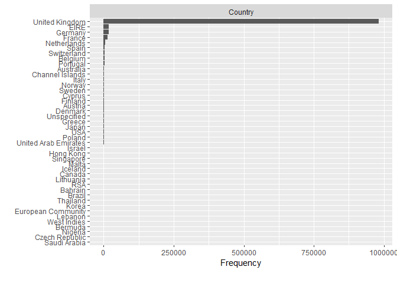

Machine Learning Approach in Inventory Management
================
Dimas Mahesa Kayun,
December 2023

- [Introduction](#introduction)
  - [Overview](#overview)
  - [Aim](#aim)
  - [Data Description](#data-description)
  - [Attribute Information](#attribute-information)
  - [Tech Stack](#tech-stack)
- [Data Preparation & Exploration](#data-preparation--exploration)
  - [Data Preparation](#data-preparation)
  - [Data Exploration](#data-exploration)
    - [Data Type Examination](#data-type-examination)
    - [Missing Value Examination](#missing-value-examination)
    - [Examination on Numeric
      Variables](#examination-on-numeric-variables)
    - [Country Column Examination](#country-column-examination)
    - [Invoice Column Examination](#invoice-column-examination)
    - [StockCode Column Examination](#stockcode-column-examination)
    - [Statistical Summary](#statistical-summary)
- [Data Cleaning](#data-cleaning)
  - [Data Transformation](#data-transformation)
  - [Eliminating NA Values](#eliminating-na-values)
  - [Examining Duplication on the
    Data](#examining-duplication-on-the-data)
  - [Price Adjustment](#price-adjustment)
  - [Handling Outlier](#handling-outlier)
  - [Examining Products Sold](#examining-products-sold)
  - [Final Result](#final-result)

# Introduction

## Overview

XYZ Company, an online non-store retailer based in the United Kingdom,
specializes in selling unique gift items, with the majority of its
customers being wholesalers. The main problem faced by XYZ Company is
the absence of a proper inventory management system to handle large and
varied data, resulting in inaccurate conclusions about the actions that
should be taken.

Data collection was carried out by downloading the online_retail2
dataset from the UC Irvine Machine Learning Repository website in csv
format. The dataset contains historical transaction data that occurred
between 1 December 2009 and 9 December 2011, at a UK-based non-store
online retailer, totaling 1,067,371 rows of data and consisting of 8
variables.

## Aim

This section is done as data preparation before modeling by carrying out
the process of data cleaning and exploratory data analysis.

## Data Description

The
[online_retail2.csv](https://archive.ics.uci.edu/ml/datasets/Online+Retail+II)
dataset contains all transactions that occurred between 01/12/2009 and
09/12/2011 at a non-store-based online retail company in the United
Kingdom. The company specializes in selling unique gift items, with a
majority of its customers being wholesale agents.

## Attribute Information

- **InvoiceNo** : Invoice number (Nominal), a 6-digit integral number
  uniquely assigned to each transaction. If this code starts with the
  letter ‘c’, it indicates a cancellation.  
- **StockCode** : Product code (Nominal), a 5-digit integral number
  uniquely assigned to each distinct product.  
- **Description** : Product name (Nominal).  
- **Quantity** : The quantities of each product per transaction
  (Numeric).  
- **InvoiceDate** : Invoice date and time (Numeric), the day and time
  when a transaction was generated.  
- **Price** : Unit price (Numeric), Product price per unit in pound
  sterling (£).  
- **CustomerID** : Customer number (Nominal), a 5-digit integral number
  uniquely assigned to each customer.  
- **Country** : Country name (Nominal), the name of the country where a
  customer resides.

## Tech Stack

**Language used**: R  
**Library used**: tidyverse, lubridate, DataExplorer, and janitor

# Data Preparation & Exploration

Data preparation involves preparing the data to be used in modeling.
This process begins with inputting the dataset and libraries used in
modeling. On the other hand, data exploration is a step carried out to
understand the data before processing it further by exploring
information to see the characteristics and patterns within the data.

In this process, data will be explored with the aim of finding basic
information in the data to determine if each variable already has the
correct data type, how many missing values there are, if there are any
outliers, and what patterns exist in the data.

## Data Preparation

``` r
##import library
library(tidyverse)
library(lubridate)
library(DataExplorer)
library(janitor)

##import and shows dataframe briefly
retail <- read_csv("../../machine_learning_approach_in_inventory_management/dataset/online_retail2.csv")
head(retail, 5)
```

    ## # A tibble: 5 × 8
    ##   Invoice StockCode Description Quantity InvoiceDate         Price `Customer ID`
    ##   <chr>   <chr>     <chr>          <dbl> <dttm>              <dbl>         <dbl>
    ## 1 489434  85048     "15CM CHRI…       12 2009-12-01 07:45:00  6.95         13085
    ## 2 489434  79323P    "PINK CHER…       12 2009-12-01 07:45:00  6.75         13085
    ## 3 489434  79323W    "WHITE CHE…       12 2009-12-01 07:45:00  6.75         13085
    ## 4 489434  22041     "RECORD FR…       48 2009-12-01 07:45:00  2.1          13085
    ## 5 489434  21232     "STRAWBERR…       24 2009-12-01 07:45:00  1.25         13085
    ## # ℹ 1 more variable: Country <chr>

## Data Exploration

In this section, we will explore the data to find basic information in
the data frame. We will determine if each variable in the data frame has
the correct data type, identify the number of missing values in the
data, and identify the columns that contain these missing values.
Additionally, we will uncover some patterns within the data.

### Data Type Examination

It is essential to examine the data types in a data frame to verify
their correctness and identify any inconsistencies. Consequently, data
transformations may be required.

``` r
###data type 
str(retail) 
```

    ## spc_tbl_ [1,067,371 × 8] (S3: spec_tbl_df/tbl_df/tbl/data.frame)
    ##  $ Invoice    : chr [1:1067371] "489434" "489434" "489434" "489434" ...
    ##  $ StockCode  : chr [1:1067371] "85048" "79323P" "79323W" "22041" ...
    ##  $ Description: chr [1:1067371] "15CM CHRISTMAS GLASS BALL 20 LIGHTS" "PINK CHERRY LIGHTS" "WHITE CHERRY LIGHTS" "RECORD FRAME 7\" SINGLE SIZE" ...
    ##  $ Quantity   : num [1:1067371] 12 12 12 48 24 24 24 10 12 12 ...
    ##  $ InvoiceDate: POSIXct[1:1067371], format: "2009-12-01 07:45:00" "2009-12-01 07:45:00" ...
    ##  $ Price      : num [1:1067371] 6.95 6.75 6.75 2.1 1.25 1.65 1.25 5.95 2.55 3.75 ...
    ##  $ Customer ID: num [1:1067371] 13085 13085 13085 13085 13085 ...
    ##  $ Country    : chr [1:1067371] "United Kingdom" "United Kingdom" "United Kingdom" "United Kingdom" ...
    ##  - attr(*, "spec")=
    ##   .. cols(
    ##   ..   Invoice = col_character(),
    ##   ..   StockCode = col_character(),
    ##   ..   Description = col_character(),
    ##   ..   Quantity = col_double(),
    ##   ..   InvoiceDate = col_datetime(format = ""),
    ##   ..   Price = col_double(),
    ##   ..   `Customer ID` = col_double(),
    ##   ..   Country = col_character()
    ##   .. )
    ##  - attr(*, "problems")=<externalptr>

An incorrect column name was found, specifically the Customer ID column,
which requires transformation such as renaming the column to Customer_ID
and changing its data type from numeric to character. Then, a
transformation is needed on the InvoiceDate column by splitting it into
2 columns, Date and Time, and changing the data type of the Date column
from date time to date.

### Missing Value Examination

This process involves identifying whether there are missing values in
the dataframe. Missing values are commonly found in dataframes and can
significantly impact modeling results. If missing values are not handled
properly, the modeling results will be inaccurate.

``` r
###missing value
retail %>% profile_missing()
```

    ## # A tibble: 8 × 3
    ##   feature     num_missing pct_missing
    ##   <fct>             <int>       <dbl>
    ## 1 Invoice               0     0      
    ## 2 StockCode             0     0      
    ## 3 Description        4382     0.00411
    ## 4 Quantity              0     0      
    ## 5 InvoiceDate           0     0      
    ## 6 Price                 0     0      
    ## 7 Customer ID      243007     0.228  
    ## 8 Country               0     0

The dataframe contains a significant number of missing values,
specifically 247,389 observation. The Customer ID column has the highest
count of missing values, followed by the Description column. To ensure
accurate modeling results, it is necessary to eliminate these missing
values from the data frame.

### Examination on Numeric Variables

``` r
###numeric variables distribution
retail %>% plot_histogram()
```

<!-- -->

The Price and Quantity columns display anomalies, as observed in the
plot above. The generated plot only shows a single vertical line
indicating the presence of outliers, and the data in these columns is
not well-distributed. Therefore, a transformation is needed to remove
the outliers in the data frame in order to achieve accurate modeling.

### Country Column Examination

This step is performed to showcase the countries listed in the data
frame and gather insights into the countries where transactions took
place and the corresponding transaction counts.

``` r
###countries listed in data frame 
unique(retail$Country) 
```

    ##  [1] "United Kingdom"       "France"               "USA"                 
    ##  [4] "Belgium"              "Australia"            "EIRE"                
    ##  [7] "Germany"              "Portugal"             "Japan"               
    ## [10] "Denmark"              "Nigeria"              "Netherlands"         
    ## [13] "Poland"               "Spain"                "Channel Islands"     
    ## [16] "Italy"                "Cyprus"               "Greece"              
    ## [19] "Norway"               "Austria"              "Sweden"              
    ## [22] "United Arab Emirates" "Finland"              "Switzerland"         
    ## [25] "Unspecified"          "Malta"                "Bahrain"             
    ## [28] "RSA"                  "Bermuda"              "Hong Kong"           
    ## [31] "Singapore"            "Thailand"             "Israel"              
    ## [34] "Lithuania"            "West Indies"          "Lebanon"             
    ## [37] "Korea"                "Brazil"               "Canada"              
    ## [40] "Iceland"              "Saudi Arabia"         "Czech Republic"      
    ## [43] "European Community"

``` r
###bar plot of countries
retail %>% plot_bar()
```

<!-- -->

The data frame contains 43 countries, with the United Kingdom being the
primary location for most transactions. For this modeling, only data
from the United Kingdom will be used, so the data in the dataframe will
be filtered to retrieve only the data from the United Kingdom and
eliminate data from countries other than the United Kingdom.

### Invoice Column Examination

``` r
###character length in every invoice
table(nchar(retail$Invoice, type = "chars"))
```

    ## 
    ##       6       7 
    ## 1047871   19500

The length of characters in each invoice is provided in two sets of
information. The first set consists of 1,047,871 invoice data with a
length of 6 characters, while the second set includes 19,500 invoice
data with a length of 7 characters.

``` r
###invoices with 6 character length
retail %>% select(Invoice) %>%  filter(nchar(Invoice) == 6) %>% distinct() %>% head()
```

    ## # A tibble: 6 × 1
    ##   Invoice
    ##   <chr>  
    ## 1 489434 
    ## 2 489435 
    ## 3 489436 
    ## 4 489437 
    ## 5 489438 
    ## 6 489439

``` r
###invoices with 7 character length
retail %>% select(Invoice) %>%  filter(nchar(Invoice) == 7) %>% distinct() %>% head()
```

    ## # A tibble: 6 × 1
    ##   Invoice
    ##   <chr>  
    ## 1 C489449
    ## 2 C489459
    ## 3 C489476
    ## 4 C489503
    ## 5 C489504
    ## 6 C489518

In the invoices with 6 character length, there are only numeric codes
that indicate the transactions that have taken place. Meanwhile, the
invoices with 7 character length, contains a combination of letters and
numbers. It commences with the letter C, followed by a 6-character
numerical code that serves as the transaction identifier.

``` r
###Invoices contains "C" letter
retail[grep(pattern="C", x = retail$Invoice, ignore.case=TRUE),]
```

    ## # A tibble: 19,494 × 8
    ##    Invoice StockCode Description              Quantity InvoiceDate         Price
    ##    <chr>   <chr>     <chr>                       <dbl> <dttm>              <dbl>
    ##  1 C489449 22087     PAPER BUNTING WHITE LACE      -12 2009-12-01 10:33:00  2.95
    ##  2 C489449 85206A    CREAM FELT EASTER EGG B…       -6 2009-12-01 10:33:00  1.65
    ##  3 C489449 21895     POTTING SHED SOW 'N' GR…       -4 2009-12-01 10:33:00  4.25
    ##  4 C489449 21896     POTTING SHED TWINE             -6 2009-12-01 10:33:00  2.1 
    ##  5 C489449 22083     PAPER CHAIN KIT RETRO S…      -12 2009-12-01 10:33:00  2.95
    ##  6 C489449 21871     SAVE THE PLANET MUG           -12 2009-12-01 10:33:00  1.25
    ##  7 C489449 84946     ANTIQUE SILVER TEA GLAS…      -12 2009-12-01 10:33:00  1.25
    ##  8 C489449 84970S    HANGING HEART ZINC T-LI…      -24 2009-12-01 10:33:00  0.85
    ##  9 C489449 22090     PAPER BUNTING RETRO SPO…      -12 2009-12-01 10:33:00  2.95
    ## 10 C489459 90200A    PURPLE SWEETHEART BRACE…       -3 2009-12-01 10:44:00  4.25
    ## # ℹ 19,484 more rows
    ## # ℹ 2 more variables: `Customer ID` <dbl>, Country <chr>

The letter C on the invoice represents a canceled transaction, indicated
by a negative value in the Quantity column. This modeling will solely
focus on the sold products, thus eliminating this data as its presence
could lead to inaccurate modeling and analysis.

### StockCode Column Examination

``` r
###character length in every product code
table(nchar(retail$StockCode, type = "chars"))
```

    ## 
    ##      1      2      3      4      5      6      7      8      9     12 
    ##   1713    283   1446   2158 932385 127591   1392    127     74    202

A total of 10 pieces of information are available regarding the
character length of each product code. This includes 1713 product codes
with a length of 1 character, 283 product codes with a length of 2
characters, 1446 product codes with a length of 3 characters, 2158
product codes with a length of 4 characters, 932,385 product codes with
a length of 5 characters, 127,591 product codes with a length of 6
characters, 1392 product codes with a length of 7 characters, 127
product codes with a length of 8 characters, 74 product codes with a
length of 9 characters, and 202 product codes with a length of 12
characters.

``` r
###product code with 1 character length
retail %>% filter(nchar(StockCode) == 1)
```

    ## # A tibble: 1,713 × 8
    ##    Invoice StockCode Description Quantity InvoiceDate           Price
    ##    <chr>   <chr>     <chr>          <dbl> <dttm>                <dbl>
    ##  1 C489535 D         Discount          -1 2009-12-01 12:11:00    9   
    ##  2 C489535 D         Discount          -1 2009-12-01 12:11:00   19   
    ##  3 489609  M         Manual             1 2009-12-01 14:50:00    4   
    ##  4 C489651 M         Manual            -1 2009-12-01 16:48:00    5.1 
    ##  5 C489859 M         Manual            -1 2009-12-02 14:45:00   69.6 
    ##  6 C490126 M         Manual            -1 2009-12-03 18:12:00    5.95
    ##  7 C490129 M         Manual            -1 2009-12-03 18:26:00 1998.  
    ##  8 490300  M         Manual             1 2009-12-04 14:19:00    0.85
    ##  9 490300  M         Manual             1 2009-12-04 14:19:00    0.21
    ## 10 490727  M         Manual             1 2009-12-07 16:38:00    0   
    ## # ℹ 1,703 more rows
    ## # ℹ 2 more variables: `Customer ID` <dbl>, Country <chr>

The product code with a length of 1 character contains Manual, Discount,
SAMPLES, and Adjust bad debt, which are not products for sale.

``` r
###product code with 2 character length
retail %>% filter(nchar(StockCode) == 2)
```

    ## # A tibble: 283 × 8
    ##    Invoice StockCode Description Quantity InvoiceDate         Price
    ##    <chr>   <chr>     <chr>          <dbl> <dttm>              <dbl>
    ##  1 490127  C2        CARRIAGE           1 2009-12-03 18:13:00    50
    ##  2 490541  C2        CARRIAGE           1 2009-12-07 09:25:00    50
    ##  3 490542  C2        CARRIAGE           1 2009-12-07 09:42:00    50
    ##  4 490998  C2        CARRIAGE           1 2009-12-08 17:24:00    50
    ##  5 491160  C2        CARRIAGE           1 2009-12-10 10:29:00    50
    ##  6 491702  C2        CARRIAGE           1 2009-12-13 13:53:00    50
    ##  7 491990  C2        <NA>             100 2009-12-15 10:06:00     0
    ##  8 492092  C2        CARRIAGE           1 2009-12-15 14:03:00    50
    ##  9 492250  C2        CARRIAGE           1 2009-12-16 10:45:00    50
    ## 10 492746  C2        CARRIAGE           1 2009-12-18 13:01:00    50
    ## # ℹ 273 more rows
    ## # ℹ 2 more variables: `Customer ID` <dbl>, Country <chr>

The product code with a length of 2 characters only contains CARRIAGE,
which is not a product for sale.

``` r
###product code with 3 character length
retail %>% filter(nchar(StockCode) == 3)
```

    ## # A tibble: 1,446 × 8
    ##    Invoice StockCode Description    Quantity InvoiceDate         Price
    ##    <chr>   <chr>     <chr>             <dbl> <dttm>              <dbl>
    ##  1 489597  DOT       DOTCOM POSTAGE        1 2009-12-01 14:28:00 647. 
    ##  2 489600  DOT       DOTCOM POSTAGE        1 2009-12-01 14:43:00  56.0
    ##  3 489601  DOT       DOTCOM POSTAGE        1 2009-12-01 14:44:00  68.4
    ##  4 489602  DOT       DOTCOM POSTAGE        1 2009-12-01 14:45:00  59.4
    ##  5 489603  DOT       DOTCOM POSTAGE        1 2009-12-01 14:46:00  42.4
    ##  6 489604  DOT       DOTCOM POSTAGE        1 2009-12-01 14:47:00  50.9
    ##  7 489607  DOT       DOTCOM POSTAGE        1 2009-12-01 14:49:00  76.3
    ##  8 489609  DOT       DOTCOM POSTAGE        1 2009-12-01 14:50:00  74.6
    ##  9 489612  DOT       DOTCOM POSTAGE        1 2009-12-01 14:55:00  87.4
    ## 10 489614  DOT       DOTCOM POSTAGE        1 2009-12-01 14:56:00  80.3
    ## # ℹ 1,436 more rows
    ## # ℹ 2 more variables: `Customer ID` <dbl>, Country <chr>

The product code with a length of 3 characters only contains DOTCOM
POSTAGE, which is not a product for sale.

``` r
###product code with 4 character length
retail %>% filter(nchar(StockCode) == 4)
```

    ## # A tibble: 2,158 × 8
    ##    Invoice StockCode Description Quantity InvoiceDate          Price
    ##    <chr>   <chr>     <chr>          <dbl> <dttm>               <dbl>
    ##  1 489439  POST      POSTAGE            3 2009-12-01 09:28:00  18   
    ##  2 489444  POST      POSTAGE            1 2009-12-01 09:55:00 141   
    ##  3 489447  POST      POSTAGE            1 2009-12-01 10:10:00 130   
    ##  4 489526  POST      POSTAGE            6 2009-12-01 11:50:00  18   
    ##  5 C489538 POST      POSTAGE           -1 2009-12-01 12:18:00   9.58
    ##  6 489557  POST      POSTAGE            4 2009-12-01 12:52:00  18   
    ##  7 C489685 POST      POSTAGE           -1 2009-12-02 10:28:00  18   
    ##  8 489883  POST      POSTAGE            3 2009-12-02 16:24:00  18   
    ##  9 C490117 POST      POSTAGE           -1 2009-12-03 17:38:00   2.99
    ## 10 C490120 POST      POSTAGE           -2 2009-12-03 17:52:00  18   
    ## # ℹ 2,148 more rows
    ## # ℹ 2 more variables: `Customer ID` <dbl>, Country <chr>

The product code with a length of 4 characters only contains POSTAGE,
which is not a product for sale.

``` r
###product code with 5 character length
retail %>% filter(nchar(StockCode) == 5)
```

    ## # A tibble: 932,385 × 8
    ##    Invoice StockCode Description              Quantity InvoiceDate         Price
    ##    <chr>   <chr>     <chr>                       <dbl> <dttm>              <dbl>
    ##  1 489434  85048     "15CM CHRISTMAS GLASS B…       12 2009-12-01 07:45:00  6.95
    ##  2 489434  22041     "RECORD FRAME 7\" SINGL…       48 2009-12-01 07:45:00  2.1 
    ##  3 489434  21232     "STRAWBERRY CERAMIC TRI…       24 2009-12-01 07:45:00  1.25
    ##  4 489434  22064     "PINK DOUGHNUT TRINKET …       24 2009-12-01 07:45:00  1.65
    ##  5 489434  21871     "SAVE THE PLANET MUG"          24 2009-12-01 07:45:00  1.25
    ##  6 489434  21523     "FANCY FONT HOME SWEET …       10 2009-12-01 07:45:00  5.95
    ##  7 489435  22350     "CAT BOWL"                     12 2009-12-01 07:46:00  2.55
    ##  8 489435  22349     "DOG BOWL , CHASING BAL…       12 2009-12-01 07:46:00  3.75
    ##  9 489435  22195     "HEART MEASURING SPOONS…       24 2009-12-01 07:46:00  1.65
    ## 10 489435  22353     "LUNCHBOX WITH CUTLERY …       12 2009-12-01 07:46:00  2.55
    ## # ℹ 932,375 more rows
    ## # ℹ 2 more variables: `Customer ID` <dbl>, Country <chr>

The product code with a length of 5 character contains 15CM CHRISTMAS
GLASS BALL 20 LIGHTS, RECORD FRAME 7” SINGLE SIZE, STRAWBERRY CERAMIC
TRINKET BOX, and many more, which are products for sale.

``` r
###product code with 6 character length
retail %>% filter(nchar(StockCode) == 6)
```

    ## # A tibble: 127,591 × 8
    ##    Invoice StockCode Description              Quantity InvoiceDate         Price
    ##    <chr>   <chr>     <chr>                       <dbl> <dttm>              <dbl>
    ##  1 489434  79323P    PINK CHERRY LIGHTS             12 2009-12-01 07:45:00  6.75
    ##  2 489434  79323W    WHITE CHERRY LIGHTS            12 2009-12-01 07:45:00  6.75
    ##  3 489436  48173C    DOOR MAT BLACK FLOCK           10 2009-12-01 09:06:00  5.95
    ##  4 489436  35004B    SET OF 3 BLACK FLYING D…       12 2009-12-01 09:06:00  4.65
    ##  5 489436  84596F    SMALL MARSHMALLOWS PINK…        8 2009-12-01 09:06:00  1.25
    ##  6 489436  84596L    BISCUITS SMALL BOWL LIG…        8 2009-12-01 09:06:00  1.25
    ##  7 489437  84507B    STRIPES DESIGN MONKEY D…        6 2009-12-01 09:08:00  2.55
    ##  8 489437  84970S    HANGING HEART ZINC T-LI…       12 2009-12-01 09:08:00  0.85
    ##  9 489438  84031A    CHARLIE+LOLA RED HOT WA…       56 2009-12-01 09:24:00  3   
    ## 10 489438  84031B    CHARLIE LOLA BLUE HOT W…       56 2009-12-01 09:24:00  3   
    ## # ℹ 127,581 more rows
    ## # ℹ 2 more variables: `Customer ID` <dbl>, Country <chr>

The product code with a length of 6 character contains PINK CHERRY
LIGHTS, WHITE CHERRY LIGHTS, DOOR MAT BLACK FLOCK, and many more, which
are products for sale.

``` r
###product code with 7 character length
retail %>% filter(nchar(StockCode) == 7)
```

    ## # A tibble: 1,392 × 8
    ##    Invoice StockCode Description              Quantity InvoiceDate         Price
    ##    <chr>   <chr>     <chr>                       <dbl> <dttm>              <dbl>
    ##  1 489522  79323LP   LIGHT PINK CHERRY LIGHTS        1 2009-12-01 11:45:00  6.75
    ##  2 489526  15056BL   EDWARDIAN PARASOL BLACK         6 2009-12-01 11:50:00  5.95
    ##  3 C489588 79323GR   GREEN CHERRY LIGHTS            -2 2009-12-01 14:01:00  6.75
    ##  4 489604  15056bl   EDWARDIAN PARASOL BLACK         1 2009-12-01 14:47:00 13   
    ##  5 489658  15056BL   EDWARDIAN PARASOL BLACK        12 2009-12-01 17:31:00  5.95
    ##  6 489658  79323LP   LIGHT PINK CHERRY LIGHTS        6 2009-12-01 17:31:00  6.75
    ##  7 489664  79323GR   GREEN CHERRY LIGHTS             2 2009-12-01 18:03:00  6.75
    ##  8 489675  15056BL   EDWARDIAN PARASOL BLACK       240 2009-12-02 09:47:00  4.6 
    ##  9 489688  79323LP   LIGHT PINK CHERRY LIGHTS       24 2009-12-02 10:42:00  5.45
    ## 10 489789  15056BL   EDWARDIAN PARASOL BLACK         3 2009-12-02 11:59:00  5.95
    ## # ℹ 1,382 more rows
    ## # ℹ 2 more variables: `Customer ID` <dbl>, Country <chr>

The product code with a length of 7 character contains LIGHT PINK CHERRY
LIGHTS, EDWARDIAN PARASOL BLACK, GREEN CHERRY LIGHTS, and many more,
which are products for sale.

``` r
###product code with 8 character length
retail %>% filter(nchar(StockCode) == 8)
```

    ## # A tibble: 127 × 8
    ##    Invoice StockCode Description              Quantity InvoiceDate         Price
    ##    <chr>   <chr>     <chr>                       <dbl> <dttm>              <dbl>
    ##  1 489597  DCGS0058  MISO PRETTY  GUM                1 2009-12-01 14:28:00  0.83
    ##  2 489597  DCGS0068  DOGS NIGHT COLLAR               1 2009-12-01 14:28:00  8.65
    ##  3 490074  DCGS0004  HAYNES CAMPER SHOULDER …        1 2009-12-03 14:39:00 17.4 
    ##  4 490074  DCGS0058  MISO PRETTY  GUM                1 2009-12-03 14:39:00  0.83
    ##  5 490074  DCGS0076  SUNJAR LED NIGHT NIGHT …        1 2009-12-03 14:39:00 16.5 
    ##  6 490741  DCGS0076  SUNJAR LED NIGHT NIGHT …        1 2009-12-07 17:56:00 16.5 
    ##  7 490745  DCGS0058  MISO PRETTY  GUM                1 2009-12-07 18:02:00  0.83
    ##  8 490745  DCGS0076  SUNJAR LED NIGHT NIGHT …        1 2009-12-07 18:02:00 16.5 
    ##  9 491041  DCGS0003  BOXED GLASS ASHTRAY             1 2009-12-09 09:42:00  2.57
    ## 10 491043  DCGS0076  SUNJAR LED NIGHT NIGHT …        1 2009-12-09 09:51:00 16.5 
    ## # ℹ 117 more rows
    ## # ℹ 2 more variables: `Customer ID` <dbl>, Country <chr>

The product code with a length of 8 character contains BOYS PARTY BAG,
HAYNES CAMPER SHOULDER BAG, BOXED GLASS ASHTRAY, and many more, which
are products for sale.

``` r
###product code with 9 character length
retail %>% filter(nchar(StockCode) == 9)
```

    ## # A tibble: 74 × 8
    ##    Invoice StockCode Description             Quantity InvoiceDate         Price
    ##    <chr>   <chr>     <chr>                      <dbl> <dttm>              <dbl>
    ##  1 493265  DCGS0066N NAVY CUDDLES DOG HOODIE        1 2009-12-22 15:05:00  8.65
    ##  2 493268  DCGS0066N <NA>                           1 2009-12-22 15:07:00  0   
    ##  3 493269  DCGS0066N NAVY CUDDLES DOG HOODIE        1 2009-12-22 15:07:00  8.65
    ##  4 493289  DCGS0066N <NA>                           1 2009-12-22 15:13:00  0   
    ##  5 496722  DCGSSGIRL <NA>                          -1 2010-02-03 14:04:00  0   
    ##  6 499042  DCGSLGIRL <NA>                         -57 2010-02-24 13:31:00  0   
    ##  7 512738  DCGSSGIRL update                       100 2010-06-17 14:11:00  0   
    ##  8 513099  DCGSSGIRL GIRLS PARTY BAG                3 2010-06-21 15:13:00  3.36
    ##  9 513200  DCGSSGIRL GIRLS PARTY BAG                6 2010-06-22 16:28:00  3.36
    ## 10 513574  DCGSSGIRL GIRLS PARTY BAG                1 2010-06-25 15:13:00  3.36
    ## # ℹ 64 more rows
    ## # ℹ 2 more variables: `Customer ID` <dbl>, Country <chr>

The product code with a length of 9 character contains NAVY CUDDLES DOG
HOODIE dan GIRLS PARTY BAG and many more, which are products for sale.
while update dan AMAZON FEE are not products for sale.

``` r
###product code with 12 character length
retail %>% filter(nchar(StockCode) == 12)
```

    ## # A tibble: 202 × 8
    ##    Invoice StockCode    Description          Quantity InvoiceDate          Price
    ##    <chr>   <chr>        <chr>                   <dbl> <dttm>               <dbl>
    ##  1 C490943 BANK CHARGES Bank Charges               -1 2009-12-08 14:08:00  15   
    ##  2 490948  BANK CHARGES Bank Charges                1 2009-12-08 14:29:00  15   
    ##  3 491968  gift_0001_80 <NA>                        2 2009-12-14 17:56:00   0   
    ##  4 491969  gift_0001_80 Dotcomgiftshop Gift…        1 2009-12-14 17:57:00  69.6 
    ##  5 491971  gift_0001_20 Dotcomgiftshop Gift…        2 2009-12-14 18:37:00  17.4 
    ##  6 C492206 BANK CHARGES Bank Charges               -1 2009-12-15 16:32:00 848.  
    ##  7 492782  gift_0001_10 Dotcomgiftshop Gift…        1 2009-12-18 17:06:00   8.69
    ##  8 492782  gift_0001_20 Dotcomgiftshop Gift…        1 2009-12-18 17:06:00  17.4 
    ##  9 492783  gift_0001_50 Dotcomgiftshop Gift…        1 2009-12-18 17:15:00  43.5 
    ## 10 493404  gift_0001_30 Dotcomgiftshop Gift…        1 2009-12-23 15:30:00  26.1 
    ## # ℹ 192 more rows
    ## # ℹ 2 more variables: `Customer ID` <dbl>, Country <chr>

The product code with a length of 12 character contains Bank Charges dan
Dotcomgiftshop Gift Voucher, which are not products for sale.

As it is known, the product code contains a unique number assigned
uniquely for each different product. Product codes with lengths of 1, 2,
3, 4, and 12 characters are not products for sale, so these data will be
eliminated.

### Statistical Summary

``` r
###statistical summary of the data
summary(retail) 
```

    ##    Invoice           StockCode         Description           Quantity        
    ##  Length:1067371     Length:1067371     Length:1067371     Min.   :-80995.00  
    ##  Class :character   Class :character   Class :character   1st Qu.:     1.00  
    ##  Mode  :character   Mode  :character   Mode  :character   Median :     3.00  
    ##                                                           Mean   :     9.94  
    ##                                                           3rd Qu.:    10.00  
    ##                                                           Max.   : 80995.00  
    ##                                                                              
    ##   InvoiceDate                         Price            Customer ID    
    ##  Min.   :2009-12-01 07:45:00.00   Min.   :-53594.36   Min.   :12346   
    ##  1st Qu.:2010-07-09 09:46:00.00   1st Qu.:     1.25   1st Qu.:13975   
    ##  Median :2010-12-07 15:28:00.00   Median :     2.10   Median :15255   
    ##  Mean   :2011-01-02 21:13:55.39   Mean   :     4.65   Mean   :15325   
    ##  3rd Qu.:2011-07-22 10:23:00.00   3rd Qu.:     4.15   3rd Qu.:16797   
    ##  Max.   :2011-12-09 12:50:00.00   Max.   : 38970.00   Max.   :18287   
    ##                                                       NA's   :243007  
    ##    Country         
    ##  Length:1067371    
    ##  Class :character  
    ##  Mode  :character  
    ##                    
    ##                    
    ##                    
    ## 

The statistical summary provides statistical information for each column
or variable in the dataframe. The Quantity column contains an outlier
with a minimum value of -80.955 and a maximum value of 80.955. The first
quartile value is 1, the median is 3, the mean is 9.94, and the third
quartile value is 10.

Similarly, the Price column has a minimum value of -£53,594.36 and a
maximum value of £38,970. The first quartile value is £1.25, the median
is £2.10, the mean is £4.65, and the third quartile value is £4.15.
Therefore, transformation is necessary to eliminate outliers in the
dataframe for accurate modeling.

The Customer ID column also provides information such as the minimum
value, first quartile value, median, mean, third quartile value, and
maximum value, indicating that the data type in that column is numeric.
Hence, transformation is needed to change the data type from numeric to
character.

# Data Cleaning

Data cleaning is the process of improving or removing inaccurate,
damaged, improperly formatted, duplicate, or incomplete data. This
process is carried out to transform raw data into a more user-friendly
format by converting the initially messy and complex raw data into
high-quality data. This stage is accomplished by performing
transformations on data that are not in the correct format, making
adjustments to outlier values within the data, and eliminating
unnecessary data.

## Data Transformation

This step is taken to transform several columns, such as InvoiceDate,
Customer ID, and Country. The transformation on the InvoiceDate column
is done by splitting it into 2 columns, namely Date and Time, and
changing the data type of the Date column from date time to date.

Next, for the Customer ID column, the column name is changed to
Customer_ID and its data type is changed from numeric to character. For
the Country column, filtering is done to retrieve data originating from
the United Kingdom only and eliminate data from countries other than the
United Kingdom.

After that, invoices starting with the letter “C” will be removed
because these invoices contain canceled transactions and have negative
values. Then, a filter will be applied to retrieve data with product
codes that have a character length of 5, 6, 7, 8, and 9 digits.

``` r
##data transformation 
###split InvoiceDate into Date and Time 
retail <- retail %>% separate(col = InvoiceDate,
                              into = c("Date", "Time"),
                              sep = " ")

###change data type from date time to date
retail$Date <- as.Date(retail$Date)

###change column name
names(retail)[names(retail) == "Customer ID"] <- "Customer_ID" 

### make Customer_ID as character
retail$Customer_ID <- as.character(retail$Customer_ID)

###select data from the United Kingdom only
retail <- retail %>% filter(Country == "United Kingdom")

###eliminate country column
retail <- select(retail, -Country)

###eliminate invoice contains "C" letter
retail <- retail %>% filter(!grepl(pattern = "C", x = Invoice)) 

###filter product code
retail <- retail %>% filter(nchar(StockCode) >= 5 & nchar(StockCode) < 12)
```

## Eliminating NA Values

As mentioned before, there are missing values in the dataframe, with the
Customer_ID column having the highest number of missing values, followed
by the Description column. These missing values will be removed from the
dataset as they do not provide much information and cannot be replaced
with other values such as the mean or any other value.

``` r
##eliminating missing values
retail <- na.omit(retail)
```

## Examining Duplication on the Data

This process focuses on identifying whether there are duplicates in the
data within the data frame. Data duplication is commonly found in data
frames and can occur due to errors or mistakes in data input. The
process of checking for duplicate data is necessary, as if duplicate
data is not handled properly, the modeling results will become
inaccurate.

``` r
##examining duplication in the data
get_dupes(retail)
```

    ## # A tibble: 48,262 × 9
    ##    Invoice StockCode Description     Quantity Date       Time  Price Customer_ID
    ##    <chr>   <chr>     <chr>              <dbl> <date>     <chr> <dbl> <chr>      
    ##  1 555524  22698     PINK REGENCY T…        1 2011-06-05 11:3…  2.95 16923      
    ##  2 555524  22698     PINK REGENCY T…        1 2011-06-05 11:3…  2.95 16923      
    ##  3 555524  22698     PINK REGENCY T…        1 2011-06-05 11:3…  2.95 16923      
    ##  4 555524  22698     PINK REGENCY T…        1 2011-06-05 11:3…  2.95 16923      
    ##  5 555524  22698     PINK REGENCY T…        1 2011-06-05 11:3…  2.95 16923      
    ##  6 555524  22698     PINK REGENCY T…        1 2011-06-05 11:3…  2.95 16923      
    ##  7 555524  22698     PINK REGENCY T…        1 2011-06-05 11:3…  2.95 16923      
    ##  8 555524  22698     PINK REGENCY T…        1 2011-06-05 11:3…  2.95 16923      
    ##  9 555524  22698     PINK REGENCY T…        1 2011-06-05 11:3…  2.95 16923      
    ## 10 555524  22698     PINK REGENCY T…        1 2011-06-05 11:3…  2.95 16923      
    ## # ℹ 48,252 more rows
    ## # ℹ 1 more variable: dupe_count <int>

There are duplications on the data frame such as **PINK REGENCY TEACUP
AND SAUCER**, **GREEN REGENCY TEACUP AND SAUCER**, **HI TEC ALPINE HAND
WARMER**, and many more. The duplicate data is on the same invoice and
time.

In this case, it is assumed that there is an error in the system that
does not capture quantity increments but captures them as duplicate
purchase items in different rows on the same invoice, therefore such
data duplication will still be ignored and not deleted.

## Price Adjustment

It is known that the Price column has a minimum value of negative
£53,594.36 and a maximum value of £38,970, which significantly deviates
from the first quartile, median, mean, and third quartile values. Hence,
a transformation is needed to address outlier values in the data frame
for accurate modeling.

``` r
##adjustment in Price column
###statistical summary of Price column 
retail %>% select(Price) %>% summary
```

    ##      Price        
    ##  Min.   :  0.000  
    ##  1st Qu.:  1.250  
    ##  Median :  1.950  
    ##  Mean   :  2.932  
    ##  3rd Qu.:  3.750  
    ##  Max.   :649.500

The provided summary statistics clearly demonstrate a change in the
Price column. Previously, the minimum value in this column was negative,
but it has now been adjusted to £0 as the new minimum value. In this
modeling will focus on the products being sold, thus requiring a data
filter to retain only those products with a minimum price that greater
than £0. However, prior to applying the filter, it is important to
conduct an examination to identify which products have prices greater
than £0.

``` r
###examining price with value greater than 0 and less or equal to 1
retail %>% 
  filter(Price > 0 & Price <= 1) %>% 
  select(Description, Price) %>% 
  distinct() %>% 
  arrange(Price)
```

    ## # A tibble: 2,907 × 2
    ##    Description                         Price
    ##    <chr>                               <dbl>
    ##  1 POPART COL BALLPOINT PEN ASST        0.03
    ##  2 ASSORTED SHAPED STENCIL FOR HENNA    0.04
    ##  3 POPART WOODEN PENCILS ASST           0.04
    ##  4 THE KING GIFT BAG                    0.05
    ##  5 JACOBS LADDER SMALL                  0.06
    ##  6 POP ART PUSH DOWN RUBBER             0.06
    ##  7 ARMY CAMO WRAPPING TAPE              0.06
    ##  8 HEARTS WRAPPING TAPE                 0.06
    ##  9 ESSENTIAL BALM 3.5g TIN IN ENVELOPE  0.06
    ## 10 CARTOON  PENCIL SHARPENERS           0.06
    ## # ℹ 2,897 more rows

After filtering the data, it was discovered that certain products have
prices greater than £0, and these products are the ones that have been
sold. as a result, a further filtering will be conducted to choose the
products with prices higher than £0 as the minimum value in the Price
column.

``` r
###filter 0 as the minimum value
retail <- retail %>%  filter(Price > 0)
```

## Handling Outlier

Outliers are data observations that deviate significantly from other
data observations in a dataset. Outliers can introduce bias in the
analysis, therefore it is necessary to handle them before conducting the
data analysis process. In the Price column, there are outliers where the
minimum and maximum values are far apart from the first quartile,
median, mean, and third quartile values.

To handle these outliers in the Price variable, a data transformation
will be performed by filtering the data in the data frame. This will
ensure that the modeling results are accurate. In this modeling, the
focus is on the products for sale. Therefore, a data filter will be
applied to only include products with a minimum product price greater
than £0.

``` r
##handling outlier
###statistical summary in Quantity dan Price 
retail %>% select(Quantity, Price) %>% summary
```

    ##     Quantity         Price        
    ##  Min.   :    1   Min.   :  0.030  
    ##  1st Qu.:    2   1st Qu.:  1.250  
    ##  Median :    4   Median :  1.950  
    ##  Mean   :   12   Mean   :  2.932  
    ##  3rd Qu.:   12   3rd Qu.:  3.750  
    ##  Max.   :80995   Max.   :649.500

The minimum values in the Quantity and Price columns have significantly
improved. The minimum value in the Quantity column is 1, indicating that
the minimum number of products sold in a transaction is one.

However, there are still outliers in both columns, specifically in the
maximum values of these columns, which require transformation to handle
the outliers. Transformation will only be performed on the Quantity
column because the product price in the Price column is a fixed variable
that has already been determined and cannot be changed.

Before performing the transformation on the Quantity column, it is
necessary to examine the data distribution by using percentiles. By
observing the data distribution using percentiles, we can identify at
which percentile a significant change occurs.

``` r
###finding desil (10th, 20th, th30, ..., 100th percentile) in Quantity column
quantile(retail$Quantity, probs = seq(.1, 1, by = .1))
```

    ##   10%   20%   30%   40%   50%   60%   70%   80%   90%  100% 
    ##     1     1     2     3     4     6    10    12    24 80995

A significant change occurred from the 90th percentile to the 100th
percentile, where the observation value at the 90th percentile was 24
while the observation value at the 100th percentile was 80.995. Since
the outlier was only at the maximum value, a transformation was carried
out by changing the outlier value using the capping method, creating an
upper limit function with the formula Q1 + (1.5 x IQR). For observations
beyond the upper limit, the value in those observations will be replaced
with the 90th percentile value, which is the value at the percentile
where the significant change occurred.

``` r
###applying capping method in Quantity column
cap_outlier <- function(x){
  qnt <- quantile(x, probs = .75)
  caps <- quantile(x, probs= .90)
  H <- 1.5 * IQR(x, na.rm = T)
  x[x > (qnt + H)] <- caps
  return(x)
}
retail$Quantity <- cap_outlier(retail$Quantity)
```

After performing a transformation to remove outlier values in the
Quantity column, the next step is to create a boxplot that provides a
visual representation of the overall data distribution.

``` r
###set plot area 1 row and 2 column
par(mfrow = c(1, 2))

###boxplot Quantity column
boxplot(retail$Quantity, main = "Quantity")

###boxplot Price column
boxplot(retail$Price, main = "Price")
```

<!-- -->

There are no outliers left in the Quantity column, indicating the
successful implementation of outlier handling transformation. Although
there are still outliers exist in the Price column, they can be ignored
as product prices are fixed variables that cannot be modified.

## Examining Products Sold

Examination of sold products is conducted to verify whether all data are
sold items or if there are any data that are not sold products, which
could interfere with the analysis and lead to biased and inaccurate
results. This examination involves displaying each sold item and
arranging them from highest to lowest price.

``` r
##examining product sold
###examining which products has the highest price 
retail %>% 
  select(Price, Quantity, Description) %>% 
  arrange(desc(Price)) 
```

    ## # A tibble: 724,465 × 3
    ##    Price Quantity Description                        
    ##    <dbl>    <dbl> <chr>                              
    ##  1  650.       24 PICNIC BASKET WICKER 60 PIECES     
    ##  2  650.        1 PICNIC BASKET WICKER 60 PIECES     
    ##  3  388.        1 Adjustment by john on 26/01/2010 17
    ##  4  358.        1 Adjustment by Peter on Jun 25 2010 
    ##  5  343.        1 Adjustment by john on 26/01/2010 16
    ##  6  300.        1 Adjustment by Peter on Jun 25 2010 
    ##  7  295         1 VINTAGE BLUE KITCHEN CABINET       
    ##  8  295         1 VINTAGE RED KITCHEN CABINET        
    ##  9  295         1 VINTAGE BLUE KITCHEN CABINET       
    ## 10  295         1 VINTAGE BLUE KITCHEN CABINET       
    ## # ℹ 724,455 more rows

The results above show what products are sold at the highest price.
However, the results show that there are several **Adjustment** which
has a fairly high price.

These **Adjustment** assumed that they are not a product sold so that
the data will be eliminated by transforming. The transformation is done
by finding data containing the word “Adjustment” in the Description
column, then deleting it from the dataframe.

``` r
###eliminate data that contain "Adjustment" in the Description column
retail <- retail[-grep(pattern="Adjustment", x = retail$Description, ignore.case=TRUE),]
```

After transforming the Description column, then a reexamination is
conducted on the sold products to ensure whether all data are indeed
sold products or if there are still data that are not sold products.

``` r
###reexamining which products has the highest price
retail %>% 
  select(Price, Quantity, Description) %>% 
  arrange(desc(Price))
```

    ## # A tibble: 724,452 × 3
    ##    Price Quantity Description                   
    ##    <dbl>    <dbl> <chr>                         
    ##  1  650.       24 PICNIC BASKET WICKER 60 PIECES
    ##  2  650.        1 PICNIC BASKET WICKER 60 PIECES
    ##  3  295         1 VINTAGE BLUE KITCHEN CABINET  
    ##  4  295         1 VINTAGE RED KITCHEN CABINET   
    ##  5  295         1 VINTAGE BLUE KITCHEN CABINET  
    ##  6  295         1 VINTAGE BLUE KITCHEN CABINET  
    ##  7  295         1 VINTAGE BLUE KITCHEN CABINET  
    ##  8  295         1 VINTAGE RED KITCHEN CABINET   
    ##  9  295         1 VINTAGE BLUE KITCHEN CABINET  
    ## 10  295         1 VINTAGE RED KITCHEN CABINET   
    ## # ℹ 724,442 more rows

Upon conducting a reexamination of the sold products, the findings
indicate that all the data are of sold products, with no data found that
are not sold products.

## Final Result

This process represents the final phase containing the outcomes of the
data cleaning process, where the dataframe will be displayed after the
cleaning and transformation process has been carried out.

``` r
###clean dataframe 
retail
```

    ## # A tibble: 724,452 × 8
    ##    Invoice StockCode Description     Quantity Date       Time  Price Customer_ID
    ##    <chr>   <chr>     <chr>              <dbl> <date>     <chr> <dbl> <chr>      
    ##  1 489434  85048     "15CM CHRISTMA…       12 2009-12-01 07:4…  6.95 13085      
    ##  2 489434  79323P    "PINK CHERRY L…       12 2009-12-01 07:4…  6.75 13085      
    ##  3 489434  79323W    "WHITE CHERRY …       12 2009-12-01 07:4…  6.75 13085      
    ##  4 489434  22041     "RECORD FRAME …       24 2009-12-01 07:4…  2.1  13085      
    ##  5 489434  21232     "STRAWBERRY CE…       24 2009-12-01 07:4…  1.25 13085      
    ##  6 489434  22064     "PINK DOUGHNUT…       24 2009-12-01 07:4…  1.65 13085      
    ##  7 489434  21871     "SAVE THE PLAN…       24 2009-12-01 07:4…  1.25 13085      
    ##  8 489434  21523     "FANCY FONT HO…       10 2009-12-01 07:4…  5.95 13085      
    ##  9 489435  22350     "CAT BOWL"            12 2009-12-01 07:4…  2.55 13085      
    ## 10 489435  22349     "DOG BOWL , CH…       12 2009-12-01 07:4…  3.75 13085      
    ## # ℹ 724,442 more rows

The dataframe displayed above represents the result of the data cleaning
process. Initially, there were data entries that did not meet the
required format, as well as missing values, outliers, and unnecessary
data. The raw data, which initially contained 1,067,371 rows of data
with 8 variables, has now been reduced to a final dataset of 724,452
rows of data with 8 variables after the completion of the data cleaning
process.

``` r
###final statistical summary
summary(retail)
```

    ##    Invoice           StockCode         Description           Quantity     
    ##  Length:724452      Length:724452      Length:724452      Min.   : 1.000  
    ##  Class :character   Class :character   Class :character   1st Qu.: 2.000  
    ##  Mode  :character   Mode  :character   Mode  :character   Median : 4.000  
    ##                                                           Mean   : 7.585  
    ##                                                           3rd Qu.:12.000  
    ##                                                           Max.   :27.000  
    ##       Date                Time               Price         Customer_ID       
    ##  Min.   :2009-12-01   Length:724452      Min.   :  0.030   Length:724452     
    ##  1st Qu.:2010-07-05   Class :character   1st Qu.:  1.250   Class :character  
    ##  Median :2010-12-02   Mode  :character   Median :  1.950   Mode  :character  
    ##  Mean   :2010-12-30                      Mean   :  2.929                     
    ##  3rd Qu.:2011-07-26                      3rd Qu.:  3.750                     
    ##  Max.   :2011-12-09                      Max.   :649.500

The above statistical summary indicates that there are 8 variables in
the dataframe, namely Invoice, StockCode, Description, Quantity, Date,
Time, Price, and Customer_ID.

There is a variable or column that has been removed, namely the Country
column. This column is not needed because a transformation has been
performed to only store transaction data originating from the United
Kingdom and remove transactions that occurred in other countries.

All the data is transaction data that only occurred in the United
Kingdom, so the Country column can be eliminated. Additionally, there is
a new column in the dataframe, namely the Time column, which appears
after partitioning the InvoiceDate column into 2 columns, Date and Time.

The Date column contains the date of the transaction, while the Time
column contains the time of the transaction. The statistical summary
also indicates that the data is clean and all columns have the
appropriate data types.
