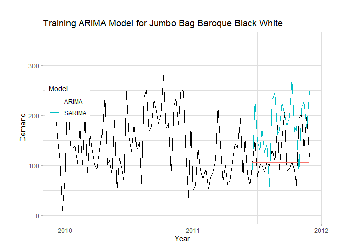

Machine Learning Approach in Inventory Management
================
Dimas Mahesa Kayun,
December 2023

- [Introduction](#introduction)
  - [Overview](#overview)
  - [Aim](#aim)
  - [Data Description](#data-description)
  - [Attribute Information](#attribute-information)
  - [Tech Stack](#tech-stack)
- [Data Preparation](#data-preparation)
- [ABC Analysis](#abc-analysis)
  - [Feature Selection & Engineering for ABC
    Analysis](#feature-selection--engineering-for-abc-analysis)
  - [K-Means Clustering](#k-means-clustering)
  - [Pareto Chart ABC Cluster](#pareto-chart-abc-cluster)
  - [ABC Cluster Visualization](#abc-cluster-visualization)
- [Demand Forecasting using ARIMA
  Model](#demand-forecasting-using-arima-model)
  - [Feature Selection & Engineering for ARIMA
    Model](#feature-selection--engineering-for-arima-model)
    - [Filter A Category Products](#filter-a-category-products)
    - [Filter Bag Items](#filter-bag-items)
    - [Training and Testing Data](#training-and-testing-data)
    - [ADF Test](#adf-test)
  - [ARIMA Modeling](#arima-modeling)
  - [Evaluation](#evaluation)
  - [Trained model Plot](#trained-model-plot)
  - [Demand Forecast](#demand-forecast)
- [EOQ](#eoq)
  - [Feature Selection & Engineering for EOQ
    Model](#feature-selection--engineering-for-eoq-model)
  - [EOQ Modeling](#eoq-modeling)
- [References](#references)

# Introduction

## Overview

XYZ company is a UK-based non-store online retailer that sells unique
gift items where most of the company’s customers are wholesalers. The
problem that occurs in XYZ company is that there is no adequate
inventory management system in processing large-scale and diverse data,
leading to inappropriate conclusions about the actions that should be
taken.

Data collection was carried out by downloading the online_retail2
dataset from the UC Irvine Machine Learning Repository website in csv
format. The dataset contains historical transaction data that occurred
between 1 December 2009 and 9 December 2011, at a UK-based non-store
online retailer, totaling 1,067,371 rows of data and consisting of 8
variables.

## Aim

This modeling aims to utilize machine learning approach to address
inventory issues by employing ABC analysis to classify inventory items
using K-means Clustering algorithm, demand forecasting using the ARIMA
model, and inventory optimization using the EOQ model. These three
models will be integrated into an interconnected system. Thus, the
utilization of a large scale and diverse data can provide accurate
outcomes within a brief timeframe. By adopting a machine learning
approach, companies can optimize inventory and prevent undesirable
shortages or excess inventory.

## Data Description

The
[online_retail2.csv](https://archive.ics.uci.edu/ml/datasets/Online+Retail+II)
dataset contains all transactions that occurred between 01/12/2009 and
09/12/2011 at a non-store-based online retail company in the United
Kingdom. The company specializes in selling unique gift items, with a
majority of its customers being wholesale agents.

## Attribute Information

- **InvoiceNo** : Invoice number (Nominal), a 6-digit integral number
  uniquely assigned to each transaction. If this code starts with the
  letter ‘c’, it indicates a cancellation.  
- **StockCode** : Product code (Nominal), a 5-digit integral number
  uniquely assigned to each distinct product.  
- **Description** : Product name (Nominal).  
- **Quantity** : The quantities of each product per transaction
  (Numeric).  
- **InvoiceDate** : Invoice date and time (Numeric), the day and time
  when a transaction was generated.  
- **Price** : Unit price (Numeric), Product price per unit in pound
  sterling (£).  
- **CustomerID** : Customer number (Nominal), a 5-digit integral number
  uniquely assigned to each customer.  
- **Country** : Country name (Nominal), the name of the country where a
  customer resides.

## Tech Stack

**Language used**: R  
**Library used**: tidyverse, lubridate, ggplot2, cluster, factoextra,
ggQC, tsibble, tseries and forecast

# Data Preparation

``` r
##import library
library(tidyverse)
library(lubridate)
library(ggplot2)
library(cluster)
library(factoextra)
library(ggQC)
library(tsibble)
library(tseries)
library(forecast)

##import and shows data frame briefly
retail <- read_csv("../../machine_learning_approach_in_inventory_management/dataset/retail_clean.csv")
head(retail, 5)
```

    ## # A tibble: 5 × 8
    ##   Invoice StockCode Description      Quantity Date       Time  Price Customer_ID
    ##     <dbl> <chr>     <chr>               <dbl> <date>     <tim> <dbl>       <dbl>
    ## 1  489434 85048     "15CM CHRISTMAS…       12 2009-12-01 07:45  6.95       13085
    ## 2  489434 79323P    "PINK CHERRY LI…       12 2009-12-01 07:45  6.75       13085
    ## 3  489434 79323W    "WHITE CHERRY L…       12 2009-12-01 07:45  6.75       13085
    ## 4  489434 22041     "RECORD FRAME 7…       24 2009-12-01 07:45  2.1        13085
    ## 5  489434 21232     "STRAWBERRY CER…       24 2009-12-01 07:45  1.25       13085

# ABC Analysis

The ABC analysis is an approach used in various fields, particularly in
inventory management, to classify products based on the Pareto principle
(80/20 Rule), which states that 80% of sales will come from 20% of
products. In other words, this principle is used to identify products
that have a significant impact on the overall revenue of the company,
thus requiring strict management and control.

As its name suggests, ABC analysis categorizes products into three
categories, namely:

- **Category A**: contains products with high sales volume and low
  inventory, making it the highest priority and requiring strict
  control.
- **Category B**: contains products with normal sales volume and normal
  inventory levels, sold regularly but not as much as products in
  Category A.
- **Category C**: contains products with low sales volume and high
  inventory levels, typically making up the largest portion of the
  overall inventory volume.

The three categories are then utilized to control product inventory and
determine ordering policies for each product. This is done in order to
tightly manage the inventory of Category A products, ensuring they never
run out of stock, while effectively managing Category B products to
minimize or eliminate stockouts. Meanwhile, Category C products, which
are sold in low volumes and do not require constant management, receive
less attention.

## Feature Selection & Engineering for ABC Analysis

In this modeling, the ABC analysis will be conducted using transaction
data from the previous year. Hence, the data will be extracted from the
retail data frame and a new data frame will be created to separate it.
Following this, the data will be processed according to the standard
data processing steps for ABC analysis.

The ABC analysis in this modeling uses revenue as a criterion in
grouping inventory items, so this step begins by calculating revenue for
each item, then sorting them in descending order based on revenue from
largest to smallest, and then calculating the cumulative value and
percentage of revenue for each item.

``` r
##collect transaction data from the previous year
df_abc <- retail %>% 
  filter(Date >= max(Date)-365 & Date <= max(Date)) %>% 
  select(Description, Quantity, Price) %>% 
  group_by(Description) %>% 
  summarise(Sales = sum(Quantity),
            Revenue = sum(Quantity*Price)) %>% 
  arrange(desc(Revenue))

##add cumulative variable
df_abc$Cumulative <- cumsum(df_abc$Revenue)

##add percentage variable
df_abc <- df_abc %>% mutate(Percentage = Cumulative/sum(Revenue)*100)

df_abc #result
```

    ## # A tibble: 3,782 × 5
    ##    Description                        Sales Revenue Cumulative Percentage
    ##    <chr>                              <dbl>   <dbl>      <dbl>      <dbl>
    ##  1 REGENCY CAKESTAND 3 TIER            7154  83538.     83538.       1.67
    ##  2 WHITE HANGING HEART T-LIGHT HOLDER 17296  48164.    131702.       2.63
    ##  3 PARTY BUNTING                       9179  43291.    174992.       3.50
    ##  4 JUMBO BAG RED RETROSPOT            16611  32719.    207712.       4.16
    ##  5 ASSORTED COLOUR BIRD ORNAMENT      17858  29921.    237633.       4.75
    ##  6 CHILLI LIGHTS                       4926  24692.    262324.       5.25
    ##  7 SPOTTY BUNTING                      5077  24493.    286817.       5.74
    ##  8 DOORMAT KEEP CALM AND COME IN       3269  23987.    310803.       6.22
    ##  9 PAPER CHAIN KIT 50'S CHRISTMAS      8259  23666.    334469.       6.69
    ## 10 HOT WATER BOTTLE KEEP CALM          4438  20566.    355036.       7.10
    ## # ℹ 3,772 more rows

## K-Means Clustering

K-Means is one of the methods aimed at dividing data into one or more
groups or clusters.The main goal is to group data with similar
characteristics into the same cluster, while data with different
characteristics are placed into separate clusters.This method is one of
the most well-known and widely used clustering methods. Its advantages
lie in its simplicity, ease of implementation, and ability to cluster
large-scale data.

K-means Clustering is an algorithm used for clustering data based on the
nearest centroid points. Through partitioning and unsupervised modeling,
data is grouped into several clusters where each cluster has similar
characteristics and shares characteristics with other clusters.

``` r
##K-Means clustering 
set.seed(999)
abc <- kmeans(df_abc[,c(3:4)], centers = 3) #using 3-4th column
abc #k-means result
```

    ## K-means clustering with 3 clusters of sizes 322, 744, 2716
    ## 
    ## Cluster means:
    ##     Revenue Cumulative
    ## 1 8329.9346    1761806
    ## 2 2054.0750    3605898
    ## 3  290.2559    4815942
    ## 
    ## Clustering vector:
    ##    [1] 1 1 1 1 1 1 1 1 1 1 1 1 1 1 1 1 1 1 1 1 1 1 1 1 1 1 1 1 1 1 1 1 1 1 1 1 1
    ##   [38] 1 1 1 1 1 1 1 1 1 1 1 1 1 1 1 1 1 1 1 1 1 1 1 1 1 1 1 1 1 1 1 1 1 1 1 1 1
    ##   [75] 1 1 1 1 1 1 1 1 1 1 1 1 1 1 1 1 1 1 1 1 1 1 1 1 1 1 1 1 1 1 1 1 1 1 1 1 1
    ##  [112] 1 1 1 1 1 1 1 1 1 1 1 1 1 1 1 1 1 1 1 1 1 1 1 1 1 1 1 1 1 1 1 1 1 1 1 1 1
    ##  [149] 1 1 1 1 1 1 1 1 1 1 1 1 1 1 1 1 1 1 1 1 1 1 1 1 1 1 1 1 1 1 1 1 1 1 1 1 1
    ##  [186] 1 1 1 1 1 1 1 1 1 1 1 1 1 1 1 1 1 1 1 1 1 1 1 1 1 1 1 1 1 1 1 1 1 1 1 1 1
    ##  [223] 1 1 1 1 1 1 1 1 1 1 1 1 1 1 1 1 1 1 1 1 1 1 1 1 1 1 1 1 1 1 1 1 1 1 1 1 1
    ##  [260] 1 1 1 1 1 1 1 1 1 1 1 1 1 1 1 1 1 1 1 1 1 1 1 1 1 1 1 1 1 1 1 1 1 1 1 1 1
    ##  [297] 1 1 1 1 1 1 1 1 1 1 1 1 1 1 1 1 1 1 1 1 1 1 1 1 1 1 2 2 2 2 2 2 2 2 2 2 2
    ##  [334] 2 2 2 2 2 2 2 2 2 2 2 2 2 2 2 2 2 2 2 2 2 2 2 2 2 2 2 2 2 2 2 2 2 2 2 2 2
    ##  [371] 2 2 2 2 2 2 2 2 2 2 2 2 2 2 2 2 2 2 2 2 2 2 2 2 2 2 2 2 2 2 2 2 2 2 2 2 2
    ##  [408] 2 2 2 2 2 2 2 2 2 2 2 2 2 2 2 2 2 2 2 2 2 2 2 2 2 2 2 2 2 2 2 2 2 2 2 2 2
    ##  [445] 2 2 2 2 2 2 2 2 2 2 2 2 2 2 2 2 2 2 2 2 2 2 2 2 2 2 2 2 2 2 2 2 2 2 2 2 2
    ##  [482] 2 2 2 2 2 2 2 2 2 2 2 2 2 2 2 2 2 2 2 2 2 2 2 2 2 2 2 2 2 2 2 2 2 2 2 2 2
    ##  [519] 2 2 2 2 2 2 2 2 2 2 2 2 2 2 2 2 2 2 2 2 2 2 2 2 2 2 2 2 2 2 2 2 2 2 2 2 2
    ##  [556] 2 2 2 2 2 2 2 2 2 2 2 2 2 2 2 2 2 2 2 2 2 2 2 2 2 2 2 2 2 2 2 2 2 2 2 2 2
    ##  [593] 2 2 2 2 2 2 2 2 2 2 2 2 2 2 2 2 2 2 2 2 2 2 2 2 2 2 2 2 2 2 2 2 2 2 2 2 2
    ##  [630] 2 2 2 2 2 2 2 2 2 2 2 2 2 2 2 2 2 2 2 2 2 2 2 2 2 2 2 2 2 2 2 2 2 2 2 2 2
    ##  [667] 2 2 2 2 2 2 2 2 2 2 2 2 2 2 2 2 2 2 2 2 2 2 2 2 2 2 2 2 2 2 2 2 2 2 2 2 2
    ##  [704] 2 2 2 2 2 2 2 2 2 2 2 2 2 2 2 2 2 2 2 2 2 2 2 2 2 2 2 2 2 2 2 2 2 2 2 2 2
    ##  [741] 2 2 2 2 2 2 2 2 2 2 2 2 2 2 2 2 2 2 2 2 2 2 2 2 2 2 2 2 2 2 2 2 2 2 2 2 2
    ##  [778] 2 2 2 2 2 2 2 2 2 2 2 2 2 2 2 2 2 2 2 2 2 2 2 2 2 2 2 2 2 2 2 2 2 2 2 2 2
    ##  [815] 2 2 2 2 2 2 2 2 2 2 2 2 2 2 2 2 2 2 2 2 2 2 2 2 2 2 2 2 2 2 2 2 2 2 2 2 2
    ##  [852] 2 2 2 2 2 2 2 2 2 2 2 2 2 2 2 2 2 2 2 2 2 2 2 2 2 2 2 2 2 2 2 2 2 2 2 2 2
    ##  [889] 2 2 2 2 2 2 2 2 2 2 2 2 2 2 2 2 2 2 2 2 2 2 2 2 2 2 2 2 2 2 2 2 2 2 2 2 2
    ##  [926] 2 2 2 2 2 2 2 2 2 2 2 2 2 2 2 2 2 2 2 2 2 2 2 2 2 2 2 2 2 2 2 2 2 2 2 2 2
    ##  [963] 2 2 2 2 2 2 2 2 2 2 2 2 2 2 2 2 2 2 2 2 2 2 2 2 2 2 2 2 2 2 2 2 2 2 2 2 2
    ## [1000] 2 2 2 2 2 2 2 2 2 2 2 2 2 2 2 2 2 2 2 2 2 2 2 2 2 2 2 2 2 2 2 2 2 2 2 2 2
    ## [1037] 2 2 2 2 2 2 2 2 2 2 2 2 2 2 2 2 2 2 2 2 2 2 2 2 2 2 2 2 2 2 3 3 3 3 3 3 3
    ## [1074] 3 3 3 3 3 3 3 3 3 3 3 3 3 3 3 3 3 3 3 3 3 3 3 3 3 3 3 3 3 3 3 3 3 3 3 3 3
    ## [1111] 3 3 3 3 3 3 3 3 3 3 3 3 3 3 3 3 3 3 3 3 3 3 3 3 3 3 3 3 3 3 3 3 3 3 3 3 3
    ## [1148] 3 3 3 3 3 3 3 3 3 3 3 3 3 3 3 3 3 3 3 3 3 3 3 3 3 3 3 3 3 3 3 3 3 3 3 3 3
    ## [1185] 3 3 3 3 3 3 3 3 3 3 3 3 3 3 3 3 3 3 3 3 3 3 3 3 3 3 3 3 3 3 3 3 3 3 3 3 3
    ## [1222] 3 3 3 3 3 3 3 3 3 3 3 3 3 3 3 3 3 3 3 3 3 3 3 3 3 3 3 3 3 3 3 3 3 3 3 3 3
    ## [1259] 3 3 3 3 3 3 3 3 3 3 3 3 3 3 3 3 3 3 3 3 3 3 3 3 3 3 3 3 3 3 3 3 3 3 3 3 3
    ## [1296] 3 3 3 3 3 3 3 3 3 3 3 3 3 3 3 3 3 3 3 3 3 3 3 3 3 3 3 3 3 3 3 3 3 3 3 3 3
    ## [1333] 3 3 3 3 3 3 3 3 3 3 3 3 3 3 3 3 3 3 3 3 3 3 3 3 3 3 3 3 3 3 3 3 3 3 3 3 3
    ## [1370] 3 3 3 3 3 3 3 3 3 3 3 3 3 3 3 3 3 3 3 3 3 3 3 3 3 3 3 3 3 3 3 3 3 3 3 3 3
    ## [1407] 3 3 3 3 3 3 3 3 3 3 3 3 3 3 3 3 3 3 3 3 3 3 3 3 3 3 3 3 3 3 3 3 3 3 3 3 3
    ## [1444] 3 3 3 3 3 3 3 3 3 3 3 3 3 3 3 3 3 3 3 3 3 3 3 3 3 3 3 3 3 3 3 3 3 3 3 3 3
    ## [1481] 3 3 3 3 3 3 3 3 3 3 3 3 3 3 3 3 3 3 3 3 3 3 3 3 3 3 3 3 3 3 3 3 3 3 3 3 3
    ## [1518] 3 3 3 3 3 3 3 3 3 3 3 3 3 3 3 3 3 3 3 3 3 3 3 3 3 3 3 3 3 3 3 3 3 3 3 3 3
    ## [1555] 3 3 3 3 3 3 3 3 3 3 3 3 3 3 3 3 3 3 3 3 3 3 3 3 3 3 3 3 3 3 3 3 3 3 3 3 3
    ## [1592] 3 3 3 3 3 3 3 3 3 3 3 3 3 3 3 3 3 3 3 3 3 3 3 3 3 3 3 3 3 3 3 3 3 3 3 3 3
    ## [1629] 3 3 3 3 3 3 3 3 3 3 3 3 3 3 3 3 3 3 3 3 3 3 3 3 3 3 3 3 3 3 3 3 3 3 3 3 3
    ## [1666] 3 3 3 3 3 3 3 3 3 3 3 3 3 3 3 3 3 3 3 3 3 3 3 3 3 3 3 3 3 3 3 3 3 3 3 3 3
    ## [1703] 3 3 3 3 3 3 3 3 3 3 3 3 3 3 3 3 3 3 3 3 3 3 3 3 3 3 3 3 3 3 3 3 3 3 3 3 3
    ## [1740] 3 3 3 3 3 3 3 3 3 3 3 3 3 3 3 3 3 3 3 3 3 3 3 3 3 3 3 3 3 3 3 3 3 3 3 3 3
    ## [1777] 3 3 3 3 3 3 3 3 3 3 3 3 3 3 3 3 3 3 3 3 3 3 3 3 3 3 3 3 3 3 3 3 3 3 3 3 3
    ## [1814] 3 3 3 3 3 3 3 3 3 3 3 3 3 3 3 3 3 3 3 3 3 3 3 3 3 3 3 3 3 3 3 3 3 3 3 3 3
    ## [1851] 3 3 3 3 3 3 3 3 3 3 3 3 3 3 3 3 3 3 3 3 3 3 3 3 3 3 3 3 3 3 3 3 3 3 3 3 3
    ## [1888] 3 3 3 3 3 3 3 3 3 3 3 3 3 3 3 3 3 3 3 3 3 3 3 3 3 3 3 3 3 3 3 3 3 3 3 3 3
    ## [1925] 3 3 3 3 3 3 3 3 3 3 3 3 3 3 3 3 3 3 3 3 3 3 3 3 3 3 3 3 3 3 3 3 3 3 3 3 3
    ## [1962] 3 3 3 3 3 3 3 3 3 3 3 3 3 3 3 3 3 3 3 3 3 3 3 3 3 3 3 3 3 3 3 3 3 3 3 3 3
    ## [1999] 3 3 3 3 3 3 3 3 3 3 3 3 3 3 3 3 3 3 3 3 3 3 3 3 3 3 3 3 3 3 3 3 3 3 3 3 3
    ## [2036] 3 3 3 3 3 3 3 3 3 3 3 3 3 3 3 3 3 3 3 3 3 3 3 3 3 3 3 3 3 3 3 3 3 3 3 3 3
    ## [2073] 3 3 3 3 3 3 3 3 3 3 3 3 3 3 3 3 3 3 3 3 3 3 3 3 3 3 3 3 3 3 3 3 3 3 3 3 3
    ## [2110] 3 3 3 3 3 3 3 3 3 3 3 3 3 3 3 3 3 3 3 3 3 3 3 3 3 3 3 3 3 3 3 3 3 3 3 3 3
    ## [2147] 3 3 3 3 3 3 3 3 3 3 3 3 3 3 3 3 3 3 3 3 3 3 3 3 3 3 3 3 3 3 3 3 3 3 3 3 3
    ## [2184] 3 3 3 3 3 3 3 3 3 3 3 3 3 3 3 3 3 3 3 3 3 3 3 3 3 3 3 3 3 3 3 3 3 3 3 3 3
    ## [2221] 3 3 3 3 3 3 3 3 3 3 3 3 3 3 3 3 3 3 3 3 3 3 3 3 3 3 3 3 3 3 3 3 3 3 3 3 3
    ## [2258] 3 3 3 3 3 3 3 3 3 3 3 3 3 3 3 3 3 3 3 3 3 3 3 3 3 3 3 3 3 3 3 3 3 3 3 3 3
    ## [2295] 3 3 3 3 3 3 3 3 3 3 3 3 3 3 3 3 3 3 3 3 3 3 3 3 3 3 3 3 3 3 3 3 3 3 3 3 3
    ## [2332] 3 3 3 3 3 3 3 3 3 3 3 3 3 3 3 3 3 3 3 3 3 3 3 3 3 3 3 3 3 3 3 3 3 3 3 3 3
    ## [2369] 3 3 3 3 3 3 3 3 3 3 3 3 3 3 3 3 3 3 3 3 3 3 3 3 3 3 3 3 3 3 3 3 3 3 3 3 3
    ## [2406] 3 3 3 3 3 3 3 3 3 3 3 3 3 3 3 3 3 3 3 3 3 3 3 3 3 3 3 3 3 3 3 3 3 3 3 3 3
    ## [2443] 3 3 3 3 3 3 3 3 3 3 3 3 3 3 3 3 3 3 3 3 3 3 3 3 3 3 3 3 3 3 3 3 3 3 3 3 3
    ## [2480] 3 3 3 3 3 3 3 3 3 3 3 3 3 3 3 3 3 3 3 3 3 3 3 3 3 3 3 3 3 3 3 3 3 3 3 3 3
    ## [2517] 3 3 3 3 3 3 3 3 3 3 3 3 3 3 3 3 3 3 3 3 3 3 3 3 3 3 3 3 3 3 3 3 3 3 3 3 3
    ## [2554] 3 3 3 3 3 3 3 3 3 3 3 3 3 3 3 3 3 3 3 3 3 3 3 3 3 3 3 3 3 3 3 3 3 3 3 3 3
    ## [2591] 3 3 3 3 3 3 3 3 3 3 3 3 3 3 3 3 3 3 3 3 3 3 3 3 3 3 3 3 3 3 3 3 3 3 3 3 3
    ## [2628] 3 3 3 3 3 3 3 3 3 3 3 3 3 3 3 3 3 3 3 3 3 3 3 3 3 3 3 3 3 3 3 3 3 3 3 3 3
    ## [2665] 3 3 3 3 3 3 3 3 3 3 3 3 3 3 3 3 3 3 3 3 3 3 3 3 3 3 3 3 3 3 3 3 3 3 3 3 3
    ## [2702] 3 3 3 3 3 3 3 3 3 3 3 3 3 3 3 3 3 3 3 3 3 3 3 3 3 3 3 3 3 3 3 3 3 3 3 3 3
    ## [2739] 3 3 3 3 3 3 3 3 3 3 3 3 3 3 3 3 3 3 3 3 3 3 3 3 3 3 3 3 3 3 3 3 3 3 3 3 3
    ## [2776] 3 3 3 3 3 3 3 3 3 3 3 3 3 3 3 3 3 3 3 3 3 3 3 3 3 3 3 3 3 3 3 3 3 3 3 3 3
    ## [2813] 3 3 3 3 3 3 3 3 3 3 3 3 3 3 3 3 3 3 3 3 3 3 3 3 3 3 3 3 3 3 3 3 3 3 3 3 3
    ## [2850] 3 3 3 3 3 3 3 3 3 3 3 3 3 3 3 3 3 3 3 3 3 3 3 3 3 3 3 3 3 3 3 3 3 3 3 3 3
    ## [2887] 3 3 3 3 3 3 3 3 3 3 3 3 3 3 3 3 3 3 3 3 3 3 3 3 3 3 3 3 3 3 3 3 3 3 3 3 3
    ## [2924] 3 3 3 3 3 3 3 3 3 3 3 3 3 3 3 3 3 3 3 3 3 3 3 3 3 3 3 3 3 3 3 3 3 3 3 3 3
    ## [2961] 3 3 3 3 3 3 3 3 3 3 3 3 3 3 3 3 3 3 3 3 3 3 3 3 3 3 3 3 3 3 3 3 3 3 3 3 3
    ## [2998] 3 3 3 3 3 3 3 3 3 3 3 3 3 3 3 3 3 3 3 3 3 3 3 3 3 3 3 3 3 3 3 3 3 3 3 3 3
    ## [3035] 3 3 3 3 3 3 3 3 3 3 3 3 3 3 3 3 3 3 3 3 3 3 3 3 3 3 3 3 3 3 3 3 3 3 3 3 3
    ## [3072] 3 3 3 3 3 3 3 3 3 3 3 3 3 3 3 3 3 3 3 3 3 3 3 3 3 3 3 3 3 3 3 3 3 3 3 3 3
    ## [3109] 3 3 3 3 3 3 3 3 3 3 3 3 3 3 3 3 3 3 3 3 3 3 3 3 3 3 3 3 3 3 3 3 3 3 3 3 3
    ## [3146] 3 3 3 3 3 3 3 3 3 3 3 3 3 3 3 3 3 3 3 3 3 3 3 3 3 3 3 3 3 3 3 3 3 3 3 3 3
    ## [3183] 3 3 3 3 3 3 3 3 3 3 3 3 3 3 3 3 3 3 3 3 3 3 3 3 3 3 3 3 3 3 3 3 3 3 3 3 3
    ## [3220] 3 3 3 3 3 3 3 3 3 3 3 3 3 3 3 3 3 3 3 3 3 3 3 3 3 3 3 3 3 3 3 3 3 3 3 3 3
    ## [3257] 3 3 3 3 3 3 3 3 3 3 3 3 3 3 3 3 3 3 3 3 3 3 3 3 3 3 3 3 3 3 3 3 3 3 3 3 3
    ## [3294] 3 3 3 3 3 3 3 3 3 3 3 3 3 3 3 3 3 3 3 3 3 3 3 3 3 3 3 3 3 3 3 3 3 3 3 3 3
    ## [3331] 3 3 3 3 3 3 3 3 3 3 3 3 3 3 3 3 3 3 3 3 3 3 3 3 3 3 3 3 3 3 3 3 3 3 3 3 3
    ## [3368] 3 3 3 3 3 3 3 3 3 3 3 3 3 3 3 3 3 3 3 3 3 3 3 3 3 3 3 3 3 3 3 3 3 3 3 3 3
    ## [3405] 3 3 3 3 3 3 3 3 3 3 3 3 3 3 3 3 3 3 3 3 3 3 3 3 3 3 3 3 3 3 3 3 3 3 3 3 3
    ## [3442] 3 3 3 3 3 3 3 3 3 3 3 3 3 3 3 3 3 3 3 3 3 3 3 3 3 3 3 3 3 3 3 3 3 3 3 3 3
    ## [3479] 3 3 3 3 3 3 3 3 3 3 3 3 3 3 3 3 3 3 3 3 3 3 3 3 3 3 3 3 3 3 3 3 3 3 3 3 3
    ## [3516] 3 3 3 3 3 3 3 3 3 3 3 3 3 3 3 3 3 3 3 3 3 3 3 3 3 3 3 3 3 3 3 3 3 3 3 3 3
    ## [3553] 3 3 3 3 3 3 3 3 3 3 3 3 3 3 3 3 3 3 3 3 3 3 3 3 3 3 3 3 3 3 3 3 3 3 3 3 3
    ## [3590] 3 3 3 3 3 3 3 3 3 3 3 3 3 3 3 3 3 3 3 3 3 3 3 3 3 3 3 3 3 3 3 3 3 3 3 3 3
    ## [3627] 3 3 3 3 3 3 3 3 3 3 3 3 3 3 3 3 3 3 3 3 3 3 3 3 3 3 3 3 3 3 3 3 3 3 3 3 3
    ## [3664] 3 3 3 3 3 3 3 3 3 3 3 3 3 3 3 3 3 3 3 3 3 3 3 3 3 3 3 3 3 3 3 3 3 3 3 3 3
    ## [3701] 3 3 3 3 3 3 3 3 3 3 3 3 3 3 3 3 3 3 3 3 3 3 3 3 3 3 3 3 3 3 3 3 3 3 3 3 3
    ## [3738] 3 3 3 3 3 3 3 3 3 3 3 3 3 3 3 3 3 3 3 3 3 3 3 3 3 3 3 3 3 3 3 3 3 3 3 3 3
    ## [3775] 3 3 3 3 3 3 3 3
    ## 
    ## Within cluster sum of squares by cluster:
    ## [1] 1.478049e+14 1.375683e+14 1.229163e+14
    ##  (between_SS / total_SS =  88.5 %)
    ## 
    ## Available components:
    ## 
    ## [1] "cluster"      "centers"      "totss"        "withinss"     "tot.withinss"
    ## [6] "betweenss"    "size"         "iter"         "ifault"

``` r
sil_abc <- silhouette(abc$cluster, dist(df_abc[,c(3:4)])) 
fviz_silhouette(sil_abc) #model validation using silhouete plot
```

    ##   cluster size ave.sil.width
    ## 1       1  322          0.54
    ## 2       2  744          0.50
    ## 3       3 2716          0.79

<!-- -->

``` r
df_abc$Cluster <- as.factor(abc$cluster)
levels(df_abc$Cluster) <- c("A", "B", "C") #changing cluster label

##cluster table
final_abc <- df_abc %>% 
  group_by(Cluster) %>% 
  summarise(
    Total_SKU = n(),
    Total_Demand = sum(Sales), 
    Total_Revenue = sum(Revenue)
  ) %>% 
  mutate(Revenue_Percentage = (Total_Revenue/sum(Total_Revenue))*100,
         Demand_Percentage = (Total_Demand/sum(Total_Demand))*100)

final_abc 
```

    ## # A tibble: 3 × 6
    ##   Cluster Total_SKU Total_Demand Total_Revenue Revenue_Percentage
    ##   <fct>       <int>        <dbl>         <dbl>              <dbl>
    ## 1 A             322       995481      2682239.               53.7
    ## 2 B             744       913425      1528232.               30.6
    ## 3 C            2716       745803       788335                15.8
    ## # ℹ 1 more variable: Demand_Percentage <dbl>

The displayed output represents the outcome of data grouping or
clustering achieved by using the K-Means Clustering algorithm. This
algorithm partitions the data into three clusters based on revenue and
cumulative values for each item. The algorithm produces three clusters:
cluster 1 with 322 data points, cluster 2 with 744 data points, and
cluster 3 with 2716 data points. The generated clustering model has an
accuracy of 88.5%, which is considered good and successful.

The silhouette graph reveals that all the data points exhibit positive
values, and the model effectively partitions the data into clusters
based on their individual characteristics. There are no instances of
negative values, indicating that the model correctly assigns the data
points to appropriate clusters. Therefore, it can be confidently stated
that the developed K-Means Clustering model successfully achieves the
intended data grouping.

## Pareto Chart ABC Cluster

``` r
## pareto chart
final_abc %>% 
  ggplot(aes(x = Cluster, y = Total_Revenue/1000))+
  theme_classic()+
  labs(
    x = NULL,
    y = "Revenue(x1000)",
    title = "Pareto Chart ABC Analysis"
  )+
  scale_y_continuous(labels = scales::comma)+
  stat_pareto(point.color = "red",
              point.size = 2,
              line.color = "orange",
              line.size = 2,
              bars.fill = "#3d5a80")
```

<!-- -->

The provided image presents information regarding the total revenue
generated by different clusters. Cluster A stands out as the top
performer, generating the highest total revenue, followed by cluster B
with a moderate total revenue, and finally cluster C with the lowest
total revenue among all clusters. The total revenue for each cluster is
visually represented by stacked bars arranged in descending order, while
the cumulative percentage generated by each cluster is depicted by
lines.

Based on the provided information, it can be concluded that the K-Means
Clustering modeling for ABC analysis is performing well. The obtained
results from this modeling also align with the principles of ABC
analysis, where a small number of inventory items generate high revenue,
while a large number of inventory items generate low revenue.

## ABC Cluster Visualization

``` r
##total sku based on cluster
final_abc %>% 
  ggplot(aes(x = Cluster, y = Total_SKU, fill = Cluster))+
  geom_bar(stat = "identity")+
  geom_text(aes(label = Total_SKU), vjust = -.5, colour = "black", size = 4)+
  ylim(c(0, 3000))+
  theme_classic()+
  labs(
    x = NULL,
    y = NULL,
    title = "ABC",
    subtitle = "Amount and distribution of products in each group"
  )
```

<!-- -->

``` r
##total revenue based on cluster
final_abc %>% 
  ggplot(aes(x = Cluster, y = Total_Revenue, fill = Cluster))+
  geom_bar(stat ="identity")+
  geom_text(aes(label = Total_Revenue), vjust = -.5, colour = "black", size = 4)+
  scale_y_continuous(limits = c(0, 3000000), labels = scales::comma)+
  theme_classic()+
  labs(
    x = NULL,
    y = NULL,
    title = "Total Revenue",
    subtitle = "Revenue amount(x1000) in each group over the past 12 months"
  )
```

<!-- -->

``` r
##total sales(demand) based on cluster
final_abc %>% 
  ggplot(aes(x = Cluster, y = Total_Demand, fill = Cluster))+
  geom_bar(stat = "identity")+
  geom_text(aes(label = Total_Demand), vjust = -.5, colour = "black", size = 4)+
  scale_y_continuous(limits = c(0, 1100000), labels = scales::comma)+
  theme_classic()+
  labs(
    x = NULL,
    y = NULL,
    title = "Total Sales",
    subtitle = "Sales amount in each group over the past 12 months"
  )
```

<!-- -->

# Demand Forecasting using ARIMA Model

ARIMA stands for Autoregressive Integrated Moving Average, which is the
most commonly used approach for time series forecasting. The ARIMA model
is based on the assumption that the data must be stationary, meaning
that it does not undergo any changes or fluctuations so that the average
observation remains constant over time. If the data is not stationary,
differencing is required by calculating the changes or differences in
values between observations to transform the non-stationary data into
stationary data.

SARIMA stands for Seasonal Autoregressive Integrated Moving Average. The
SARIMA model is an extension of the ARIMA model that can handle data
with seasonal patterns. By considering the seasonal component in
forecasting, this model can provide more accurate results in
anticipating demand fluctuations. Seasonality can be defined as a
pattern that occurs repeatedly within a fixed time interval.

## Feature Selection & Engineering for ARIMA Model

This step is taken to prepare the data for demand forecasting using the
ARIMA model. It starts by extracting data that falls into cluster A and
then saving it into a new data frame.  
After that, the data is filtered to select items that have 25 sales
months. This data filtering is intended to choose only items that have
sales in every month within the period from December 1, 2009, to
December 9, 2011. This is done to obtain a demand forecasting model with
good accuracy.

### Filter A Category Products

``` r
##filter cluster used for forecasting
a_category <- df_abc %>% filter(Cluster == "A") %>% select(Description)

##inner join to collect data belonging to cluster A
df_a <- retail %>% inner_join(a_category, by = c("Description" = "Description"))

##create new data frame
a_product <- df_a %>% 
  group_by(Description, Date = yearmonth(Date)) %>% 
  summarise(Sales = sum(Quantity)) %>% 
  arrange(Date)

##filter data with sales month is equal to 25
a_product <- a_product %>% 
  group_by(Description) %>% 
  summarise(sum = n()) %>% 
  filter(sum == 25) %>% 
  select(Description)

a_product #result
```

    ## # A tibble: 64 × 1
    ##    Description                      
    ##    <chr>                            
    ##  1 3 HOOK PHOTO SHELF ANTIQUE WHITE 
    ##  2 3 STRIPEY MICE FELTCRAFT         
    ##  3 60 TEATIME FAIRY CAKE CASES      
    ##  4 ANTIQUE SILVER TEA GLASS ENGRAVED
    ##  5 ASSORTED COLOUR BIRD ORNAMENT    
    ##  6 ASSORTED COLOUR MINI CASES       
    ##  7 ASSORTED COLOURS SILK FAN        
    ##  8 BAKING SET 9 PIECE RETROSPOT     
    ##  9 BEWARE OF THE CAT METAL SIGN     
    ## 10 BLACK RECORD COVER FRAME         
    ## # ℹ 54 more rows

After filtering the data on items in cluster A, the results show that
there are 64 items with 25 sales months. Therefore, the data is saved
and manipulated to group sales into weekly format so that the sales
pattern in the data can be clearly seen.

``` r
##inner join to collect data with sales month is equal to 25
df_a <- df_a %>% inner_join(a_product,by= c("Description" = "Description"))

##transforming data
df_a <- df_a %>% 
  group_by(Description, Date = ceiling_date(Date, "week")) %>% 
  summarise(Sales = sum(Quantity),
            Price = mean(Price)) %>% 
  arrange(Date)
```

### Filter Bag Items

In this modeling, demand forecasting will be based on a sample of data.
Therefore, out of the 64 product items, only a few items with similar
types will be selected, with a total of more than 5 variations. The
selected items are bag items, which have 8 variations.

After identifying which items will be used for demand forecasting, a
search is conducted in the data frame to find items that contain the
word “BAG”. These items are then selected and stored in a new data
frame. The sales patterns for each bag item can be seen in the image
below.

``` r
##items containing the word BAG in a data frame
bag <- df_a[grep(pattern="BAG", x = df_a$Description, ignore.case=TRUE),]

##data plot
bag %>% 
  ggplot(aes(x = Date, y = Sales, col = Description))+
  geom_line()+
  theme_bw() + 
  labs(title = "Sales plot bag items", x = "Date", y = "Sales")+
  theme(plot.margin = margin(1, 1, 0, 1, "cm"),legend.position = "bottom")+
  guides(color = guide_legend(title = "Product name", ncol = 2))
```

<!-- -->

### Training and Testing Data

After selecting, extracting, and merging the data, the next step
involves manipulating the data by converting it into a time series
format. Subsequently, the data is partitioned into two parts, namely the
training set and the testing set.

The training set contains data used for modeling, comprising
approximately 80% of the total data. Meanwhile, the testing set
comprises data used to test the completed modeling, with a composition
of approximately 20% of the total data.

``` r
##pivot data
bag_sales <- bag %>% pivot_wider(id_cols = Date, 
                                 names_from = Description, 
                                 values_from = Sales,
                                 values_fill = 0)

##make it data frame
bag_sales <- as.data.frame(bag_sales)

##time series data frame
ts_bag <- ts(data = bag_sales[,-1], start = c(2009, 49), frequency = 52)

##partitions into training set and testing set
train <- window(ts_bag, end = c(2011,24))
test <- window(ts_bag, start = c(2011,25))

##test set for every product
p1_test <- window(test[,1])
p2_test <- window(test[,2])
p3_test <- window(test[,3])
p4_test <- window(test[,4])
p5_test <- window(test[,5])
p6_test <- window(test[,6])
p7_test <- window(test[,7])
p8_test <- window(test[,8])
```

### ADF Test

The last step in the process is to carry out a time series plot and
conduct the Augmented Dickey-Fuller Test (ADF Test) to assess the level
of stationarity for each item within the set. The time series plot is
available for viewing in the figure below.

``` r
##time series plot
par(mfrow = c(4, 2), mar=c(2,2,2,1))   
plot(ts_bag[,1], main = "Jumbo Bag Baroque Black White")
plot(ts_bag[,2], main = "Jumbo Bag Strawberry")
plot(ts_bag[,3], main = "Jumbo Storage Bag Skulls")
plot(ts_bag[,4], main = "Jumbo Storage Bag Suki")
plot(ts_bag[,5], main = "Lunch Bag Black Skull")
plot(ts_bag[,6], main = "Lunch Bag Cars Blue")
plot(ts_bag[,7], main = "Lunch Bag Woodland")
plot(ts_bag[,8], main = "Red Floral Feltcraft Shoulder Bag")
```

<!-- -->

Based on the image above, the data movement for each product fluctuates,
indicating that the data is non-stationary. The image also shows a trend
pattern in some products such as Jumbo Bah Strawberry, Jumbo Storage Bag
Suki, and Lunch Bag Cars Blue. The ADF Test results for each item are as
follows:

``` r
##adf test
lapply(ts_bag,function(x){ adf.test(x) })
```

    ## $`JUMBO  BAG BAROQUE BLACK WHITE`
    ## 
    ##  Augmented Dickey-Fuller Test
    ## 
    ## data:  x
    ## Dickey-Fuller = -3.4878, Lag order = 4, p-value = 0.04659
    ## alternative hypothesis: stationary
    ## 
    ## 
    ## $`JUMBO BAG STRAWBERRY`
    ## 
    ##  Augmented Dickey-Fuller Test
    ## 
    ## data:  x
    ## Dickey-Fuller = -3.0933, Lag order = 4, p-value = 0.1234
    ## alternative hypothesis: stationary
    ## 
    ## 
    ## $`JUMBO STORAGE BAG SKULLS`
    ## 
    ##  Augmented Dickey-Fuller Test
    ## 
    ## data:  x
    ## Dickey-Fuller = -3.2209, Lag order = 4, p-value = 0.08812
    ## alternative hypothesis: stationary
    ## 
    ## 
    ## $`JUMBO STORAGE BAG SUKI`
    ## 
    ##  Augmented Dickey-Fuller Test
    ## 
    ## data:  x
    ## Dickey-Fuller = -3.4222, Lag order = 4, p-value = 0.05457
    ## alternative hypothesis: stationary
    ## 
    ## 
    ## $`LUNCH BAG  BLACK SKULL.`
    ## 
    ##  Augmented Dickey-Fuller Test
    ## 
    ## data:  x
    ## Dickey-Fuller = -3.4404, Lag order = 4, p-value = 0.05153
    ## alternative hypothesis: stationary
    ## 
    ## 
    ## $`LUNCH BAG CARS BLUE`
    ## 
    ##  Augmented Dickey-Fuller Test
    ## 
    ## data:  x
    ## Dickey-Fuller = -2.883, Lag order = 4, p-value = 0.2105
    ## alternative hypothesis: stationary
    ## 
    ## 
    ## $`LUNCH BAG WOODLAND`
    ## 
    ##  Augmented Dickey-Fuller Test
    ## 
    ## data:  x
    ## Dickey-Fuller = -3.4418, Lag order = 4, p-value = 0.05131
    ## alternative hypothesis: stationary
    ## 
    ## 
    ## $`RED FLORAL FELTCRAFT SHOULDER BAG`
    ## 
    ##  Augmented Dickey-Fuller Test
    ## 
    ## data:  x
    ## Dickey-Fuller = -2.6304, Lag order = 4, p-value = 0.3153
    ## alternative hypothesis: stationary

Based on the results of the ADF Test above, the hypothesis results can
be seen as follows:

**Hypothesis** H0: Data is not stationary H1: Data is stationary  
**Significance Level** α = 5% or 0.05  
**Statistical Test** The p-value for each item is greater than the alpha
value, except for the item Jumbo Bag Baroque Black White with a p-value
of 0.0466.  
**Critical Region** p-value \< α, therefore H0 is rejected  
**Decision** Since the p-value is greater than α, we fail to reject H0  
**Conclusion** The data is not stationary

The ADF Test suggests that the data for each item is non-stationary,
even though the p-value for the Jumbo Bag Baroque Black White item is
0.0466. While the p-value is below the alpha value for this item,
indicating stationary data, a closer look at the time series plot shows
irregular data movement and fluctuations. Therefore, it can be inferred
that the data is non-stationary, even though the p-value from the ADF
Test is less than the alpha value.

Following the outcomes, it is necessary to make the data stationary
initially through differencing. Differencing is carried out by by
calculating the changes or differences in values in observations to
transform non-stationary data into stationary data.

Once the data has undergone the differencing process, it is necessary to
carry out a time series plot and an ADF Test to ensure the degree of
stationarity in each item set. The time series plot for each item, after
undergoing a single differencing, can be observed in the image below..

``` r
## 1x differencing
ts_bag_diff <- diff(ts_bag, differences = 1)

## time series plot setelah 1x differencing
par(mfrow = c(4, 2), mar=c(2,2,2,1))  
plot(ts_bag_diff[,1], main = "Jumbo Bag Baroque Black White after 1x Differencing", cex.lab = 0.5)
plot(ts_bag_diff[,2], main = "Jumbo Bag Strawberry after 1x Differencing", cex.lab = 0.5)
plot(ts_bag_diff[,3], main = "Jumbo Storage Bag Skulls after 1x Differencing", cex.lab = 0.5)
plot(ts_bag_diff[,4], main = "Jumbo Storage Bag Suki after 1x Differencing", cex.lab = 0.5)
plot(ts_bag_diff[,5], main = "Lunch Bag Black Skull after 1x Differencing", cex.lab = 0.5)
plot(ts_bag_diff[,6], main = "Lunch Bag Cars Blue after 1x Differencing", cex.lab = 0.5)
plot(ts_bag_diff[,7], main = "Lunch Bag Woodland after 1x Differencing", cex.lab = 0.5)
plot(ts_bag_diff[,8], main = "Red Floral Feltcraft Shoulder Bag after 1x Differencing", cex.lab = 0.5)
```

<!-- -->

Based on the image above, the data movement for each product has shown
no fluctuations, resulting in a constant average observation over time,
indicating that the data is stationary. The ADF Test results for each
item after undergoing one differencing are as follows:

``` r
## adf test setelah 1x differencing
lapply(ts_bag_diff,function(x){ adf.test(x) })
```

    ## $`JUMBO  BAG BAROQUE BLACK WHITE`
    ## 
    ##  Augmented Dickey-Fuller Test
    ## 
    ## data:  x
    ## Dickey-Fuller = -6.9396, Lag order = 4, p-value = 0.01
    ## alternative hypothesis: stationary
    ## 
    ## 
    ## $`JUMBO BAG STRAWBERRY`
    ## 
    ##  Augmented Dickey-Fuller Test
    ## 
    ## data:  x
    ## Dickey-Fuller = -6.6766, Lag order = 4, p-value = 0.01
    ## alternative hypothesis: stationary
    ## 
    ## 
    ## $`JUMBO STORAGE BAG SKULLS`
    ## 
    ##  Augmented Dickey-Fuller Test
    ## 
    ## data:  x
    ## Dickey-Fuller = -6.5615, Lag order = 4, p-value = 0.01
    ## alternative hypothesis: stationary
    ## 
    ## 
    ## $`JUMBO STORAGE BAG SUKI`
    ## 
    ##  Augmented Dickey-Fuller Test
    ## 
    ## data:  x
    ## Dickey-Fuller = -7.3655, Lag order = 4, p-value = 0.01
    ## alternative hypothesis: stationary
    ## 
    ## 
    ## $`LUNCH BAG  BLACK SKULL.`
    ## 
    ##  Augmented Dickey-Fuller Test
    ## 
    ## data:  x
    ## Dickey-Fuller = -6.369, Lag order = 4, p-value = 0.01
    ## alternative hypothesis: stationary
    ## 
    ## 
    ## $`LUNCH BAG CARS BLUE`
    ## 
    ##  Augmented Dickey-Fuller Test
    ## 
    ## data:  x
    ## Dickey-Fuller = -5.8272, Lag order = 4, p-value = 0.01
    ## alternative hypothesis: stationary
    ## 
    ## 
    ## $`LUNCH BAG WOODLAND`
    ## 
    ##  Augmented Dickey-Fuller Test
    ## 
    ## data:  x
    ## Dickey-Fuller = -7.9218, Lag order = 4, p-value = 0.01
    ## alternative hypothesis: stationary
    ## 
    ## 
    ## $`RED FLORAL FELTCRAFT SHOULDER BAG`
    ## 
    ##  Augmented Dickey-Fuller Test
    ## 
    ## data:  x
    ## Dickey-Fuller = -6.7755, Lag order = 4, p-value = 0.01
    ## alternative hypothesis: stationary

Based on the results of the ADF Test above, the hypothesis results can
be seen as follows:

**Hypothesis** H0: Data is non-stationary H1: Data is stationary  
**Significance Level** α = 5% or 0.05  
**Statistical Test** The p-value for each item is greater than the alpha
value, where the p-value for each item = 0.01  
**Critical Region** p-value \< α, therefore H0 is rejected  
**Decision** Since the p-value \< α, we reject H0  
**Conclusion** The data is stationary

Based on the ADF Test, it can be concluded that the data for each item
can be considered stationary after undergoing a single differencing.
This is supported by the time series plot for each item, where the data
movement is relatively constant and there are no fluctuations.

## ARIMA Modeling

ARIMA modeling is conducted using the Auto ARIMA method to automate the
process of identifying the best order of the ARIMA model. The modeling
begins with creating two functions used to identify the model and
determine the best order of the ARIMA model and SARIMA model using the
Auto ARIMA method for each product batch. The training process involves
creating two models, namely the ARIMA model and SARIMA model by running
the auto.arima() function.

Once the model training is completed, the obtained results reveal that
the best ARIMA model for each product is determined by considering the
lowest AIC value. These outcomes can be observed in the presented output
below.

``` r
##model train
###arima model
arima_fit <- sapply(train, FUN = auto.arima, simplify = FALSE, USE.NAMES = TRUE,
                    # auto.arima arguments
                    d = 1,
                    max.p = 5,
                    max.q = 5,
                    ic = "aic",
                    test = "adf", 
                    allowdrift = FALSE,
                    seasonal = FALSE, 
                    stepwise = FALSE, 
                    trace = TRUE,
                    method = "ML"
)
```

    ## 
    ##  Fitting models using approximations to speed things up...
    ## 
    ##  ARIMA(0,1,0)                               : 910.4085
    ##  ARIMA(0,1,1)                               : 878.9632
    ##  ARIMA(0,1,2)                               : 880.5307
    ##  ARIMA(0,1,3)                               : 882.4849
    ##  ARIMA(0,1,4)                               : 884.475
    ##  ARIMA(0,1,5)                               : 885.9031
    ##  ARIMA(1,1,0)                               : 896.2882
    ##  ARIMA(1,1,1)                               : 880.5579
    ##  ARIMA(1,1,2)                               : 882.4557
    ##  ARIMA(1,1,3)                               : 884.4433
    ##  ARIMA(1,1,4)                               : 886.442
    ##  ARIMA(2,1,0)                               : 890.7582
    ##  ARIMA(2,1,1)                               : 882.4881
    ##  ARIMA(2,1,2)                               : 884.4426
    ##  ARIMA(2,1,3)                               : 886.4462
    ##  ARIMA(3,1,0)                               : 889.89
    ##  ARIMA(3,1,1)                               : 884.4781
    ##  ARIMA(3,1,2)                               : 886.443
    ##  ARIMA(4,1,0)                               : 889.1622
    ##  ARIMA(4,1,1)                               : 886.0375
    ##  ARIMA(5,1,0)                               : 889.6667
    ## 
    ##  Now re-fitting the best model(s) without approximations...
    ## 
    ## 
    ## 
    ## 
    ##  Best model: ARIMA(0,1,1)                               
    ## 
    ## 
    ##  Fitting models using approximations to speed things up...
    ## 
    ##  ARIMA(0,1,0)                               : 920.5773
    ##  ARIMA(0,1,1)                               : 891.1492
    ##  ARIMA(0,1,2)                               : 892.9644
    ##  ARIMA(0,1,3)                               : 894.8409
    ##  ARIMA(0,1,4)                               : 892.8522
    ##  ARIMA(0,1,5)                               : 891.7862
    ##  ARIMA(1,1,0)                               : 904.3606
    ##  ARIMA(1,1,1)                               : 892.9488
    ##  ARIMA(1,1,2)                               : 894.9432
    ##  ARIMA(1,1,3)                               : 892.6394
    ##  ARIMA(1,1,4)                               : 893.1113
    ##  ARIMA(2,1,0)                               : 902.8964
    ##  ARIMA(2,1,1)                               : 894.9154
    ##  ARIMA(2,1,2)                               : 893.4142
    ##  ARIMA(2,1,3)                               : 893.2819
    ##  ARIMA(3,1,0)                               : 890.0142
    ##  ARIMA(3,1,1)                               : 891.9367
    ##  ARIMA(3,1,2)                               : 893.3843
    ##  ARIMA(4,1,0)                               : 891.9551
    ##  ARIMA(4,1,1)                               : Inf
    ##  ARIMA(5,1,0)                               : 893.6529
    ## 
    ##  Now re-fitting the best model(s) without approximations...
    ## 
    ## 
    ## 
    ## 
    ##  Best model: ARIMA(3,1,0)                               
    ## 
    ## 
    ##  Fitting models using approximations to speed things up...
    ## 
    ##  ARIMA(0,1,0)                               : 854.901
    ##  ARIMA(0,1,1)                               : 815.4976
    ##  ARIMA(0,1,2)                               : 817.4811
    ##  ARIMA(0,1,3)                               : 819.481
    ##  ARIMA(0,1,4)                               : 819.3239
    ##  ARIMA(0,1,5)                               : 821.3191
    ##  ARIMA(1,1,0)                               : 836.7334
    ##  ARIMA(1,1,1)                               : 817.4811
    ##  ARIMA(1,1,2)                               : Inf
    ##  ARIMA(1,1,3)                               : 821.3945
    ##  ARIMA(1,1,4)                               : 821.3357
    ##  ARIMA(2,1,0)                               : 832.9988
    ##  ARIMA(2,1,1)                               : 819.4804
    ##  ARIMA(2,1,2)                               : 821.4422
    ##  ARIMA(2,1,3)                               : Inf
    ##  ARIMA(3,1,0)                               : 828.0982
    ##  ARIMA(3,1,1)                               : 820.3837
    ##  ARIMA(3,1,2)                               : 822.3814
    ##  ARIMA(4,1,0)                               : 818.6126
    ##  ARIMA(4,1,1)                               : 820.2351
    ##  ARIMA(5,1,0)                               : 820.255
    ## 
    ##  Now re-fitting the best model(s) without approximations...
    ## 
    ## 
    ## 
    ## 
    ##  Best model: ARIMA(0,1,1)                               
    ## 
    ## 
    ##  Fitting models using approximations to speed things up...
    ## 
    ##  ARIMA(0,1,0)                               : 887.2798
    ##  ARIMA(0,1,1)                               : 858.4854
    ##  ARIMA(0,1,2)                               : 859.6428
    ##  ARIMA(0,1,3)                               : 859.4449
    ##  ARIMA(0,1,4)                               : 861.344
    ##  ARIMA(0,1,5)                               : 860.5263
    ##  ARIMA(1,1,0)                               : 869.71
    ##  ARIMA(1,1,1)                               : 859.3976
    ##  ARIMA(1,1,2)                               : 861.134
    ##  ARIMA(1,1,3)                               : 861.4216
    ##  ARIMA(1,1,4)                               : 863.0591
    ##  ARIMA(2,1,0)                               : 869.3047
    ##  ARIMA(2,1,1)                               : 860.5883
    ##  ARIMA(2,1,2)                               : 862.4347
    ##  ARIMA(2,1,3)                               : 861.733
    ##  ARIMA(3,1,0)                               : 870.3888
    ##  ARIMA(3,1,1)                               : 861.8176
    ##  ARIMA(3,1,2)                               : 862.0658
    ##  ARIMA(4,1,0)                               : 863.3498
    ##  ARIMA(4,1,1)                               : 860.5128
    ##  ARIMA(5,1,0)                               : 863.9465
    ## 
    ##  Now re-fitting the best model(s) without approximations...
    ## 
    ## 
    ## 
    ## 
    ##  Best model: ARIMA(0,1,1)                               
    ## 
    ## 
    ##  Fitting models using approximations to speed things up...
    ## 
    ##  ARIMA(0,1,0)                               : 906.9613
    ##  ARIMA(0,1,1)                               : 876.6528
    ##  ARIMA(0,1,2)                               : 877.1655
    ##  ARIMA(0,1,3)                               : 879.1522
    ##  ARIMA(0,1,4)                               : Inf
    ##  ARIMA(0,1,5)                               : Inf
    ##  ARIMA(1,1,0)                               : 895.1553
    ##  ARIMA(1,1,1)                               : 877.2112
    ##  ARIMA(1,1,2)                               : Inf
    ##  ARIMA(1,1,3)                               : Inf
    ##  ARIMA(1,1,4)                               : Inf
    ##  ARIMA(2,1,0)                               : 887.4093
    ##  ARIMA(2,1,1)                               : 879.1997
    ##  ARIMA(2,1,2)                               : Inf
    ##  ARIMA(2,1,3)                               : Inf
    ##  ARIMA(3,1,0)                               : 887.0685
    ##  ARIMA(3,1,1)                               : Inf
    ##  ARIMA(3,1,2)                               : Inf
    ##  ARIMA(4,1,0)                               : 886.8476
    ##  ARIMA(4,1,1)                               : Inf
    ##  ARIMA(5,1,0)                               : 888.4261
    ## 
    ##  Now re-fitting the best model(s) without approximations...
    ## 
    ## 
    ## 
    ## 
    ##  Best model: ARIMA(0,1,1)                               
    ## 
    ## 
    ##  Fitting models using approximations to speed things up...
    ## 
    ##  ARIMA(0,1,0)                               : 898.6013
    ##  ARIMA(0,1,1)                               : 858.1759
    ##  ARIMA(0,1,2)                               : 859.4233
    ##  ARIMA(0,1,3)                               : 861.3965
    ##  ARIMA(0,1,4)                               : 860.7173
    ##  ARIMA(0,1,5)                               : 862.4099
    ##  ARIMA(1,1,0)                               : 874.264
    ##  ARIMA(1,1,1)                               : 859.4435
    ##  ARIMA(1,1,2)                               : 861.4179
    ##  ARIMA(1,1,3)                               : 862.8327
    ##  ARIMA(1,1,4)                               : 862.5336
    ##  ARIMA(2,1,0)                               : 861.1847
    ##  ARIMA(2,1,1)                               : 861.2898
    ##  ARIMA(2,1,2)                               : 862.2471
    ##  ARIMA(2,1,3)                               : Inf
    ##  ARIMA(3,1,0)                               : 862.6136
    ##  ARIMA(3,1,1)                               : Inf
    ##  ARIMA(3,1,2)                               : 863.0214
    ##  ARIMA(4,1,0)                               : 863.8432
    ##  ARIMA(4,1,1)                               : 862.9698
    ##  ARIMA(5,1,0)                               : 865.4515
    ## 
    ##  Now re-fitting the best model(s) without approximations...
    ## 
    ## 
    ## 
    ## 
    ##  Best model: ARIMA(0,1,1)                               
    ## 
    ## 
    ##  Fitting models using approximations to speed things up...
    ## 
    ##  ARIMA(0,1,0)                               : 895.1418
    ##  ARIMA(0,1,1)                               : 843.661
    ##  ARIMA(0,1,2)                               : 843.8964
    ##  ARIMA(0,1,3)                               : 844.7402
    ##  ARIMA(0,1,4)                               : 845.8779
    ##  ARIMA(0,1,5)                               : 846.8889
    ##  ARIMA(1,1,0)                               : 858.1657
    ##  ARIMA(1,1,1)                               : 843.4529
    ##  ARIMA(1,1,2)                               : 844.1224
    ##  ARIMA(1,1,3)                               : 846.1178
    ##  ARIMA(1,1,4)                               : Inf
    ##  ARIMA(2,1,0)                               : 854.9749
    ##  ARIMA(2,1,1)                               : 844.5469
    ##  ARIMA(2,1,2)                               : 846.1179
    ##  ARIMA(2,1,3)                               : Inf
    ##  ARIMA(3,1,0)                               : 853.2341
    ##  ARIMA(3,1,1)                               : 846.0024
    ##  ARIMA(3,1,2)                               : 847.4092
    ##  ARIMA(4,1,0)                               : 852.4788
    ##  ARIMA(4,1,1)                               : 847.2968
    ##  ARIMA(5,1,0)                               : 844.3205
    ## 
    ##  Now re-fitting the best model(s) without approximations...
    ## 
    ## 
    ## 
    ## 
    ##  Best model: ARIMA(1,1,1)                               
    ## 
    ## 
    ##  Fitting models using approximations to speed things up...
    ## 
    ##  ARIMA(0,1,0)                               : 681.095
    ##  ARIMA(0,1,1)                               : 660.5165
    ##  ARIMA(0,1,2)                               : 659.9615
    ##  ARIMA(0,1,3)                               : 659.646
    ##  ARIMA(0,1,4)                               : 661.332
    ##  ARIMA(0,1,5)                               : 662.6951
    ##  ARIMA(1,1,0)                               : 675.0559
    ##  ARIMA(1,1,1)                               : 661.088
    ##  ARIMA(1,1,2)                               : 659.5829
    ##  ARIMA(1,1,3)                               : 661.4317
    ##  ARIMA(1,1,4)                               : Inf
    ##  ARIMA(2,1,0)                               : 661.259
    ##  ARIMA(2,1,1)                               : 659.6679
    ##  ARIMA(2,1,2)                               : 661.5673
    ##  ARIMA(2,1,3)                               : 663.4316
    ##  ARIMA(3,1,0)                               : 660.575
    ##  ARIMA(3,1,1)                               : 661.6656
    ##  ARIMA(3,1,2)                               : Inf
    ##  ARIMA(4,1,0)                               : 660.9476
    ##  ARIMA(4,1,1)                               : 662.1844
    ##  ARIMA(5,1,0)                               : 662.2303
    ## 
    ##  Now re-fitting the best model(s) without approximations...
    ## 
    ## 
    ## 
    ## 
    ##  Best model: ARIMA(1,1,2)

``` r
###sarima model
sarima_fit <- sapply(train, FUN = auto.arima, simplify = FALSE, USE.NAMES = TRUE,
                     # auto.arima arguments
                     d = 1,
                     D = 1,
                     max.p = 5,
                     max.q = 5,
                     max.P = 2,
                     max.Q = 2,
                     ic = "aic",
                     test = "adf", 
                     seasonal = TRUE, 
                     stepwise = FALSE, 
                     trace = TRUE,
                     method = "ML"
)
```

    ## 
    ##  Fitting models using approximations to speed things up...
    ## 
    ##  ARIMA(0,1,0)(0,1,0)[52]                    : 337.8458
    ##  ARIMA(0,1,1)(0,1,0)[52]                    : Inf
    ##  ARIMA(0,1,2)(0,1,0)[52]                    : Inf
    ##  ARIMA(0,1,3)(0,1,0)[52]                    : Inf
    ##  ARIMA(0,1,4)(0,1,0)[52]                    : Inf
    ##  ARIMA(0,1,5)(0,1,0)[52]                    : Inf
    ##  ARIMA(1,1,0)(0,1,0)[52]                    : 331.2546
    ##  ARIMA(1,1,1)(0,1,0)[52]                    : Inf
    ##  ARIMA(1,1,2)(0,1,0)[52]                    : Inf
    ##  ARIMA(1,1,3)(0,1,0)[52]                    : Inf
    ##  ARIMA(1,1,4)(0,1,0)[52]                    : Inf
    ##  ARIMA(2,1,0)(0,1,0)[52]                    : 328.6507
    ##  ARIMA(2,1,1)(0,1,0)[52]                    : Inf
    ##  ARIMA(2,1,2)(0,1,0)[52]                    : Inf
    ##  ARIMA(2,1,3)(0,1,0)[52]                    : Inf
    ##  ARIMA(3,1,0)(0,1,0)[52]                    : 328.717
    ##  ARIMA(3,1,1)(0,1,0)[52]                    : Inf
    ##  ARIMA(3,1,2)(0,1,0)[52]                    : Inf
    ##  ARIMA(4,1,0)(0,1,0)[52]                    : 330.5033
    ##  ARIMA(4,1,1)(0,1,0)[52]                    : Inf
    ##  ARIMA(5,1,0)(0,1,0)[52]                    : 331.2548
    ## 
    ##  Now re-fitting the best model(s) without approximations...
    ## 
    ## 
    ## 
    ## 
    ##  Best model: ARIMA(2,1,0)(0,1,0)[52]                    
    ## 
    ## 
    ##  Fitting models using approximations to speed things up...
    ## 
    ##  ARIMA(0,1,0)(0,1,0)[52]                    : 350.7163
    ##  ARIMA(0,1,1)(0,1,0)[52]                    : 336.9378
    ##  ARIMA(0,1,2)(0,1,0)[52]                    : 338.9375
    ##  ARIMA(0,1,3)(0,1,0)[52]                    : 340.5405
    ##  ARIMA(0,1,4)(0,1,0)[52]                    : Inf
    ##  ARIMA(0,1,5)(0,1,0)[52]                    : Inf
    ##  ARIMA(1,1,0)(0,1,0)[52]                    : 342.5417
    ##  ARIMA(1,1,1)(0,1,0)[52]                    : 338.9374
    ##  ARIMA(1,1,2)(0,1,0)[52]                    : 339.0093
    ##  ARIMA(1,1,3)(0,1,0)[52]                    : 339.8157
    ##  ARIMA(1,1,4)(0,1,0)[52]                    : 341.2921
    ##  ARIMA(2,1,0)(0,1,0)[52]                    : 343.4485
    ##  ARIMA(2,1,1)(0,1,0)[52]                    : Inf
    ##  ARIMA(2,1,2)(0,1,0)[52]                    : 340.2473
    ##  ARIMA(2,1,3)(0,1,0)[52]                    : 341.1413
    ##  ARIMA(3,1,0)(0,1,0)[52]                    : 339.7535
    ##  ARIMA(3,1,1)(0,1,0)[52]                    : 340.6949
    ##  ARIMA(3,1,2)(0,1,0)[52]                    : 341.9322
    ##  ARIMA(4,1,0)(0,1,0)[52]                    : 340.7843
    ##  ARIMA(4,1,1)(0,1,0)[52]                    : 342.6114
    ##  ARIMA(5,1,0)(0,1,0)[52]                    : 342.1335
    ## 
    ##  Now re-fitting the best model(s) without approximations...
    ## 
    ## 
    ## 
    ## 
    ##  Best model: ARIMA(0,1,1)(0,1,0)[52]                    
    ## 
    ## 
    ##  Fitting models using approximations to speed things up...
    ## 
    ##  ARIMA(0,1,0)(0,1,0)[52]                    : 306.83
    ##  ARIMA(0,1,1)(0,1,0)[52]                    : Inf
    ##  ARIMA(0,1,2)(0,1,0)[52]                    : Inf
    ##  ARIMA(0,1,3)(0,1,0)[52]                    : Inf
    ##  ARIMA(0,1,4)(0,1,0)[52]                    : Inf
    ##  ARIMA(0,1,5)(0,1,0)[52]                    : Inf
    ##  ARIMA(1,1,0)(0,1,0)[52]                    : 294.5766
    ##  ARIMA(1,1,1)(0,1,0)[52]                    : Inf
    ##  ARIMA(1,1,2)(0,1,0)[52]                    : Inf
    ##  ARIMA(1,1,3)(0,1,0)[52]                    : Inf
    ##  ARIMA(1,1,4)(0,1,0)[52]                    : Inf
    ##  ARIMA(2,1,0)(0,1,0)[52]                    : 295.7033
    ##  ARIMA(2,1,1)(0,1,0)[52]                    : Inf
    ##  ARIMA(2,1,2)(0,1,0)[52]                    : Inf
    ##  ARIMA(2,1,3)(0,1,0)[52]                    : Inf
    ##  ARIMA(3,1,0)(0,1,0)[52]                    : 297.3284
    ##  ARIMA(3,1,1)(0,1,0)[52]                    : Inf
    ##  ARIMA(3,1,2)(0,1,0)[52]                    : Inf
    ##  ARIMA(4,1,0)(0,1,0)[52]                    : 297.9745
    ##  ARIMA(4,1,1)(0,1,0)[52]                    : Inf
    ##  ARIMA(5,1,0)(0,1,0)[52]                    : 299.2149
    ## 
    ##  Now re-fitting the best model(s) without approximations...
    ## 
    ## 
    ## 
    ## 
    ##  Best model: ARIMA(1,1,0)(0,1,0)[52]                    
    ## 
    ## 
    ##  Fitting models using approximations to speed things up...
    ## 
    ##  ARIMA(0,1,0)(0,1,0)[52]                    : 332.8155
    ##  ARIMA(0,1,1)(0,1,0)[52]                    : Inf
    ##  ARIMA(0,1,2)(0,1,0)[52]                    : Inf
    ##  ARIMA(0,1,3)(0,1,0)[52]                    : Inf
    ##  ARIMA(0,1,4)(0,1,0)[52]                    : Inf
    ##  ARIMA(0,1,5)(0,1,0)[52]                    : Inf
    ##  ARIMA(1,1,0)(0,1,0)[52]                    : 323.7261
    ##  ARIMA(1,1,1)(0,1,0)[52]                    : Inf
    ##  ARIMA(1,1,2)(0,1,0)[52]                    : Inf
    ##  ARIMA(1,1,3)(0,1,0)[52]                    : Inf
    ##  ARIMA(1,1,4)(0,1,0)[52]                    : Inf
    ##  ARIMA(2,1,0)(0,1,0)[52]                    : 319.5999
    ##  ARIMA(2,1,1)(0,1,0)[52]                    : Inf
    ##  ARIMA(2,1,2)(0,1,0)[52]                    : Inf
    ##  ARIMA(2,1,3)(0,1,0)[52]                    : Inf
    ##  ARIMA(3,1,0)(0,1,0)[52]                    : 319.7027
    ##  ARIMA(3,1,1)(0,1,0)[52]                    : Inf
    ##  ARIMA(3,1,2)(0,1,0)[52]                    : Inf
    ##  ARIMA(4,1,0)(0,1,0)[52]                    : 318.2181
    ##  ARIMA(4,1,1)(0,1,0)[52]                    : Inf
    ##  ARIMA(5,1,0)(0,1,0)[52]                    : 319.0843
    ## 
    ##  Now re-fitting the best model(s) without approximations...
    ## 
    ## 
    ## 
    ## 
    ##  Best model: ARIMA(4,1,0)(0,1,0)[52]                    
    ## 
    ## 
    ##  Fitting models using approximations to speed things up...
    ## 
    ##  ARIMA(0,1,0)(0,1,0)[52]                    : 339.9619
    ##  ARIMA(0,1,1)(0,1,0)[52]                    : Inf
    ##  ARIMA(0,1,2)(0,1,0)[52]                    : Inf
    ##  ARIMA(0,1,3)(0,1,0)[52]                    : Inf
    ##  ARIMA(0,1,4)(0,1,0)[52]                    : Inf
    ##  ARIMA(0,1,5)(0,1,0)[52]                    : Inf
    ##  ARIMA(1,1,0)(0,1,0)[52]                    : 335.2108
    ##  ARIMA(1,1,1)(0,1,0)[52]                    : Inf
    ##  ARIMA(1,1,2)(0,1,0)[52]                    : Inf
    ##  ARIMA(1,1,3)(0,1,0)[52]                    : Inf
    ##  ARIMA(1,1,4)(0,1,0)[52]                    : Inf
    ##  ARIMA(2,1,0)(0,1,0)[52]                    : 326.6536
    ##  ARIMA(2,1,1)(0,1,0)[52]                    : Inf
    ##  ARIMA(2,1,2)(0,1,0)[52]                    : Inf
    ##  ARIMA(2,1,3)(0,1,0)[52]                    : Inf
    ##  ARIMA(3,1,0)(0,1,0)[52]                    : 327.5832
    ##  ARIMA(3,1,1)(0,1,0)[52]                    : Inf
    ##  ARIMA(3,1,2)(0,1,0)[52]                    : Inf
    ##  ARIMA(4,1,0)(0,1,0)[52]                    : 328.7701
    ##  ARIMA(4,1,1)(0,1,0)[52]                    : Inf
    ##  ARIMA(5,1,0)(0,1,0)[52]                    : 330.3314
    ## 
    ##  Now re-fitting the best model(s) without approximations...
    ## 
    ## 
    ## 
    ## 
    ##  Best model: ARIMA(2,1,0)(0,1,0)[52]                    
    ## 
    ## 
    ##  Fitting models using approximations to speed things up...
    ## 
    ##  ARIMA(0,1,0)(0,1,0)[52]                    : 338.732
    ##  ARIMA(0,1,1)(0,1,0)[52]                    : Inf
    ##  ARIMA(0,1,2)(0,1,0)[52]                    : Inf
    ##  ARIMA(0,1,3)(0,1,0)[52]                    : Inf
    ##  ARIMA(0,1,4)(0,1,0)[52]                    : Inf
    ##  ARIMA(0,1,5)(0,1,0)[52]                    : Inf
    ##  ARIMA(1,1,0)(0,1,0)[52]                    : 326.3308
    ##  ARIMA(1,1,1)(0,1,0)[52]                    : Inf
    ##  ARIMA(1,1,2)(0,1,0)[52]                    : Inf
    ##  ARIMA(1,1,3)(0,1,0)[52]                    : Inf
    ##  ARIMA(1,1,4)(0,1,0)[52]                    : Inf
    ##  ARIMA(2,1,0)(0,1,0)[52]                    : 321.792
    ##  ARIMA(2,1,1)(0,1,0)[52]                    : Inf
    ##  ARIMA(2,1,2)(0,1,0)[52]                    : Inf
    ##  ARIMA(2,1,3)(0,1,0)[52]                    : Inf
    ##  ARIMA(3,1,0)(0,1,0)[52]                    : 323.7653
    ##  ARIMA(3,1,1)(0,1,0)[52]                    : Inf
    ##  ARIMA(3,1,2)(0,1,0)[52]                    : Inf
    ##  ARIMA(4,1,0)(0,1,0)[52]                    : 325.1665
    ##  ARIMA(4,1,1)(0,1,0)[52]                    : Inf
    ##  ARIMA(5,1,0)(0,1,0)[52]                    : 324.6385
    ## 
    ##  Now re-fitting the best model(s) without approximations...
    ## 
    ## 
    ## 
    ## 
    ##  Best model: ARIMA(2,1,0)(0,1,0)[52]                    
    ## 
    ## 
    ##  Fitting models using approximations to speed things up...
    ## 
    ##  ARIMA(0,1,0)(0,1,0)[52]                    : 339.2308
    ##  ARIMA(0,1,1)(0,1,0)[52]                    : Inf
    ##  ARIMA(0,1,2)(0,1,0)[52]                    : Inf
    ##  ARIMA(0,1,3)(0,1,0)[52]                    : Inf
    ##  ARIMA(0,1,4)(0,1,0)[52]                    : 314.4015
    ##  ARIMA(0,1,5)(0,1,0)[52]                    : Inf
    ##  ARIMA(1,1,0)(0,1,0)[52]                    : 322.4526
    ##  ARIMA(1,1,1)(0,1,0)[52]                    : Inf
    ##  ARIMA(1,1,2)(0,1,0)[52]                    : 313.1346
    ##  ARIMA(1,1,3)(0,1,0)[52]                    : Inf
    ##  ARIMA(1,1,4)(0,1,0)[52]                    : 316.149
    ##  ARIMA(2,1,0)(0,1,0)[52]                    : 321.4443
    ##  ARIMA(2,1,1)(0,1,0)[52]                    : Inf
    ##  ARIMA(2,1,2)(0,1,0)[52]                    : Inf
    ##  ARIMA(2,1,3)(0,1,0)[52]                    : Inf
    ##  ARIMA(3,1,0)(0,1,0)[52]                    : 321.0667
    ##  ARIMA(3,1,1)(0,1,0)[52]                    : Inf
    ##  ARIMA(3,1,2)(0,1,0)[52]                    : Inf
    ##  ARIMA(4,1,0)(0,1,0)[52]                    : 322.9232
    ##  ARIMA(4,1,1)(0,1,0)[52]                    : Inf
    ##  ARIMA(5,1,0)(0,1,0)[52]                    : 320.2429
    ## 
    ##  Now re-fitting the best model(s) without approximations...
    ## 
    ## 
    ## 
    ## 
    ##  Best model: ARIMA(1,1,2)(0,1,0)[52]                    
    ## 
    ## 
    ##  Fitting models using approximations to speed things up...
    ## 
    ##  ARIMA(0,1,0)(0,1,0)[52]                    : 252.6968
    ##  ARIMA(0,1,1)(0,1,0)[52]                    : Inf
    ##  ARIMA(0,1,2)(0,1,0)[52]                    : Inf
    ##  ARIMA(0,1,3)(0,1,0)[52]                    : 238.027
    ##  ARIMA(0,1,4)(0,1,0)[52]                    : Inf
    ##  ARIMA(0,1,5)(0,1,0)[52]                    : Inf
    ##  ARIMA(1,1,0)(0,1,0)[52]                    : 252.214
    ##  ARIMA(1,1,1)(0,1,0)[52]                    : Inf
    ##  ARIMA(1,1,2)(0,1,0)[52]                    : Inf
    ##  ARIMA(1,1,3)(0,1,0)[52]                    : Inf
    ##  ARIMA(1,1,4)(0,1,0)[52]                    : Inf
    ##  ARIMA(2,1,0)(0,1,0)[52]                    : 240.6181
    ##  ARIMA(2,1,1)(0,1,0)[52]                    : Inf
    ##  ARIMA(2,1,2)(0,1,0)[52]                    : Inf
    ##  ARIMA(2,1,3)(0,1,0)[52]                    : Inf
    ##  ARIMA(3,1,0)(0,1,0)[52]                    : 240.9984
    ##  ARIMA(3,1,1)(0,1,0)[52]                    : Inf
    ##  ARIMA(3,1,2)(0,1,0)[52]                    : Inf
    ##  ARIMA(4,1,0)(0,1,0)[52]                    : 240.0179
    ##  ARIMA(4,1,1)(0,1,0)[52]                    : Inf
    ##  ARIMA(5,1,0)(0,1,0)[52]                    : 241.9406
    ## 
    ##  Now re-fitting the best model(s) without approximations...
    ## 
    ## 
    ## 
    ## 
    ##  Best model: ARIMA(0,1,3)(0,1,0)[52]

``` r
##model test
###forecast test arima
fc_arima <- sapply(arima_fit, FUN = forecast, simplify = FALSE, USE.NAMES = TRUE,
                   h = 24 # forecast horizon
)


###forecast test sarima
fc_sarima <- sapply(sarima_fit, FUN = forecast, simplify = FALSE, USE.NAMES = TRUE,
                    h = 24 # forecast horizon
)
```

## Evaluation

After acquiring the best model, the model testing procedure is then
performed. The testing process entails predicting the demand for the
next 24 weeks using the testing set on the best ARIMA model that has
been obtained.

Following the demand forecasting, measurements will be taken on the
forecasted demand results using RMSE to assess the accuracy of the
model, which can be seen in the result below.

``` r
#evaluation
##fuction for extracting forecast result
get_value <- function(x, type = c("mean", "lower", "upper"), 
                      level = c(80, 95)){
  if(type == "mean"){
    out <- x[["mean"]]
  }
  if(type == "lower"){
    if(level == 80){
      out <- x[["lower"]][,1]
    }
    if(level == 95){
      out <- x[["lower"]][,2]
    }
  }
  if(type == "upper"){
    if(level == 80){
      out <- x[["upper"]][,1]
    }
    if(level == 95){
      out <- x[["upper"]][,2]
    }
  }
  return(out)
}

##extracting forecast point
###forecast point arima
mean_fc_arima <- sapply(fc_arima, FUN = get_value, simplify = TRUE, 
                        USE.NAMES = TRUE,
                        type = "mean")
###forecast point sarima
mean_fc_sarima <- sapply(fc_sarima, FUN = get_value, simplify = TRUE, 
                         USE.NAMES = TRUE,
                         type = "mean")

##transform it into time series format
mean_fc_arima <- ts(mean_fc_arima, start = c(2011, 25), frequency = 52)
mean_fc_sarima <- ts(mean_fc_sarima, start = c(2011, 25), frequency = 52)

###model accuracy
p1_a1 <- mean_fc_arima[,1] %>% accuracy(test[,1])
p2_a1 <- mean_fc_arima[,2] %>% accuracy(test[,2])
p3_a1 <- mean_fc_arima[,3] %>% accuracy(test[,3])
p4_a1 <- mean_fc_arima[,4] %>% accuracy(test[,4])
p5_a1 <- mean_fc_arima[,5] %>% accuracy(test[,5])
p6_a1 <- mean_fc_arima[,6] %>% accuracy(test[,6])
p7_a1 <- mean_fc_arima[,7] %>% accuracy(test[,7])
p8_a1 <- mean_fc_arima[,8] %>% accuracy(test[,8])

p1_a2 <- mean_fc_sarima[,1] %>% accuracy(test[,1]) 
p2_a2 <- mean_fc_sarima[,2] %>% accuracy(test[,2]) 
p3_a2 <- mean_fc_sarima[,3] %>% accuracy(test[,3]) 
p4_a2 <- mean_fc_sarima[,4] %>% accuracy(test[,4]) 
p5_a2 <- mean_fc_sarima[,5] %>% accuracy(test[,5]) 
p6_a2 <- mean_fc_sarima[,6] %>% accuracy(test[,6]) 
p7_a2 <- mean_fc_sarima[,7] %>% accuracy(test[,7]) 
p8_a2 <- mean_fc_sarima[,8] %>% accuracy(test[,8]) 

### RMSE
rmse <- data.frame(Product = c("JUMBO BAG BAROQUE BLACK WHITE",
                              "JUMBO BAG STRAWBERRY",
                              "JUMBO STORAGE BAG SKULLS",
                              "JUMBO STORAGE BAG SUKI",
                              "LUNCH BAG BLACK SKULL",
                              "LUNCH BAG CARS BLUE",
                              "LUNCH BAG WOODLAND",
                              "RED FLORAL FELTCRAFT SHOULDER BAG"),
                   ARIMA = c(round(p1_a1[,2], 2), round(p2_a1[,2], 2),
                             round(p3_a1[,2], 2), round(p4_a1[,2], 2),
                             round(p5_a1[,2], 2), round(p6_a1[,2], 2),
                             round(p7_a1[,2], 2), round(p8_a1[,2], 2)),
                   SARIMA = c(round(p1_a2[,2], 2), round(p2_a2[,2], 2),
                              round(p3_a2[,2], 2), round(p4_a2[,2], 2),
                              round(p5_a2[,2], 2), round(p6_a2[,2], 2),
                              round(p7_a2[,2], 2), round(p8_a2[,2], 2)))

rmse #RMSE value
```

    ##                             Product ARIMA SARIMA
    ## 1     JUMBO BAG BAROQUE BLACK WHITE 46.43  84.22
    ## 2              JUMBO BAG STRAWBERRY 67.15  80.81
    ## 3          JUMBO STORAGE BAG SKULLS 45.87  80.11
    ## 4            JUMBO STORAGE BAG SUKI 60.68  67.72
    ## 5             LUNCH BAG BLACK SKULL 66.30  76.33
    ## 6               LUNCH BAG CARS BLUE 73.32  59.84
    ## 7                LUNCH BAG WOODLAND 48.43  57.53
    ## 8 RED FLORAL FELTCRAFT SHOULDER BAG 36.90  26.39

``` r
summary(ts_bag) #statistical summary
```

    ##  JUMBO  BAG BAROQUE BLACK WHITE JUMBO BAG STRAWBERRY JUMBO STORAGE BAG SKULLS
    ##  Min.   : 10.00                 Min.   :  0.0        Min.   :  0.00          
    ##  1st Qu.: 90.75                 1st Qu.:101.5        1st Qu.: 46.50          
    ##  Median :129.50                 Median :140.0        Median : 70.00          
    ##  Mean   :135.41                 Mean   :143.0        Mean   : 75.03          
    ##  3rd Qu.:182.50                 3rd Qu.:193.2        3rd Qu.: 95.25          
    ##  Max.   :280.00                 Max.   :361.0        Max.   :220.00          
    ##  JUMBO STORAGE BAG SUKI LUNCH BAG  BLACK SKULL. LUNCH BAG CARS BLUE
    ##  Min.   : 20.0          Min.   : 10.0           Min.   :  0.00     
    ##  1st Qu.:108.2          1st Qu.:112.8           1st Qu.: 88.75     
    ##  Median :142.0          Median :153.0           Median :117.00     
    ##  Mean   :141.9          Mean   :154.3           Mean   :129.47     
    ##  3rd Qu.:171.8          3rd Qu.:192.5           3rd Qu.:168.75     
    ##  Max.   :297.0          Max.   :304.0           Max.   :288.00     
    ##  LUNCH BAG WOODLAND RED FLORAL FELTCRAFT SHOULDER BAG
    ##  Min.   :  0.0      Min.   :  0.00                   
    ##  1st Qu.: 72.5      1st Qu.:  7.75                   
    ##  Median : 99.5      Median : 16.00                   
    ##  Mean   :104.1      Mean   : 21.26                   
    ##  3rd Qu.:139.0      3rd Qu.: 27.25                   
    ##  Max.   :239.0      Max.   :122.00

The RMSE values for the ARIMA model and SARIMA model for each product
are determined based on the output above. The ARIMA model selected for
demand forecasting on actual data is the model with the smallest error
based on the RMSE value.

## Trained model Plot

``` r
##plot training result
### plot item 1
autoplot(ts_bag[,1]) +
  autolayer(mean_fc_arima[,1], series="ARIMA") +
  autolayer(mean_fc_sarima[,1], series="SARIMA") +
  ylim(c(0, 350))+
  theme_light() + 
  labs(
    x = "Year",
    y = "Demand",
    title = "Training ARIMA Model for Jumbo Bag Baroque Black White",
  )+
  guides(colour=guide_legend(title="Model")) +
  theme(plot.margin = margin(1, 1, 0, 1, "cm"), legend.justification=c(0,0), legend.position=c(.01,.53))
```

    ## Warning: A numeric `legend.position` argument in `theme()` was deprecated in ggplot2
    ## 3.5.0.
    ## ℹ Please use the `legend.position.inside` argument of `theme()` instead.
    ## This warning is displayed once every 8 hours.
    ## Call `lifecycle::last_lifecycle_warnings()` to see where this warning was
    ## generated.

<!-- -->

``` r
### plot item 2
autoplot(ts_bag[,2]) +
  autolayer(mean_fc_arima[,2], series="ARIMA") +
  autolayer(mean_fc_sarima[,2], series="SARIMA") +
  ylim(c(0, 400))+
  theme_light() + 
  labs(
    x = "Year",
    y = "Demand",
    title = "Training ARIMA Model for Jumbo Bag Strawberry",
  )+
  guides(colour=guide_legend(title="Model")) +
  theme(plot.margin = margin(1, 1, 0, 1, "cm"), legend.justification=c(0,0), legend.position=c(.01,.73))
```

<!-- -->

``` r
### plot item 3
autoplot(ts_bag[,3]) +
  autolayer(mean_fc_arima[,3], series="ARIMA") +
  autolayer(mean_fc_sarima[,3], series="SARIMA") +
  ylim(c(0, 250))+
  theme_light() + 
  labs(
    x = "Year",
    y = "Demand",
    title = "Training ARIMA Model for Jumbo Storage Bag Skulls",
  )+
  guides(colour=guide_legend(title="Model")) +
  theme(plot.margin = margin(1, 1, 0, 1, "cm"), legend.justification=c(0,0), legend.position=c(.01,.73))
```

<!-- -->

``` r
### plot item 4
autoplot(ts_bag[,4]) +
  autolayer(mean_fc_arima[,4], series="ARIMA") +
  autolayer(mean_fc_sarima[,4], series="SARIMA") +
  ylim(c(0, 350))+
  theme_light() + 
  labs(
    x = "Year",
    y = "Demand",
    title = "Training ARIMA Model for Jumbo Storage Bag Suki",
  )+
  guides(colour=guide_legend(title="Model")) +
  theme(plot.margin = margin(1, 1, 0, 1, "cm"), legend.justification=c(0,0), legend.position=c(.01,.73))
```

<!-- -->

``` r
### plot pitem 5
autoplot(ts_bag[,5]) +
  autolayer(mean_fc_arima[,5], series="ARIMA") +
  autolayer(mean_fc_sarima[,5], series="SARIMA") +
  ylim(c(0, 350))+
  theme_light() + 
  labs(
    x = "Year",
    y = "Demand",
    title = "Training ARIMA Model for Lunch Bag Black Skull",
  )+
  guides(colour=guide_legend(title="Model")) +
  theme(plot.margin = margin(1, 1, 0, 1, "cm"), legend.justification=c(0,0), legend.position=c(.01,.73))
```

<!-- -->

``` r
### plot item 6
autoplot(ts_bag[,6]) +
  autolayer(mean_fc_arima[,6], series="ARIMA") +
  autolayer(mean_fc_sarima[,6], series="SARIMA") +
  ylim(c(0, 350))+
  theme_light() + 
  labs(
    x = "Year",
    y = "Demand",
    title = "Training ARIMA Model for Lunch Bag Cars Blue",
  )+
  guides(colour=guide_legend(title="Model")) +
  theme(plot.margin = margin(1, 1, 0, 1, "cm"), legend.justification=c(0,0), legend.position=c(.01,.73))
```

<!-- -->

``` r
### plot item 7
autoplot(ts_bag[,7]) +
  autolayer(mean_fc_arima[,7], series="ARIMA") +
  autolayer(mean_fc_sarima[,7], series="SARIMA") +
  ylim(c(0, 300))+
  theme_light() + 
  labs(
    x = "Year",
    y = "Demand",
    title = "Training ARIMA Model for Lunch Bag Woodland",
  )+
  guides(colour=guide_legend(title="Model")) +
  theme(plot.margin = margin(1, 1, 0, 1, "cm"), legend.justification=c(0,0), legend.position=c(.01,.73))
```

<!-- -->

``` r
### plot item 8
autoplot(ts_bag[,8]) +
  autolayer(mean_fc_arima[,8], series="ARIMA") +
  autolayer(mean_fc_sarima[,8], series="SARIMA") +
  ylim(c(0, 125))+
  theme_light() + 
  labs(
    x = "Year",
    y = "Demand",
    title = "Training ARIMA Model for Red Floral Feltcraft Shoulder Bag",
  )+
  guides(colour=guide_legend(title="Model")) +
  theme(plot.margin = margin(1, 1, 0, 1, "cm"), legend.justification=c(0,0), legend.position=c(.01,.73))
```

<!-- -->

## Demand Forecast

After determining the suitable ARIMA model for each item, the final step
is to forecast the demand for each product using the selected ARIMA
model for the next 52 months or the upcoming one-year period. The
forecasted demand results can be observed in the graph provided below.

``` r
## forecasting
p1_fc <- Arima(ts_bag[,1], order = c(0,1,1)) %>% forecast(52)
p2_fc <- Arima(ts_bag[,2], order = c(3,1,0)) %>% forecast(52)
p3_fc <- Arima(ts_bag[,3], order = c(0,1,1)) %>% forecast(52)
p4_fc <- Arima(ts_bag[,4], order = c(0,1,1)) %>% forecast(52)
p5_fc <- Arima(ts_bag[,5], order = c(0,1,1)) %>% forecast(52)
p6_fc <- Arima(ts_bag[,6], order = c(2,1,0), seasonal = c(0,1,0)) %>% forecast(52)
p7_fc <- Arima(ts_bag[,7], order = c(1,1,1)) %>% forecast(52)
p8_fc <- Arima(ts_bag[,8], order = c(0,1,3), seasonal = c(0,1,0)) %>% forecast(52)

## plot hasil forecast
### item 1
autoplot(p1_fc) +
  theme_light() + 
  labs(
    x = "Year",
    y = "Demand",
    title = "Demand forecast for Jumbo Bag Baroque Black White item",
    subtitle = "with ARIMA (0,1,1)"
  )
```

<!-- -->

``` r
### item 2
autoplot(p2_fc) +
  theme_light() + 
  labs(
    x = "Year",
    y = "Demand",
    title = "Demand forecast for Jumbo Bag Strawberry item",
    subtitle = "with ARIMA (3,1,0)"
  )
```

<!-- -->

``` r
### item 3
autoplot(p3_fc) +
  theme_light() + 
  labs(
    x = "Year",
    y = "Demand",
    title = "Demand forecast for Jumbo Storage Bag Skulls item",
    subtitle = "with ARIMA (0,1,1)"
  )
```

<!-- -->

``` r
### item 4
autoplot(p4_fc) +
  theme_light() + 
  labs(
    x = "Year",
    y = "Demand",
    title = "Demand forecast for Jumbo Storage Bag Suki item",
    subtitle = "with ARIMA (0,1,1)"
  )
```

<!-- -->

``` r
### item 5
autoplot(p5_fc) +
  theme_light() + 
  labs(
    x = "Year",
    y = "Demand",
    title = "Demand forecast for Lunch Bag Black Skull item",
    subtitle = "with ARIMA (0,1,1)"
  )
```

<!-- -->

``` r
### item 6
autoplot(p6_fc) +
  theme_light() + 
  labs(
    x = "Year",
    y = "Demand",
    title = "Demand forecast for Lunch Bag Cars Blue item",
    subtitle = "with SARIMA (2,1,0)(0,1,0)[52]"
  )
```

<!-- -->

``` r
### item 7
autoplot(p7_fc) +
  theme_light() + 
  labs(
    x = "Year",
    y = "Demand",
    title = "Demand forecast for Lunch Bag Woodland item",
    subtitle = "with ARIMA (1,1,1)"
  )
```

<!-- -->

``` r
### item 8
autoplot(p8_fc) +
  theme_light() + 
  labs(
    x = "Year",
    y = "Demand",
    title = "Demand forecast for Red Floral Feltcraft Shoulder Bag item",
    subtitle = "with SARIMA (0,1,3)(0,1,0)[52]"
  )
```

<!-- -->

# EOQ

Economic Order Quantity (EOQ) is one of the most commonly used inventory
control techniques to address two important inventory-related questions:
when to place an order and how much to order. The model aims to minimize
the costs incurred by the company in procurement by determining the
optimal purchase quantity at the most economical cost.

This model enables companies to minimize both ordering costs and storage
costs. It provides a framework for determining the optimal inventory
quantity, the necessary number of items to be ordered, and the frequency
of ordering.

## Feature Selection & Engineering for EOQ Model

The EOQ modeling involves the annual demand data for each item,
purchasing cost data, ordering cost data, and holding rate data. This
process begins by extracting the demand data for each item obtained from
demand forecasting using the ARIMA model. Following this, calculations
are performed to determine the annual demand for each item.

Afterward, the data was combined and transformed, utilizing the
purchasing cost data, ordering cost data, and holding rate data derived
from the predefined assumptions. The resulting output is in the form of
a data frame, which is displayed in the result below.

``` r
##product demand forecasting data
demand <- data.frame(Product1 = as.numeric(p1_fc$mean),
                     Product2 = as.numeric(p2_fc$mean),
                     Product3 = as.numeric(p3_fc$mean),
                     Product4 = as.numeric(p4_fc$mean),
                     Product5 = as.numeric(p5_fc$mean),
                     Product6 = as.numeric(p6_fc$mean),
                     Product7 = as.numeric(p7_fc$mean),
                     Product8 = as.numeric(p8_fc$mean))

##Product annual demand data
annual <- data.frame(Product = c("JUMBO  BAG BAROQUE BLACK WHITE",
                                "JUMBO BAG STRAWBERRY",
                                "JUMBO STORAGE BAG SKULLS",
                                "JUMBO STORAGE BAG SUKI",
                                "LUNCH BAG  BLACK SKULL.",
                                "LUNCH BAG CARS BLUE",
                                "LUNCH BAG WOODLAND",
                                "RED FLORAL FELTCRAFT SHOULDER BAG"),
                     Annual_Demand = c(round(sum(demand$Product1)),
                                       round(sum(demand$Product2)),
                                       round(sum(demand$Product3)),
                                       round(sum(demand$Product4)),
                                       round(sum(demand$Product5)),
                                       round(sum(demand$Product6)),
                                       round(sum(demand$Product7)),
                                       round(sum(demand$Product8))))

##prepare data frames for EOQ modeling
for_eoq <- bag %>% 
  group_by(Description) %>% 
  summarise(
    Total_Demand = sum(Sales),
    Price = mean(Price)
  ) 

##adding annual demand column 
for_eoq <- for_eoq %>% left_join(annual, by = c("Description"="Product"))

##adding unit cost, ordering cost, dan holding rate column
for_eoq <- for_eoq %>% 
  mutate(
    Purchase_Cost = round((Price*0.7), digits = 2),
    Ordering_Cost = 9.59,
    Holding_Rate = 0.15
  )

for_eoq[,2:3] <- NULL #eliminate 2nd and 3rd column
for_eoq #result
```

    ## # A tibble: 8 × 5
    ##   Description             Annual_Demand Purchase_Cost Ordering_Cost Holding_Rate
    ##   <chr>                           <dbl>         <dbl>         <dbl>        <dbl>
    ## 1 JUMBO  BAG BAROQUE BLA…          7334          1.37          9.59         0.15
    ## 2 JUMBO BAG STRAWBERRY             4457          1.37          9.59         0.15
    ## 3 JUMBO STORAGE BAG SKUL…          4465          1.38          9.59         0.15
    ## 4 JUMBO STORAGE BAG SUKI           7315          1.38          9.59         0.15
    ## 5 LUNCH BAG  BLACK SKULL.          9663          1.15          9.59         0.15
    ## 6 LUNCH BAG CARS BLUE              7294          1.16          9.59         0.15
    ## 7 LUNCH BAG WOODLAND               5150          1.16          9.59         0.15
    ## 8 RED FLORAL FELTCRAFT S…          1267          2.63          9.59         0.15

## EOQ Modeling

``` r
##create EOQ function
EOQ <- function(annualdemand,orderingcost,purchasecost,holdingrate,leadtime,na.rm=TRUE){
  
  EOQ <- sqrt((2*annualdemand*orderingcost)/(purchasecost*holdingrate))
  N <- annualdemand/EOQ
  Freq <- 52/N
  ROP <- (annualdemand/312)*(leadtime*7)
  return(data.frame(EOQ = EOQ, order_frequency = N, time_between_order = Freq, ROP = ROP))
}
##calculate EOQ
eoq_bag <- for_eoq %>% 
  group_by(Description) %>% 
  mutate(
    EOQ(Annual_Demand, Ordering_Cost, Purchase_Cost, Holding_Rate, 1)
  ) %>% 
  summarise(
    EOQ = round(EOQ),
    order_frequency = round(order_frequency),
    time_between_order = round(time_between_order),
    ROP = round(ROP)
  )

eoq_bag #final result
```

    ## # A tibble: 8 × 5
    ##   Description                       EOQ order_frequency time_between_order   ROP
    ##   <chr>                           <dbl>           <dbl>              <dbl> <dbl>
    ## 1 JUMBO  BAG BAROQUE BLACK WHITE    827               9                  6   165
    ## 2 JUMBO BAG STRAWBERRY              645               7                  8   100
    ## 3 JUMBO STORAGE BAG SKULLS          643               7                  7   100
    ## 4 JUMBO STORAGE BAG SUKI            823               9                  6   164
    ## 5 LUNCH BAG  BLACK SKULL.          1037               9                  6   217
    ## 6 LUNCH BAG CARS BLUE               897               8                  6   164
    ## 7 LUNCH BAG WOODLAND                753               7                  8   116
    ## 8 RED FLORAL FELTCRAFT SHOULDER …   248               5                 10    28

The result provided presents the outcomes of the EOQ modeling that has
been conducted. The variable “Product Name” includes information
regarding the name of each item, the variable “EOQ” provides details
about the optimal quantity of units per order for each item, the
variable “Order Frequency” contains information about the number of
orders placed within a year, and the variable “Order Interval” provides
information about the frequency of orders that need to be placed in
weeks throughout the year.

# References

- Aamer, A., Eka Yani, L., & Alan Priyatna, I. (2021). Data Analytics in
  the Supply Chain Management: Review of Machine Learning Applications
  in Demand Forecasting. Operations and Supply Chain Management: An
  International Journal, 14(1), 1-13.  

- Al-dulaime, W., & Emar, W. (2020). Analysis of Inventory Management of
  Laptops Spare Parts by Using XYZ Techniques and EOQ Model–A Case
  Study. Journal of Electronic Systems Volume, 10(1), 1.  

- Bianto, M. A., Rahayu, S., Huda, M., & Kusrini , K. (2018).
  Perancangan Sistem Pendeteksi Plagiarisme Terhadap Topik Penelitian
  Menggunakan Metode K-Means Clustering dan Model Bayesian.
  SEMNASTEKNOMEDIA ONLINE, 6(1), 1-2.  

- Dave, E., Leonardo, A., Jeanice, M., & Hanafiah, N. (2021).
  Forecasting Indonesia exports using a hybrid model ARIMA-LSTM.
  Procedia Computer Science, 175, 480-487.  

- Douissa, M. R., & Jabeur, K. (2016). A new model for multi-criteria
  ABC inventory classification: PROAFTN method. Procedia Computer
  Science, 96, 550-559.  

- Fattah, J., Ezzine, L., Aman, Z., El Moussami, H., & Lachhab, A.
  (2018). Forecasting of demand using ARIMA model. International Journal
  of Engineering Business Management, 10, 1-9.  

- Heizer, J., Render, B., & Munson, C. (2017). Operations Management:
  Sustainability and Supply Chain Management (12th ed.). Pearson.  

- Indriyani, F., & Irfiani, E. (2019). Clustering Data Penjualan pada
  Toko Perlengkapan Outdoor Menggunakan Metode K-Means. JUITA: Jurnal
  Informatika, 7(2), 109-113.  

- Karafa, Z., Rumlawang, F. Y., & Sinay, L. J. (2017). Peramalan Curah
  Hujan Dengan Pendekatan Seasonal Autoregressive Integrated Moving
  Average (Sarima). Barekeng: Jurnal Ilmu Matematika dan Terapan, 11(1),
  63-74.  

- Lip, N. M., Jumery, N. S., Termizi, F. A., Mulyadi, N. A., Anuar, N.,
  & Ithnin, H. (2020). Forecasting International Tourist Arrivals in
  Malaysia using SARIMA and HOLT-WINTERS Model. Journal of Tourism,
  Hospitality and Environment Management (JTHEM), 5(18), 41-51.  

- Nahmias, S., & Olsen, T. L. (2015). Production and operations analysis
  (7th ed.). Waveland Press.  

- Pongdatu, G., & Putra, Y. (2018). Seasonal Time Series Forecasting
  using SARIMA and Holt Winter’s Exponential Smoothing. IOP Conference
  Series: Materials Science and Engineering, 407(1).  

- Reid, R. D., & Sanders, N. R. (2013). Operations management: an
  integrated approach (5th ed.). John Wiley & Sons.  

- Stojanović, M., & Regodić, D. (2017). The significance of the
  integrated multicriteria ABC-XYZ method for the inventory management
  process. Acta Polytechnica Hungarica, 14(5), 29-48.  

- Triyandana, G., Putri, L. A., & Umaidah, Y. (2022). Penerapan Data
  Mining Pengelompokan Menu Makanan dan Minuman Berdasarkan Tingkat
  Penjualan Menggunakan Metode K-Means. Journal of Applied Informatics
  and Computing, 6(1), 40-46.

- Clarke, M. (2021, Maret 05). How to create an ABC inventory
  classification model, from <a
  href="https://practicaldatascience.co.uk/datascience/how-to-create-an-abc-inventory-classification-model"
  class="uri">https://practicaldatascience.co.uk/datascience/how-to-create-an-abc-inventory-classification-model</a>  

- Hyndman, R. J., & Athanasopoulos, G. (2018). Forecasting: principles
  and practice (2nd ed.). Melbourne, Australia: Otexts, from
  OTexts.com/fpp2

- Kuuse, M. ABC Analysis (80/20 Rule) in Inventory Management, from MRP
  easy: <https://manufacturing-software-blog.mrpeasy.com/abc-analysis/>

- Udell, A. ABC Analysis with K-Means Clustering, from Medium:
  <https://towardsdatascience.com/abc-analysis-with-k-means-clustering-10d63ffff5b>

- Salazar, R. ABC Inventory Analysis with R, from Medium:
  <https://medium.datadriveninvestor.com/abc-inventory-analysis-with-r-d77408cb07d2>
